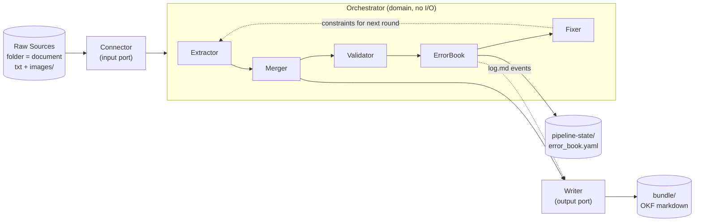

# Architecture Document

> System boundaries, module responsibilities, and dependency flow for `llm_yuki`.
> This file is the AI-Native Repository Standard's required root-level summary. The authoritative, detailed
> design — data model, execution algorithm, lint rules, link/backlink handling, cost tracking — lives in
> [`docs/llm-yuki-v0.1-proposal/ARCHITECTURE.md`](./docs/llm-yuki-v0.1-proposal/ARCHITECTURE.md). Read that
> document before implementing any pipeline logic; this file only orients you to the module boundaries.

---

## 1. High-Level Architecture

This project follows **Ports & Adapters (hexagonal architecture)**, not a layered web-service architecture —
there is no HTTP API layer. The core is a domain-agnostic `Orchestrator` that runs the compile → lint → fix
loop; all I/O (reading Raw Sources, persisting wiki pages) happens through replaceable adapters.



---

## 2. Module Responsibilities

### 2.1 `llm_yuki.domain` — core logic, no I/O

- `Orchestrator`: runs the compile loop (Algorithm 1; see proposal `ARCHITECTURE.md` §3)
- `Extractor` / `Merger` / `Validator` / `ErrorBook` / `Fixer`: sub-steps of the loop (proposal `ARCHITECTURE.md` §2.2)
- **Forbidden**: importing anything from `llm_yuki.adapters`, filesystem or network access, and any
  domain-specific (per-corpus) rule — those belong to a future skill layer, not the core pipeline
  (proposal `README.md` D3; unverified extension mechanism, see `ASSUMPTIONS.md` B-1)
- **LLM call interface**: the LLM-backed steps (`Extractor.compile_wiki_pages`, `Validator.content_validate`,
  `Fixer.llm_periodic_fix`) are expected to call an OpenAI-compatible Chat Completions API — either via
  OpenRouter, or a self-hosted OpenAI-compatible server (e.g. vLLM, Ollama) — via the `openai` Python package
  with a configurable `base_url`/`api_key`, not a vendor-specific native SDK. See `TODO.md` §B.

### 2.2 `llm_yuki.ports` — abstract interfaces

- `Connector`: `list_sources()` / `read_source(ref)` — turns Raw Sources into passages/documents
- `Writer`: persists `Claim`/`Concept` pages, supports read-back, renders body links deterministically,
  maintains backlinks incrementally (proposal `ARCHITECTURE.md` §2.3)

### 2.3 `llm_yuki.adapters` — concrete I/O implementations

- `adapters.connectors.txt_file_connector.TxtFileConnector`: default/first `Connector` (D10) — reads the
  "folder = document, txt + `images/`" Raw Source format, preserving image links without interpreting them
- `adapters.writers.markdown_writer.MarkdownWriter`: default `Writer` — serializes `Claim`/`Concept` pages as
  OKF-conformant markdown with YAML frontmatter under `bundle/`

---

## 3. Dependency Flow

```text
adapters  →  ports  ←  domain
```

Adapters depend on ports (they implement them). Domain depends only on ports (it calls them through the
interface), never on adapters directly. This keeps `domain` testable without any filesystem or network access,
and lets `Connector`/`Writer` implementations be swapped — e.g. for a `deepagents` skill (proposal `README.md`
D3) — without touching the `Orchestrator`.

---

## 4. Forbidden

- No cross-boundary imports: `domain` must not import `adapters`.
- No domain-specific extraction/linking rules inside `Orchestrator` — that logic belongs to a per-corpus skill.
- No writing directly into `bundle/` from anywhere except a `Writer` implementation — this is what keeps OKF
  conformance enforceable in one place.
- No mixing of `pipeline-state/` (internal, e.g. `error_book.yaml`, `cost_ledger.jsonl`) into `bundle/`
  (must pass OKF conformance) — see proposal `ARCHITECTURE.md` §4.4.

---

## 5. Execution Interface

Pipeline execution is exposed as a **CLI first** — `llm_yuki.cli` (installed as the `llm-yuki` script; see
`pyproject.toml` `[tool.poetry.scripts]`). No web/API service is planned for this POC. The `compile`
subcommand wires `Connector`/`Writer` into the `Orchestrator`; until `Extractor`/`Merger`/`Validator`/
`ErrorBook`/`Fixer` have concrete implementations (`TODO.md` §B), it fails fast with a clear error rather
than partially running.
