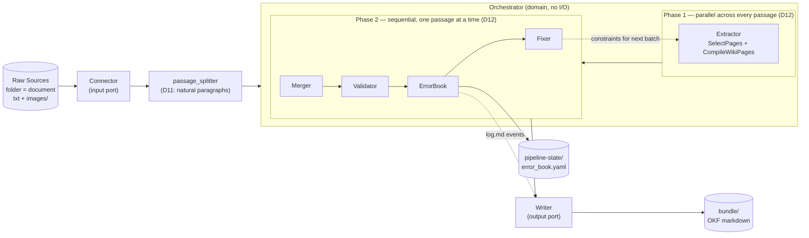

# Architecture Document

> System boundaries, module responsibilities, and dependency flow for `llm_yuki`.
> This file is the AI-Native Repository Standard's required root-level summary. The authoritative, detailed
> design — data model, execution algorithm, lint rules, link/backlink handling, cost tracking — lives in
> [`docs/llm-yuki-v0.1-proposal/ARCHITECTURE.md`](./docs/llm-yuki-v0.1-proposal/ARCHITECTURE.md). Read that
> document before implementing any pipeline logic; this file only orients you to the module boundaries.

---

## 1. High-Level Architecture

This project follows **Ports & Adapters (hexagonal architecture)**, not a layered web-service architecture —
there is no HTTP API layer. The core is a domain-agnostic `Orchestrator` that runs the compile → lint → fix
loop; all I/O (reading Raw Sources, persisting wiki pages) happens through replaceable adapters.



---

## 2. Module Responsibilities

### 2.1 `llm_yuki.domain` — core logic, no I/O

- `Orchestrator`: runs the compile loop (Algorithm 1; see proposal `ARCHITECTURE.md` §3) as D12's two phases —
  Phase 1 (`SelectPages`/`CompileWikiPages`) runs concurrently across every passage in the batch
  (`concurrent.futures.ThreadPoolExecutor`, `max_workers`), read-only against `Writer`; Phase 2 (`Merger`/
  `Validator`/`ErrorBook`/`Fixer`/writes) runs sequentially, one passage at a time, to avoid concurrent write
  conflicts
- `passage_splitter.split_into_natural_paragraphs`: default blank-line-delimited natural-paragraph splitter
  (D11) — the `Orchestrator`'s extraction unit, not a fixed-length chunker; per-corpus splitting stays
  delegated to a future domain skill (D3)
- `Extractor` / `Merger` / `Validator` / `ErrorBook` / `Fixer`: sub-steps of the loop (proposal `ARCHITECTURE.md` §2.2)
- **Forbidden**: importing anything from `llm_yuki.adapters`, filesystem or network access, and any
  domain-specific (per-corpus) rule — those belong to a future skill layer, not the core pipeline
  (proposal `README.md` D3; unverified extension mechanism, see `ASSUMPTIONS.md` B-1)
- **LLM call interface**: the LLM-backed steps (`Extractor.compile_wiki_pages`, `Validator.content_validate`,
  `Fixer.llm_periodic_fix`) are expected to call an OpenAI-compatible Chat Completions API — either via
  OpenRouter, or a self-hosted OpenAI-compatible server (e.g. vLLM, Ollama) — via the `openai` Python package
  with a configurable `base_url`/`api_key`, not a vendor-specific native SDK. See `TODO.md` §B.
- **Core types** (`domain/entities.py`): `Claim` / `Concept` / `Source` — the three shared OKF
  typed-frontmatter types every domain uses (D9, D21). `Source` is a per-Raw-Source navigation page
  (`slug` = the source's id), distinct from `Claim.source_ref` (which still points *out* of the wiki to the
  Raw Source itself, D17) — see proposal `ARCHITECTURE.md` §1.5.
- `domain/query.py` (D25, proposal `ARCHITECTURE.md` §8): the third Karpathy circle — Query — read-only
  against `Writer`, never writes. `SearchStrategy`/`AnswerSynthesizer`/`NextActionDecider` ABCs plus
  `StructuredSignalSearch` (the one non-stub retrieval signal this POC ships), `reciprocal_rank_fusion`,
  one-hop `expand_via_wikilinks`, and two swappable top-level `QueryEngine`s — `SinglePassQueryEngine`
  (search → fuse → graph-expand → read → synthesize, single pass) and `IterativeAgenticQueryEngine`
  (multi-hop `wiki_search`/`wiki_read` loop with `T_max`/patience termination, per the LLM-Wiki paper).
  Embedding-based retrieval is an explicit, undone architecture placeholder (D25) — see
  `adapters.query.embedding_search.EmbeddingSearch`.

### 2.2 `llm_yuki.ports` — abstract interfaces

- `Connector`: `list_sources()` / `read_source(ref)` — turns Raw Sources into passages/documents
- `Writer`: persists `Claim`/`Concept`/`Source` pages, supports read-back, renders body links
  deterministically, maintains backlinks incrementally, and appends `log.md` audit-trail events
  (proposal `ARCHITECTURE.md` §2.3/§4.4)

### 2.3 `llm_yuki.adapters` — concrete I/O implementations

- `adapters.connectors.txt_file_connector.TxtFileConnector`: default/first `Connector` (D10) — reads the
  "folder = document, txt + `images/`" Raw Source format, preserving image links without interpreting them
- `adapters.writers.markdown_writer.MarkdownWriter`: default `Writer` — serializes `Claim`/`Concept`/
  `Source` pages as OKF-conformant markdown with YAML frontmatter under `bundle/`, in per-type
  subdirectories (`claims/`, `concepts/`, `sources/`) each with its own `index.md`, plus a root `index.md`
  linking to all three (D23)
- `adapters.llm.extractor.LLMExtractor`: LLM-backed `Extractor` — `SelectPages`/`CompileWikiPages`
- `adapters.merging.default_merger.DefaultMerger`: `Merger` — slug-exact dedupe; for `Concept` updates,
  three-layer merge protection (array union / LLM merge + 70%-length rejection / locked `concept_title`, D22);
  also generates `Source.summary` via recursive batch-reduce over that document's Claims (D21 §1.5)
- `adapters.validation.default_validator.DefaultValidator`: `Validator` — deterministic structural checks
  (5 types) + LLM-backed content checks (2 types)
- `adapters.fixing.default_fixer.DefaultFixer`: `Fixer` — deterministic auto-fix + LLM-backed periodic fix
- `adapters.state.error_book_store.YamlErrorBookStore`: persists `ErrorBook` to `pipeline-state/error_book.yaml`
- `adapters.cost_ledger.JsonlCostLedger`: append-only `pipeline-state/cost_ledger.jsonl` cost recorder (D19)
- `adapters.query.embedding_search.EmbeddingSearch`: `SearchStrategy` stub — raises `NotImplementedError`,
  deliberately unimplemented this POC (D25)
- `adapters.llm.answer_synthesizer.LLMAnswerSynthesizer`: LLM-backed `AnswerSynthesizer` — answer + mandatory
  citations (D25)
- `adapters.llm.next_action_decider.LLMActionDecider`: LLM-backed `NextActionDecider` for
  `IterativeAgenticQueryEngine`'s per-round `wiki_search`/`wiki_read`/stop decision (D25)
- `adapters.stats`: read-only rollup over the bundle + `cost_ledger.jsonl` + `ErrorBook` — writes one
  `pipeline-state/stat_<timestamp>.md` report per `compile` invocation (D27 — renumbered from this decision's
  original D24 to resolve a decision-log collision with D24's actual holder, "型別更名 Document → Source";
  see proposal `README.md`'s note after D26)

---

## 3. Dependency Flow

```text
adapters  →  ports  ←  domain
```

Adapters depend on ports (they implement them). Domain depends only on ports (it calls them through the
interface), never on adapters directly. This keeps `domain` testable without any filesystem or network access,
and lets `Connector`/`Writer` implementations be swapped — e.g. for a `deepagents` skill (proposal `README.md`
D3) — without touching the `Orchestrator`.

---

## 4. Forbidden

- No cross-boundary imports: `domain` must not import `adapters`.
- No domain-specific extraction/linking rules inside `Orchestrator` — that logic belongs to a per-corpus skill.
- No writing directly into `bundle/` from anywhere except a `Writer` implementation — this is what keeps OKF
  conformance enforceable in one place.
- No mixing of `pipeline-state/` (internal, e.g. `error_book.yaml`, `cost_ledger.jsonl`, `stat_<timestamp>.md`)
  into `bundle/` (must pass OKF conformance) — see proposal `ARCHITECTURE.md` §4.4.

---

## 5. Execution Interface

Pipeline execution is exposed as a **CLI first** — `llm_yuki.cli` (installed as the `llm-yuki` script; see
`pyproject.toml` `[tool.poetry.scripts]`). No web/API service is planned for this POC. The `compile`
subcommand wires every concrete adapter (§2.3) into a real `Orchestrator` and runs one batch end to end;
`--max-workers` (default 4) caps Phase 1's concurrency (D12); missing/invalid LLM configuration
(`OPENAI_API_KEY`/`OPENAI_BASE_URL`/`LLM_MODEL`) fails fast at startup with a clear error, before any batch
work starts, rather than partway through one. The `query` subcommand (D25) reads an existing `bundle_dir`
(no write access) and answers one question via `--method single-pass` (default) or `--method agentic`,
printing the answer and its cited page slugs. The `evaluate-qa` subcommand (D5/D8) runs a `QueryEngine` over a
QA-pairs JSONL against an existing `bundle_dir` and reports aggregate exact-match/F1.

---

## 6. Evaluation Tooling

`llm_yuki.evaluation` (`qa_metrics.py`/`qa_runner.py`) sits outside the Ports & Adapters split above — it is
QA-evaluation tooling built on top of the Query module (§2.1), not core pipeline logic, the same top-level
status `cli.py` already has. It does not vendor any benchmark dataset; see
`docs/implementation/evaluation.md` for what a real `M3SciQA`/`MMDocRAG` run still requires.
