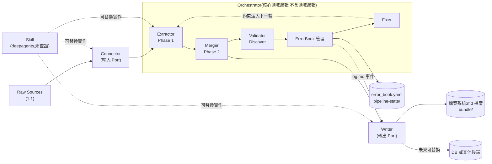

# LLM Wiki 編譯方法論——架構參考

Implementation-ready 文件:把 `README.md` 裡已經拍板的「怎麼做」細節,抽出來整理成一份不含討論過程、只留結論的實作參考。寫 code 時查這份,不用回頭翻整份討論稿。每節結尾標註來源決議編號,細節理由回 `README.md` 查。

---

## 1. 資料模型(Data Model)

### 1.1 Raw Sources 格式

一個資料夾 = 一份文件,內含:
- 一個 txt 正文檔
- 一個 `images/` 子資料夾
- 正文檔內用 markdown image 連結指向對應圖片,例如 ``

Connector 攝入時原樣保留這個連結(對應 OKF 的 `resource`/`sources[]` 欄位),圖片**內容**不解讀(無 OCR、無 vision model)。假設語料已經是這個格式,不負責 PDF/原始論文 → 這個結構的轉換。

來源:D10、D10 二次更正。

### 1.2 `Claim` schema

| 欄位 | 型別 | 說明 |
|---|---|---|
| `claim_text` | string | 結構化後的主張文字(不是 passage 原文照抄) |
| `source_ref` | string/object | 出處指標,對應 Raw Sources 的文件/段落位置;涉及圖片連結時原樣保留該連結 |
| `confidence` | float(0.0–1.0) | 事實確定性分數 |
| `provenance_state` | enum | `extracted`(直接從原文抽出)/ `merged`(合併多來源)/ `inferred`(LLM 推論)/ `ambiguous`(不確定) |
| `related_concepts` | string[](slug) | 連到哪些 `Concept` 頁面 |
| `contradicted_by` | {slug, reason}[] | 跟哪些既有 Claim 衝突、理由。**候選線索,非權威判定**——lint(第 4 節)仍須完整偵測 |

來源:D9 補充決議。

### 1.3 `Concept` schema

| 欄位 | 型別 | 說明 |
|---|---|---|
| `concept_title` | string | 人類可讀標題 |
| `aliases` | string[] | 別名 |
| `tags` | string[] | 標籤 |
| `summary` | string | 一段話摘要(LLM 生成) |
| `key_facts` | slug[] | 關聯到的 `Claim` 清單——**backlink,由 `Writer` 增量維護,不是 LLM 生成**(見第 5.3 節) |
| `related_pages` | string[](slug) | 相關頁面 wikilink |
| `related_sources` | string[] | 出處/來源 digest 連結 |

來源:D9 補充決議、D18。

### 1.4 型別系統

- 共享核心型別:所有領域都用 `Claim`/`Concept` 這兩個核心型別,核心 pipeline 只寫一套處理這兩型別的邏輯就能跨領域通用
- 領域延伸型別:各領域 skill 自訂,不強制 namespace 前綴,**建議**(非強制)用 `<領域>:<Type>` 命名慣例(例如 `sci-paper:Paper`、`doc:Chart`)
- 這次 POC 只驗證兩個領域各自的核心型別行為一致,不測試合併成單一跨領域 bundle 的情境

來源:D9。

---

## 2. 模組架構(Module Architecture)

採 Ports & Adapters(hexagonal architecture)分層思路(借用軟體工程既有的通用架構命名,不是 LLM-Wiki 生態系文獻裡查到的做法)。



### 2.1 `Connector`(輸入 Port)

- **職責**:把 Raw Sources 轉成 `Orchestrator` 能處理的統一表示(passage/document 序列)
- **最少介面**:`list_sources()` 列出這次 batch 有哪些來源;`read_source(ref)` 讀出正文 + 保留的圖片連結
- **目前實作**:txt file connector(唯一/預設實作)
- 來源:D2、D10、D16

### 2.2 `Orchestrator`(核心領域邏輯)

不得包含任何領域特定規則(呼應設計準則 MUST 5)。只依 Algorithm 1(第 3 節)的迴圈結構依序呼叫底下五個子模組。

#### 2.2.1 `Extractor`

- **輸入**:passage + 既有頁面 snapshot
- **輸出**:候選 `Claim`/`Concept`(欄位見 1.2/1.3)
- 領域特有的段落切法/型別擴充委派給領域 skill(未查證,見 `ASSUMPTIONS.md` B-1),`Extractor` 本身介面領域無關
- 抽取粒度:文件的自然段落/概念單位,不做固定長度 chunk 切割
- 來源:D9、D11、D12 Phase 1

#### 2.2.2 `Merger`

- **輸入**:`Extractor` 產出的候選
- **職責**:去重(`is_new` 判定)、決定最終內容——**不負責實際持久化**,決定完交給 `Writer`
- 來源:D12 Phase 2

#### 2.2.3 `Validator`

- `StructuralValidate`:deterministic,涵蓋 D6 的 OKF conformance + 擴大範圍的結構性檢查(見第 4.1 節)
- `ContentValidate`:LLM-based(見第 4.1 節)
- 來源:D13 Discover

#### 2.2.4 `ErrorBook` 管理

- 四個函式:`UpdateErrorBook(ℬ, E)` / `ActiveConstraints(ℬ)` / `PeriodicFixDue(ℬ)` / `VerifyAndClose(ℬ, W)`
- 來源:D14

#### 2.2.5 `Fixer`

- `CodeAutoFix`(deterministic,結構性錯誤)/ `LLMPeriodicFix`(LLM,內容性錯誤)
- 來源:D13

### 2.3 `Writer`(輸出 Port)

- **職責**:把 `Merger` 決定的內容、`ErrorBook` 產生的事件實際持久化,並支援讀回(`Extractor` 的 `SelectPages`/`ContentValidate` 需要讀既有頁面內容)
- **目前唯一實作**:檔案系統,寫成 markdown 檔案,對應 `bundle/` 目錄(D6 要求通過 OKF conformance)
- **額外職責**(2.3.1、2.3.2 見下):body 連結渲染、backlink 增量維護
- **硬性約束**:不管未來換哪種實作(如 DB),都必須能匯出/渲染出符合 OKF conformance 的 markdown 檔案集合供驗證
- 來源:D6、D16

#### 2.3.1 body 連結渲染(方向A)

`Writer` 從 `related_concepts`/`contradicted_by`/`source_ref` 決定性渲染出 body 裡的 `## Related Pages`/`## Related Sources` 區塊,**不由 LLM 獨立生成這段文字**——避免 body 與 frontmatter 不一致,不需要新增額外的一致性檢查。`summary` 等敘述文字仍是 LLM 生成,不受影響。

來源:D17。

#### 2.3.2 backlink 增量維護

`Writer` 在 Phase 2 `ApplyUpdates` 時,每次有新 `Claim` 帶 `related_concepts` 寫入,同步把它加進目標 `Concept` 的 `key_facts` 清單;`contradicted_by` 指向的 Claim 也同步維護反向指標(對稱),不需要 LLM 自己想到要雙向都寫。

**目的**:讓「查詢某概念的所有相關 Claim」不需要全庫掃描,直接讀 `key_facts` 即可——這是 D8 要驗證的效率優勢的必要前提。

**責任邊界**:這個增量維護邏輯本身的正確性,是一般軟體測試(unit test)範圍,不屬於 D13 Error Book 處理的「LLM 編譯品質」錯誤分類。

來源:D18。

### 2.4 Skill 抽換原則(⚠️ 未查證假設,見 `ASSUMPTIONS.md` B-1)

`Connector`/`Extractor`/`Writer` 的具體實作都可能是內建程式碼,也可能是一個 deepagents skill——`Orchestrator` 面對的永遠是抽象介面,不需要知道底下是哪一種。**這次 POC 的具體實作(txt connector、markdown writer)都用內建程式碼**,不用 skill 包;介面設計上要讓「換成 skill」是之後可以無痛替換的選項。

來源:D3、D16。

---

## 3. 執行流程(Execution Flow)

直接採納 LLM-Wiki 論文 Algorithm 1 當執行迴圈範本:

```
Input: Source batch X, current Wiki W, directory indices I,
       source archives A, active Error Book constraints C
Output: Updated Wiki W and Error Book ℬ

1: for each source passage x ∈ X do
2:   S ← SelectPages(x, I)
3:   U ← CompileWikiPages(x, S, C)
4:   E_s ← StructuralValidate(U, W)
5:   E_c ← ContentValidate(U, W, A)
6:   E ← E_s ∪ E_c
7:   if E ≠ ∅ then
8:     ℬ ← UpdateErrorBook(ℬ, E)
9:     C ← ActiveConstraints(ℬ)
10:    U ← CodeAutoFix(U, E_s)
11:  end if
12:  W ← ApplyUpdates(W, U)
13: end for
14: if PeriodicFixDue(ℬ) then
15:   W ← LLMPeriodicFix(W, ℬ)
16:   ℬ ← VerifyAndClose(ℬ, W)
17: end if
18: return W, ℬ
```

**對應關係**:

| Algorithm 1 行號 | 對應模組 |
|---|---|
| 1–3(`SelectPages`/`CompileWikiPages`) | `Extractor`(2.2.1),Phase 1,可平行 |
| 4–6(`StructuralValidate`/`ContentValidate`) | `Validator`(2.2.3),**每個 batch 都跑**,含結構性與內容性偵測 |
| 7–10(`UpdateErrorBook`/`ActiveConstraints`/`CodeAutoFix`) | `ErrorBook` 管理 + `Fixer` 的即時部分(2.2.4/2.2.5) |
| 12(`ApplyUpdates`) | `Writer`(2.3),Phase 2,序列化——同時觸發 body 渲染(2.3.1)與 backlink 維護(2.3.2) |
| 14–17(`LLMPeriodicFix`/`VerifyAndClose`) | `Fixer` 的批次部分 + `ErrorBook` 管理,**降頻到每 N batch** |

**執行策略要點**:
- Phase 1(第 1–6 行的抽取與偵測部分)可以對 passage/文章層級平行處理
- Phase 2(第 12 行的 `ApplyUpdates`)必須序列化,避免同一 `Concept` 頁面被並發寫入衝突
- 只有「修正」動作(第 10 行 `CodeAutoFix` 除外,它本來就是即時的;主要是第 15 行 `LLMPeriodicFix`)延後到 periodic,**偵測**(第 4–6 行)不延後,每 batch 都做,好讓約束能盡早生效

來源:D11、D12、D14。

---

## 4. Lint / Error Book

### 4.1 七類錯誤

| # | 錯誤類型 | 分類 | 偵測方法 |
|---|---|---|---|
| 1 | Dangling Links | 結構性 | 連結指向不存在的頁面,跟檔案系統交叉驗證 |
| 2 | Incomplete Pages | 結構性 | 必要區塊缺失(facts/sources),模板完整性檢查 |
| 3 | Malformed Refs | 結構性 | 出處引用格式不對,regex 驗證 |
| 4 | Unseen Overwrite | 結構性 | LLM 改了 Phase 1 沒選中的頁面,集合比對 |
| 5 | Index Inconsistency | 結構性 | `index.md` 跟檔案系統對不上,雙向 diff |
| 6 | Unsupported Facts | 內容性 | `Claim` 沒有 `source_ref` 支撐,source-grounded LLM verification;對 `provenance_state=extracted` 尤其重要 |
| 7 | Cross-Page Contradictions | 內容性 | 相關頁面屬性/日期/關係互相矛盾,sampling-based consistency check,以 `contradicted_by` 候選為起點但不限於此 |

結構性錯誤含 D6 的 OKF conformance 驗證,但範圍更廣(多了 index 一致性、unseen overwrite 這類 pipeline 正確性檢查)。

來源:D13。

### 4.2 五階段生命週期

1. **Discover**——依 4.1 分類偵測錯誤(deterministic validator 或 LLM verification)
2. **Attribute**——追溯根因
3. **Constrain**——根因 formalize 成自然語言約束規則
4. **Inject**——開放中的約束規則加進下一輪編譯 prompt
5. **Verify & Close**——定期重新驗證曾出錯的頁面,錯誤不再出現才標記 closed

來源:D13。

### 4.3 執行時機

| 頻率 | 動作 |
|---|---|
| 每個 batch(Phase 2 寫入完立刻) | 結構性 + 內容性錯誤的 **Discover**;結構性的 **Code Auto-fix**;Attribute→Constrain→Inject |
| 每 N 個 batch | 內容性錯誤的 **LLM Periodic Fix**(只有修正動作延後,偵測不延後) |
| 更低頻率(每 M 個 periodic 週期,或整個 run 結束) | **Verify & Close** |

N/M 具體數值不在架構層級決定,留給 scaffolding 階段依實測效能調整。

**⚠️ 這是 D14 對 D13 原始說法的修正**:D13 原本把內容性錯誤的偵測也歸類成「每 N batch」,對照 Algorithm 1 後修正為「偵測每 batch、只有修正才降頻」。

來源:D13、D14。

### 4.4 Error Book(ℬ)資料結構

**儲存位置**:獨立於 OKF bundle 之外的 pipeline 內部狀態檔案,不放進 D6 要驗證 conformance 的 `bundle/` 目錄。

```
<wiki-instance-root>/
  bundle/                <- 通過 OKF conformance 驗證,只放 Wiki 內容
    index.md
    log.md
    concepts/...
  pipeline-state/        <- 不屬於 OKF bundle,pipeline 自己的內部狀態
    error_book.yaml
```

**欄位**(對照 Algorithm 1 的四個函式介面反推,論文本身沒給欄位清單,以下是本專案自訂設計):

| 欄位 | 說明 |
|---|---|
| `id` | entry 唯一識別碼 |
| `error_type` | 4.1 七類之一 |
| `phenomenon` | Discover 產出,錯誤現象描述 |
| `affected_refs` | 受影響的 `Claim`/`Concept` slug 清單 |
| `root_cause` | Attribute 產出的根因文字 |
| `constraint_rule` | Constrain 產出的約束規則,`ActiveConstraints(ℬ)` 撈出串進下一輪 prompt 的內容 |
| `verification_method` | Verify & Close 怎麼確認錯誤不再發生 |
| `status` | `open` / `closed` |
| `discovered_at_batch` | 發現時的 batch |
| `closed_at_batch` | 關閉時的 batch,`open` 時為 `null` |

**跟 `log.md` 的分工**:`error_book.yaml` 是當前狀態快照,`log.md` 是 append-only 歷史。每次 `UpdateErrorBook`/`VerifyAndClose` 都要同步寫一筆事件進 `log.md`。

來源:D14。

---

## 5. Link / Backlink

### 5.1 六種 link 形式

| # | 形式 | 儲存位置 | 方向 |
|---|---|---|---|
| 1 | body 內文 wikilink | body(人類可讀) | 頁面 ↔ 頁面,OKF 無型別邊標籤,只表示有關聯 |
| 2 | `related_concepts` | frontmatter | Claim → Concept,機器可讀權威來源 |
| 3 | `contradicted_by` | frontmatter | Claim → Claim,語意是衝突,`{slug, reason}` |
| 4 | `source_ref` | frontmatter | Claim/Concept → Raw Source(連出 wiki 之外) |
| 5 | 圖片連結 | Raw Source txt 正文 | 正文 → `images/` |
| 6 | `index.md` 目錄連結 | `index.md` | Index → 所有頁面 |

另有 `error_book.yaml` 的 `affected_refs`(第 4.4 節),不算 wiki page 內部連結,是 pipeline meta-state 對 wiki content 的連結。

來源:D17。

### 5.2 body/frontmatter 一致性

見 2.3.1。body 的連結區塊由 `Writer` 決定性渲染,不獨立由 LLM 生成,消除不一致的可能性,不需要新增 lint 檢查。

### 5.3 Backlink

見 2.3.2。`Concept.key_facts` 由 `Writer` 增量維護,不是 LLM 生成內容。

---

## 6. 驗證/評估方式

### 6.1 編譯/維護端正確性

- **`index.md` 完整性**:是否完整列出 bundle 內所有頁面(無遺漏)、無孤兒頁面、階層跟磁碟實際結構一致
- **`log.md` 稽核軌跡**:人工/合成注入已知矛盾到語料裡,跑完 lint 管線後,比對 `log.md` 實際記錄的偵測/歸因/修正筆數與內容,算 precision/recall

明確排除:逐頁人工審閱內容品質、wikilink 語意人工評估、大規模使用者研究。

來源:D7。

### 6.2 檢索/推理端正確性與對照基準

| 項目 | 角色 |
|---|---|
| `M3SciQA` | 對照領域1(科學論文,窄深,多文件+部分多模態) |
| `MMDocRAG` | 對照領域2(十領域長文件,廣雜,重度多模態) |
| `MuSiQue` | 跨文件多跳問答 baseline(不算第三個領域) |
| 簡單向量 RAG | 對照基準1:回答品質(QA 正確率/F1) |
| `langchain-ai/openwiki` | 對照基準2:量化 + 質化(含矛盾偵測這塊它沒有的能力) |

明確不列入對照:「未優化的 OKF/Karpathy 原版」(`openwiki` 已某種程度扮演這個角色)、「整批塞 context」(`MMDocRAG` 平均 67 頁/文件會撞 context window)。

來源:D5、D8。

---

## 7. 成本統計(Cost Tracking)

### 7.1 記錄機制

每個 pipeline stage 呼叫都記錄一筆 cost event,存進 `pipeline-state/cost_ledger.jsonl`(append-only,一行一個 JSON 事件)——跟 4.4 節的 `error_book.yaml` 同一個道理:pipeline 自己的 meta-state,不需要通過 D6 的 OKF conformance 驗證,不混進 `bundle/log.md`。

```
<wiki-instance-root>/
  bundle/                <- OKF conformance 範圍(不含成本資料)
  pipeline-state/
    error_book.yaml       <- D14
    cost_ledger.jsonl      <- D19,append-only
```

### 7.2 欄位

| 欄位 | 說明 |
|---|---|
| `event_id` | 唯一識別碼 |
| `stage` | 呼叫的模組/函式(對應 2.2/2.3 節的模組劃分,例如 `Extractor.compile`、`Validator.ContentValidate`、`Fixer.LLMPeriodicFix`) |
| `batch_id` | 對應 3 節的 batch 概念 |
| `tokens_in` / `tokens_out` | LLM 呼叫的輸入/輸出 token 數;**非 LLM 步驟(`CodeAutoFix`、`StructuralValidate`)明確記 0**,不留空 |
| `wall_clock_ms` | 這次呼叫的實際耗時 |
| `timestamp` | 事件發生時間 |

### 7.3 彙總(Rollup)

每個 batch 結束或整個 run 結束時,產生彙總:按 `stage` 分組的 token 總數、按 Phase 1/Phase 2(第 3 節)分組的 wall-clock 總時間、按 4.1 節七類錯誤/兩層修正分組的成本。彙總可以是 `cost_ledger.jsonl` 的聚合查詢結果,不強制另開檔案。

### 7.4 用途

- **驗證 D12 的效能取捨**:D12 選「Phase 1 平行 + Phase 2 序列」時沒有實測數據佐證,`cost_ledger` 提供直接的數據來源,不需要另外設計對照實驗。
- **補上 6.2 節對照基準的第三軸**:除了回答品質、矛盾偵測能力,現在可以用 `cost_ledger` 的數字跟簡單向量 RAG(embedding + 查詢成本)、`openwiki`(每日 CI 整批重新生成成本)做量化的成本/效率對照。

**明確排除**:這次 POC 只做被動記錄與事後分析,不設定成本上限或預算警報這類主動 governance 機制。

來源:D19。

---

## 待補齊

這份文件反映 2026-08-26 為止的決議(D1–D19)。如果之後 `README.md` 有新決議或修正既有決議,回頭同步更新對應章節,以最新版本為準。
