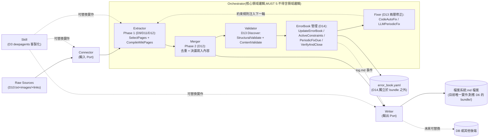

# POC 討論稿:LLM Wiki 知識編譯與推理(Compilation & Inference)

**狀態:討論中(pre-SPEC)—— 尚未進入 `.ai/workflows/validate-poc.md` 的 Phase 1**

這份文件是這個 POC 的討論草稿(scratchpad),用來在正式寫 `SPEC.md` 之前,把假設(hypothesis)、範疇、動機逐步收斂清楚。依照 `AGENTS.md` 的核心原則「POC 需要 SPEC.md 先行」,本文件本身**不算** POC 的起跑點——等我們討論到假設夠具體、範疇夠窄之後,再把結論濃縮寫成同目錄下的 `SPEC.md`,才正式開始寫 code。

---

## 背景與動機

### 這個 POC 要做什麼(目的)

**這個 POC 的目的是提出一套 LLM Wiki 知識庫編譯做法(一份方法論 / proposal),本身就是產出,不是拿現成做法回頭改造本專案的 repo。** 換句話說:

- **產出是「做法本身」**:一份說明「文件語料如何被編譯成 LLM Wiki 知識庫、如何被查詢與推理、如何維護」的方法論/規格文件(+ 支撐這份方法論的最小可運行驗證),可以被任何團隊、任何領域拿去套用。
- **不是要把這套做法套用在本專案的 `knowledge-base/` 上**。本 repo(Agent-Research-Loop)在這個 POC 裡的角色只是「研究與驗證這個方法論的工作場所」——我們在這裡討論、設計、寫驗證程式碼、記錄結論,但驗證用的目標語料與最終產出的方法論,設計上必須跟「本 repo 的筆記」脫鉤,才能證明它是可移植到任意領域的通用做法,而不是一個只服務本專案的工具。
- 這點跟 `knowledge-base/topics/llm-wiki-knowledge-construction-and-retrieval.md` 筆記第五節原本標記的 POC candidate(「把本專案自己的 topic notes 升級成雙向連結 wiki,提升本專案查詢舊筆記的品質」)是不同方向、範疇更廣的提案——那個 candidate 是「把方法套用在自己身上」,這裡是「提出方法本身,拿其他領域語料驗證」。那篇筆記仍是重要的背景研究依據,只是不再是這個 POC 要達成的目標。

### 立論基礎(呼應 D1 決議)

這個提案不是憑空發明,而是站在既有研究脈絡上:讓 LLM 把來源文件「編譯(compile)」成一份持續存在、可累積、可雙向連結的結構化知識庫,取代「每次查詢都重新檢索、重新推理」的傳統 RAG 模式。具體依循(見下方「已決議」D1):

- **Karpathy 原始 LLM-Wiki 模式**:三層架構(Raw Sources 不可變原始文件 / Wiki 由 LLM 生成維護的 markdown 頁面 / Schema 定義規則的層)+ 三循環(Ingest 攝入時抽取整合、Query 查詢時定位並可歸檔回 wiki、Lint 定期健檢矛盾與孤兒頁面)。
- **OKF(Open Knowledge Format,Google Cloud,2026-06)**:Karpathy 模式的正式化、可互通標準——`index.md` 目錄 + typed frontmatter(`type` 必填)+ 標準 markdown link 建交叉引用,並有明確的 MUST/SHOULD/MAY conformance 規則可供機器驗證。

這個提案要做的,是**以 OKF 的具體 schema 與 conformance 規則、Karpathy 的三層架構與三循環精神為基礎,不重新發明一套**,但在此之上做針對性優化(候選優化方向見 D1)——目標是讓這套做法既保有跟現有 OKF 生態互通的能力,又補上 OKF 目前缺乏的動態行為與品質守門機制。

### 相關參考

完整研究筆記見 `knowledge-base/topics/llm-wiki-knowledge-construction-and-retrieval.md`;開源專案的完整 framework analysis 見各自的 `knowledge-base/frameworks/<project>/analysis.md`(目前只有 `llm_wiki-0.6.11` 完成,`deepagents-0.7.6` 延後未寫,見下方「執行框架」)。下面依「查證深度」誠實分類——**完整原始碼分析**(已 vendor 進本 repo 並逐檔讀過)、**官方文件/repo README 查閱**(讀過線上文件但沒 vendor/沒讀原始碼)、**僅列出未深入**(只在候選清單裡出現過名字,沒有具體查證),避免誤讀成每個來源都被同等程度驗證過。

#### 核心標準/學術基礎

| 名稱 | 核心做法 | 跟我們的關係 |
|---|---|---|
| Karpathy 原始 gist | 三層架構(Raw Sources 不可變原始文件 / Wiki 由 LLM 生成維護 / Schema 定義規則)+ 三循環(Ingest / Query / Lint) | 整個方法論的精神地基(D1)。**"per-document summary page"這個細節一度來回**:先被否決(D20,依 LLM-Wiki 論文與兩個現成實作 3 比 1 反對),後因 `nashsu/llm_wiki` 有忠實實作出的 `source` 型別佐證而推翻採用(D21) |
| 學術形式化:*Retrieval as Reasoning via LLM-Wiki*(arXiv 2605.25480) | 把 Karpathy 模式形式化成 Algorithm 1(七類 Error Book、五階段生命週期)+ `wiki_search`/`wiki_read` 兩個原子工具的組合式檢索 | Algorithm 1 直接採為 lint/Error Book 的執行迴圈範本(D14);論文「每頁代表一個獨立實體或概念」的論點曾是 D20 否決 `Source` 型別的三個依據之一(後由 D21 推翻) |
| OKF(Open Knowledge Format,Google Cloud,2026-06~) | `index.md` 目錄 + typed frontmatter(`type` 必填)+ 標準 markdown link 交叉引用 + 明確 MUST/SHOULD/MAY conformance 規則 | 整個 bundle 格式的依循基準(D1);lint 兩層檢查之一就是 OKF 官方 conformance 驗證(D6);D23 的分層 `index.md` 規則直接依 OKF spec 本身「漸進式揭露」的規定設計。**⚠️ 版本落差**:2026-06 首發時的簡化描述,跟 2026-08-19 直接查官方 spec 原文(疑似已更新到 v0.2 前後)內容不一致,細節見 D1 附註 |

#### 代表實作/開源專案(LLM Wiki 領域)

| 名稱 | 查證深度 | 核心做法 | 跟我們的關係 |
|---|---|---|---|
| `nashsu/llm_wiki` | **完整原始碼分析**(已 vendor 進 `knowledge-base/frameworks/llm_wiki-0.6.11/`,見 `analysis.md`) | 跨平台桌面 App(Tauri+Rust 後端/React 前端),忠實遵循 Karpathy 精神。九種內建型別(含 `source`)、兩步驟 CoT ingest(Analysis→Generation)、`page-merge.ts` 三層合併保護、`dedup.ts` 軟碰撞去重、`lint.ts`/`lint-structural-core.ts` 雙層無狀態 lint(沒有 Error Book)、`context-budget.ts` 固定比例配額 | `source` 型別直接觸發 D21(推翻 D20,加 `Source` 型別);`page-merge.ts` 三層保護採用進 D22;`dedup.ts` 軟碰撞去重列為 design-only、不實作(D22);`context-budget.ts` 固定比例配額精神借用進 D21 的 `summary` 遞迴 batch-reduce 演算法。**不是 OKF conformant**——是它自己的 bundle 格式,借用的機制都要重新對應到我們自己的 schema,不是直接抄 |
| `SamurAIGPT/llm-wiki-agent` | **僅列出,未深入分析** | 兩階段連結建構:確定性 wikilink 解析 + 語義關係推斷 | 目前只是「代表實作」清單裡的一員,沒有任何具體機制被借用到已決議項目裡——誠實標注,不要誤讀成已經像 `nashsu/llm_wiki` 那樣查證過 |
| `langchain-ai/openwiki`(OpenWiki Brains) | 官方文件/repo README 查閱,未 vendor 原始碼 | LangChain 出品 CLI,輸出格式即 **OKF v0.1 bundle**,是「OKF 的產出者,不是新格式」。兩種模式:code mode(掃 repo 生成/維護技術文件)、personal mode(接 Gmail/Notion/X/web search 等 connector 建個人知識庫)。GitHub Action 每日排程整批重新掃描、自動開 PR | D2 決議借用其「connector 抽象攝入」架構模式;它「定期整批重新掃描生成」的維護方式,是我們刻意做出差異化的對照對象——D1/D2 的「lint 診斷矛盾→歸因→針對性修正」正是要回應這點;D8 決議裡也是量化+質化的對照基準之一 |
| `atomicstrata/llm-wiki-compiler` | 官方文件/repo README 查閱,未 vendor 原始碼 | Configurable Lifecycle Profiles(`.llmwiki/profile.json`)——宣告式定義各領域 typed entities + 生命週期,共用 runtime 驗證,已有 `autosci`(研究)/`newsroom`(編輯)兩份跨領域範本,支援 OKF export/import | 目前查到「分層 schema 因應跨領域」這個候選方向最接近的現成原型(D1),但 D3 最終選了不同路線(deepagents 程序式 skill,而非 CLP 宣告式 profile)——**這題本身尚未完全收斂**,只是採取了不同實作路徑,細節見 D3 的附註;D12 的 Phase 1/Phase 2 兩階段執行策略也部分參照它的兩階段形狀 |
| `arturseo-geo/llm-knowledge-base` | 官方文件/repo README 查閱,未 vendor 原始碼 | 個人知識庫 schema 標準,用目錄結構(`wiki/`/`learning/`/`insights/`/`output/`)分層而非 type 標籤,`status: quarantined` 等 frontmatter 欄位標記矛盾內容 | 只在 D1 候選方向表格中列為對照組,沒有具體機制被採納到任何決議 |

#### 執行框架(不是 LLM Wiki 方法論本身,是我們的實作地基)

| 名稱 | 查證深度 | 核心做法 | 跟我們的關係 |
|---|---|---|---|
| `deepagents` | 已 vendor 進 `knowledge-base/frameworks/deepagents-0.7.6/`,**但 `analysis.md` 延後未寫** | 通用 agent 框架 | D3 決議的客製化執行層——核心 pipeline 之外,各領域客製化邏輯包成 deepagents 的 skill。**目前仍是未查證假設**(`ASSUMPTIONS.md` B-1,風險等級高):deepagents 是否原生支援「skill」這個概念、具體是 sub-agent、工具註冊、還是外部檔案結構,都還沒確認過,`SPEC.md` 撰寫時已明講這點 |

#### 評測方法論參照(非設計來源)

GraphRAG-Bench——D5/D8 決議對照基準(簡單向量 RAG、`langchain-ai/openwiki`)時,評測邏輯與既有文獻數字的對照對象,不是我們借用機制的來源。

**驗證資料集不算在這裡**:`M3SciQA`/`MMDocRAG`/`MuSiQue` 是 D5 決議的評測語料,不是設計方法論的參照對象,細節見下方 D5 決議,不重複列在這節。

---

## 已決議(Decided)

### D1. 編譯 schema 與維護精神:依循 OKF + Karpathy 原始 LLM Wiki,但保留優化空間(2026-08-19)

**決議**:這次 POC 的知識庫編譯 schema 與維護精神,以 **OKF(Open Knowledge Format)規格 + Karpathy 原始 LLM Wiki 的三層架構(Raw Sources / Wiki / Schema)與三循環(Ingest / Query / Lint)**為基礎,不重新發明一套。但不是照抄——在此基礎上保留「優化」的空間。

**理由**:OKF 本質上就是 LLM Wiki 精神的正式化版本(見 topic note 第六節),兩者已經是目前最接近標準化、且思路一致的參照。用既有基礎能省下重新設計 schema 的成本,產出也理論上具備跟其他 OKF 工具鏈(conformance 驗證工具等)互通的可能性。

**候選優化方向**(下一輪討論收斂用,不代表都會做):
- ✅ **補上動態行為**——**已於 D2 決議採用**(參考 `openwiki` 的 connector 架構)。OKF 只定義靜態 bundle 格式(`index.md` + typed frontmatter + markdown link),沒定義「編譯」與「查詢」怎麼跑。可以把 LLM-Wiki 論文的 `wiki_search` / `wiki_read` 兩個原子工具,或 Karpathy 的 Ingest/Query/Lint 三循環接上去,讓 OKF 從「格式規範」變成「可執行的編譯 + 查詢 + 維護管線」。`langchain-ai/openwiki` 是這個方向的現成參照(connector 攝入 → agent 生成 OKF bundle → CI 排程重新編譯)。
- ✅ **補上矛盾偵測/自我修正**——**已於 D2 決議採用,列為明確差異化方向**(lint 診斷矛盾 → 根因歸因 → 針對性修正)。`openwiki` 的維護機制只是「定期整批重新掃描生成」,不是「偵測矛盾 → 歸因 → 針對性修正」——這仍是我們這個提案相對 `openwiki` 明確做出差異化貢獻的地方。

  **⚠️ 2026-08-19 修正(原本這裡寫「OKF 目前沒有內建品質守門機制」,查證後需要修正)**:直接讀 OKF 官方 spec 才發現內容已經比 2026-06 首發時豐富——多了 `status`(`draft`/`stable`/`deprecated`)+ `stale_after`(過期日期)這組**生命週期**欄位,以及 `generated`/`verified`(記錄由誰、何時產生/驗證,並依 `human:` 前綴分出 unverified / machine-confirmed / human-reviewed 三個信任層級)這組**信任**欄位。**但這些都是靜態宣告的中繼資料**(由 producer 手動或半自動填寫「這份內容是誰驗證的、什麼時候過期」),**不是系統主動比對內容找出矛盾、判斷根因、產生修正**的動態機制——OKF spec 本身沒有「偵測兩份文件互相矛盾」這件事的定義或流程。差異化方向本身站得住腳,只是理由要更精確:不是「OKF 什麼都沒有」,而是「OKF 有靜態的信任/新鮮度標記,但沒有動態的矛盾偵測與修正迴路」,我們的提案補的是後者,也可以考慮直接借用/相容 OKF 這組既有欄位來標記偵測結果(例如偵測到矛盾後,自動把受影響頁面標成 `status: deprecated` 或加註 `stale_after`),而不是另外發明一套平行的欄位。
- ✅ **把 lint 檢查接回編譯迴路**——**已隨 D2 一併採用**,實質上就是上一點「lint 診斷矛盾 → 根因歸因 → 針對性修正」這條迴路的具體化,不再是獨立方向。OKF 的 SHOULD 規則(例如「不留孤兒頁面」)目前只在驗證時報警告、不會自動修;`openwiki` 的每日 CI PR 是這個迴路的簡化版(重新生成即隱含修正),但不是顯式的「先診斷、再針對性 patch」。
- ✅ **分層 schema 因應跨領域**——**已於 D9 決議採用「共享核心型別(`Claim`/`Concept`)+ 領域延伸型別」**。在 OKF 的 typed frontmatter 上,設計「各領域自訂 `type` 詞彙表,但共用同一套 index / link / conformance 規則」的分層做法,呼應「測試領域選擇」那題的跨領域需求。

  **已查證的相關文件/專案(2026-08-19 整理,細節見討論紀錄):**

  | 來源 | 對「跨領域 schema」的做法 | 跟我們的方向的關係 |
  |---|---|---|
  | **OKF 官方 SPEC**([spec 原文](https://github.com/GoogleCloudPlatform/knowledge-catalog/blob/main/okf/SPEC.md)) | 明確**不提供**任何機制:`type` 值不集中註冊、沒有 namespace 慣例(如 `domain:Type`)、沒有階層/繼承。設計哲學是「故意寬鬆」——producer 自訂字串、consumer 必須容忍未知 type。 | 這是問題的起點,不是答案:OKF 本身刻意不管這件事,分層/跨領域怎麼做完全留給 producer 自己設計,我們的提案要補的正是這塊空白。 |
  | **`langchain-ai/openwiki` / OpenWiki Brains**([介紹](https://www.langchain.com/blog/introducing-openwiki-brains-general-purpose-wiki-memory-for-agents)) | 不是用統一 schema 分層,而是用**「模式(mode)分離」**——Code Brain 與 Personal Brain 是兩套獨立運作邏輯,底下再用 connector 分來源(deterministic connector 如 Gmail/X/Git,agentic connector 如 Notion/web search)。輸出都收斂成 plain markdown,但 type 詞彙本身沒有跨模式的統一規則。查詢機制(全文/語意/agentic search)也還在開發中。 | 是「用場景/模式切分」而非「用 schema 分層」的對照組——提醒我們:如果要做分層 schema,不能只做到「來源分開就好」,還要處理「跨來源查詢時 type 詞彙怎麼互通」這個 openwiki 目前也還沒解的問題。 |
  | **`arturseo-geo/llm-knowledge-base`**([repo](https://github.com/arturseo-geo/llm-knowledge-base)) | 個人知識庫 schema 標準,把 Karpathy 的 workflow 正式化成 `AGENTS.md` 契約 + 版本化 schema。**用目錄結構分層,不是用 type 標籤分層**(`wiki/` 編譯後文章、`learning/` 間隔重複與缺口追蹤、`insights/` 人工筆記、`output/` 產出報告)。額外有 `confidence`/`status`(如 `quarantined`)這類 frontmatter 欄位處理矛盾內容。沒有提到跟 OKF 的關係。 | 提供了另一種「分層」思路——**用目錄位置代替 type 前綴做隔離**,以及用 `status: quarantined` 這種欄位處理矛盾內容,跟我們 D2 的「矛盾偵測/針對性修正」方向可以互相參照。 |
  | **`atomicstrata/llm-wiki-compiler`**([repo](https://github.com/atomicstrata/llm-wiki-compiler)) | **目前查到最接近我們要的東西**:用 **Configurable Lifecycle Profiles(CLP)**——一份宣告式的 `.llmwiki/profile.json`,定義每個領域自己的「typed entities + 關聯 + 生命週期狀態 + workflow」,由共用 runtime 強制驗證(不是留給 prompt 自己約束)。已經有兩份完整範本證明跨領域可行:**`autosci`**(論文/想法/實驗 + Crossref 整合的研究領域)、**`newsroom`**(文章/編輯台/署名的編輯領域)——同一套底層機制,換 profile 就能套用到完全不同的領域,不用改程式碼。而且**已經做了 OKF export/import**,保持跨系統的 metadata 一致性。 | **這基本上就是「分層 schema 因應跨領域」這個候選方向的現成原型**——「各領域自訂 profile(型別詞彙表+生命週期),共用同一套 runtime 驗證 + OKF 匯出」跟我們設想的方案幾乎同構。下一步如果要做這個方向,應該把這個專案的 CLP 設計讀熟,再決定是要參照它的做法自己刻小規模驗證,還是有可能直接拿它當實驗基礎架構。 |

  **初步結論**:OKF 本身刻意不解決這個問題,`openwiki` 靠「模式/connector 分離」繞過它,`arturseo-geo` 靠「目錄分層」局部處理(但只在單一領域內),真正做「跨領域共用 runtime + 各領域自訂型別」的只有 `atomicstrata/llm-wiki-compiler` 的 CLP 設計——這也代表如果我們要在這個方向上做出貢獻,得先想清楚**跟 CLP 的差異在哪裡**,不然會變成重造一個已經有人做掉的輪子。

---

### D2. 對 `langchain-ai/openwiki` 的兩點參照決議(2026-08-19)

**決議**:

1. **架構參照:採用「connector 作為引入原始資料來源」的模式**。呼應 D1 候選優化方向「補上動態行為」——編譯 pipeline 的攝入(ingest)端,參照 `openwiki` 的做法,用可插拔的 connector 抽象來源(不預設綁定 LangChain 的 connector 生態或其清單,細節待 SPEC 階段設計),而不是假設語料一開始就是乾淨的本機檔案。這讓後續要測不同領域(問題1)時,換語料來源比較不需要改動核心編譯邏輯。
2. **差異化方向底定:「lint 診斷矛盾 → 根因歸因 → 針對性修正」**。這是本提案相對 OKF 原版與 `openwiki` 最明確的貢獻點——把 D1 原本分開列的「矛盾偵測/自我修正」與「lint 接回編譯迴路」兩個候選方向,收斂成同一條具體管線:先用 lint 規則偵測矛盾/問題(呼應 OKF 的 SHOULD 規則 + LLM-Wiki 論文的 Error Book 七類錯誤),再對每個問題做根因歸因,最後產生針對性修正(而不是像 `openwiki` 那樣整批重新生成)。

**影響**:「待收斂的開放問題」第 3 題(優化方向的優先順序)大部分已由此決議收斂——四個候選方向中,動態行為(以 connector 為核心)與矛盾偵測/lint 迴路(收斂成一條差異化管線)已定案為這次 POC 的重點;只剩「分層 schema 因應跨領域」仍未決議,留待後續討論(可能視「測試領域選擇」的結果決定要不要做)。

---

### D3. 執行架構分兩層:基本 pipeline + deepagents 客製化層(以 skill 形式)(2026-08-19)

**決議**:

1. **核心流程先用一個「基本 pipeline」跑起來**。D1/D2 已定案的主線——connector 攝入 → 編譯成 OKF bundle → lint 診斷矛盾 → 根因歸因 → 針對性修正——先用相對簡單、線性的 pipeline 實作,不預設每個領域都需要複雜客製化。
2. **需要客製化各領域編譯架構或搜尋方法時,改用 `deepagents` 架構,把該領域的邏輯包成 skill**。也就是說「跨領域客製化」不是靠改核心 pipeline 的程式碼,而是靠加一個新的 skill——由 deepagents 的 agent 在需要時呼叫,由這個 skill 內部處理該領域特有的編譯規則(例如抽取什麼實體、怎麼分頁、怎麼建連結)或搜尋方法(例如某領域適合結構化直接存取,某領域適合探索式瀏覽)。

**這對「分層 schema 因應跨領域」(D1 第四個候選方向)的意義**:給出了具體的實作路徑,但走的是跟 `atomicstrata/llm-wiki-compiler` 的 CLP 不同的路線——CLP 是**宣告式**做法(每領域寫一份 `profile.json` 描述型別/生命週期,共用 runtime 驗證);這裡傾向的是**程序式 / agent skill** 做法(每領域是一個可執行的 skill,邏輯寫在 skill 裡,由 deepagents 的 agent 決定何時呼叫)。兩條路線不衝突,甚至可能互補(skill 內部仍然可以輸出宣告式的 profile 供其他工具驗證),但取捨不同:宣告式較容易驗證與約束一致性,程序式較有彈性但較難保證跨領域產出的一致性。這點在後續設計時要留意,「分層 schema」這題本身**尚未因此決議而完全收斂**——D3 決定的是「客製化邏輯放哪裡執行」,還沒決定「客製化出來的 schema/frontmatter 要不要有共同規則」。

**待查證/待辦**:
- `deepagents` 目前在本 repo 只有原始碼(`knowledge-base/frameworks/deepagents-0.7.6/examples/`、`libs/`),**還沒寫過 `analysis.md`**——依照 `AGENTS.md` 目錄慣例,框架的「借用機制」應該要先有 `knowledge-base/frameworks/deepagents-0.7.6/analysis.md`(核心抽象、關鍵檔案地圖、可借用機制、限制)才算完整走過 Track 2(Synthesis)。這個決議先記錄下來,但實際寫 SPEC.md 之前,建議先補這份分析,尤其要確認:deepagents 的「skill」具體指什麼機制(sub-agent?工具註冊?類似 Claude Code skill 目錄的外部檔案結構?),跟我們設想的「一個領域一個 skill」是否真的對得上。
- 目前沒有查證 deepagents 是否原生支援「skill」這個概念,或者這是使用者這邊要在 deepagents 之上另外設計的一層——這點需要在補 `analysis.md` 時確認,先不假設。

---

### D4. 通用化目標層次:設計通用 + 少量領域驗證(2026-08-19)

**決議**:pipeline/schema 本身**設計成領域無關**(呼應 D1–D3 已經在走的方向——connector 抽象攝入、skill 客製化層),但這次 POC 的**實際驗證範疇只挑 2 個特質差異大的領域**做對照(例如結構化程度高 vs 低、更新頻率快 vs 慢),當作「這套抽象真的能承載跨領域差異」的初步證據,不要求窮盡所有領域、也不做 3 個以上的大規模驗證。

**理由**:全面通用性證明(3+ 領域)成本高、範疇太大,不符合 `.ai/rules/research.md` 對 POC「Minimal Scope,刻意narrow」的要求;但只做單一領域驗證,又跟 D1–D3 已經做的 connector/skill 抽象設計意圖不符——那些設計本身就是為了支援多領域,如果只用一個領域驗證,等於「做了通用化的架構,卻沒有機會證明它真的通用」。2 個特質差異大的領域是成本與證據力的折衷點。

**影響**:「通用化的目標層次」(開放問題2)由此收斂。連動收窄「測試領域選擇」(開放問題1)——不再是「1 個 vs 2–3 個」的選擇,而是**「選哪 2 個特質差異大的領域」**,下一步要具體選定。

---

### D5. 驗證資料集決議:M3SciQA + MMDocRAG 當 D4 的 2 個對照領域,MuSiQue 當多跳問答 baseline(2026-08-25)

**決議**:

1. **`M3SciQA` 與 `MMDocRAG` 當作 D4 要的兩個「特質差異大」的領域測試床**:
   - **`M3SciQA`**([arXiv 2411.04075](https://arxiv.org/abs/2411.04075)):科學論文領域,窄而深——70 個 NLP 論文 cluster(共 3,066 篇,EMNLP 2023),1,452 題專家標註問答,任務是兩階段的多文件、多模態流程(先從 anchor 論文的圖表定位相關引用論文,再深入引用論文找細節),模擬真實研究時「跨文件追蹤」的流程。
   - **`MMDocRAG`**([mmdocrag.github.io](https://mmdocrag.github.io/MMDocRAG/)):跨 10 個領域的長文件,廣而雜——222 份文件(平均 67 頁、約 33,000 字),4,055 題專家標註問答,重度多模態(text/tables/charts/images,48,618 段文字引用 + 32,071 段圖片引用),要求答案本身也要「文字穿插視覺元素」,證據鏈常常跨頁、跨模態。
   - 兩者對照出的差異:單一深度領域 vs 跨十個領域的廣度、多模態程度中等 vs 重度、文件數量少而集中 vs 文件長而分散。
2. **`MuSiQue`**([arXiv 2108.00573](https://arxiv.org/abs/2108.00573))**當作跨文件多跳問答準確率的 baseline,不算 D4 的第三個領域**:純文字、Wikipedia 風格短段落,25K 題 2–4 hop 問題,是 HotpotQA/2WikiMultiHopQA 這一掛的標準 multi-hop QA benchmark——LLM-Wiki 論文(arXiv 2605.25480)與 GraphRAG-Bench 都是用這幾個 benchmark 比較。用它的意義是回答「待收斂的開放問題」第 4 題(推理驗證任務)裡懸而未決的部分:**要疊加跨文件多跳問答準確率驗證**,而且用 MuSiQue 可以讓我們的數字跟既有文獻(GraphRAG、HippoRAG 2、LLM-Wiki 論文報的 F1)做間接對照,不用自己另外設計評測問題。

**理由**:三個都是有公開 ground-truth QA pairs 的學術 benchmark,直接解決了「語料來源」(開放問題7)的一部分——不用自己合成或找真實敏感文件,也解決了「成功判準的量化方式」(開放問題8)的一部分——可以直接用既有的正確率/F1 等指標,不用自己設計評測問題。

**已知的範疇侷限(誠實記錄,不隱藏)**:D4 舉的領域差異例子包含「更新頻率快 vs 慢」,但這三個都是**靜態的學術 benchmark**,沒有一個測到「內容會持續更新」這個維度(不像客服知識庫、新聞、財報那種活語料)。這代表這次 POC 驗證不到「跨領域 + 隨時間更新」這個組合情境,如果之後要驗證這塊,得留給後續 POC。**另一個範疇侷限見 D10 補充決議**:D10 決定這次 POC 只處理純文字輸入,`M3SciQA`/`MMDocRAG` 需要圖表/圖片才能回答的題目不在覆蓋範圍內,會影響這裡的 QA 正確率/F1 數字怎麼解讀。

---

### D6. Lint 階段要包含 OKF 官方 conformance 驗證,不能只驗自訂的矛盾偵測(2026-08-25)

**決議**:pipeline 產出的 OKF bundle,lint 階段要分兩層檢查:(1) **OKF 官方 conformance 驗證**(格式面:frontmatter 可解析、`type` 非空、保留檔案 `index.md`/`log.md` 結構正確等,對應官方 spec 的 conformance 規則),(2) **D2 已定案的自訂矛盾偵測**(內容面:lint 診斷矛盾 → 根因歸因 → 針對性修正)。兩層都要跑,不能只做我們自己發明的那層。

**理由**:D1 的決議理由寫「產出也理論上具備跟其他 OKF 工具鏈互通的可能性」——這句「理論上」如果沒有實際跑過 conformance 驗證,就只是假設,不是證據。如果我們的 pipeline 產出連基本的 OKF 合規都過不了,後面談的「跟 OKF 生態互通」、跟 `openwiki`/`llm-wiki-compiler` 對照都沒有意義。

**實作方向**:優先直接借用既有社群工具(topic note 第六節列過的 [`Sudhakaran88/okf-conformance`](https://github.com/Sudhakaran88/okf-conformance) 或官方 spec 附的 `okf-validate.mjs`),不用自己重寫一套 conformance checker——這也呼應 D1「不重新發明一套」的精神。

**⚠️ 2026-08-25 由 D13 精確化**:這裡講的「兩層」在**執行頻率**上其實不一樣——不是每次 lint 都同時跑兩層。格式面(含 OKF conformance,但範圍被 D13 擴大成論文的五類結構性錯誤)是便宜的 deterministic 檢查,每個編譯 batch 完就立刻跑;內容面的矛盾偵測是昂貴的 LLM 檢查,累積到一定量(每 N batch)才跑一次。這不是推翻本決議,兩層檢查本身仍然都要做,只是把「什麼時候做」講精確。細節見 D13。

---

### D7. 最小驗證範疇:編譯/維護端的正確性驗證聚焦在 `index.md` 完整性 + `log.md` 稽核軌跡(2026-08-25)

**決議**:這次 POC 對「編譯出來的東西對不對」的驗證,不逐頁人工審閱每個生成的 concept page,而是聚焦在兩個 OKF 保留檔案:

1. **`index.md` 驗證完整性/結構**:編譯後的 `index.md` 是否完整列出 bundle 內所有頁面(無遺漏)、沒有孤兒頁面、階層跟磁碟實際結構一致。這比 D6 的 OKF conformance 驗證更進一步——conformance 只查「格式對不對」,這裡加查「內容是否忠實反映實際頁面」。
2. **`log.md` 驗證過程稽核軌跡**:人工/合成注入一批已知矛盾到語料裡,跑完「lint 診斷矛盾 → 根因歸因 → 針對性修正」管線後,比對 `log.md` 實際記錄的偵測/歸因/修正筆數與內容,跟注入的矛盾清單算出 precision/recall。**這填補了 D5 留下的缺口**:矛盾偵測管線本身沒有現成 benchmark,量化判準未定——現在有具體做法了。

**明確排除**(呼應 `.ai/rules/research.md` 的 POC「Minimal Scope」要求):不逐頁人工審閱每個生成頁面的內容品質(交給 D5 的 QA benchmark 正確率驗證檢索/推理端)、不做 wikilink 語意精確度的人工評估、不做大規模使用者研究。

**影響**:「最小驗證範疇」(開放問題6)由此收斂。「成功判準的量化方式」(開放問題8)裡原本懸而未決的「矛盾偵測修正的量化判準」子問題,也一併解決。

---

### D8. 對照基準:跟向量 RAG 比回答品質,跟 `openwiki` 比(2026-08-25)

**決議**:這次 POC 的對照基準定為兩個:

1. **簡單向量 RAG**——用 embedding + top-k 檢索的傳統 RAG 做對照,比較**回答品質**(用 D5 的三個 QA benchmark 算正確率/F1)。這是最基本、也是 GraphRAG-Bench 等文獻的標準對照組,能直接回答「編譯一次、持續維護的 wiki 模式,是否真的比每次重新檢索的傳統 RAG 好」這個最根本的問題。
2. **`langchain-ai/openwiki`**——現成的 OKF producer 實作,對照我們這套「connector 攝入 + lint 矛盾偵測/根因歸因/針對性修正 + OKF conformance 驗證」相對於 `openwiki` 的「connector 攝入 + 整批重新掃描生成」,有沒有實質差異。這個對照的重點不只是回答品質,還包含 D2 決議的差異化方向(矛盾偵測)——`openwiki` 沒有這塊,所以這裡除了量化指標,也會是質化的能力對比。

**明確不列入這次 POC 對照基準的**(留待後續,若有餘力再補):跟「未優化的 OKF/Karpathy 原版」比、跟「直接把原始領域文件整批塞進 context」比。這兩個沒有被選中,主要是因為 `openwiki` 這個對照組某種程度上已經涵蓋了「OKF 原版」的角色(它就是最貼近 OKF 原版精神的現成實作),而「整批塞 context」在大型文件集(尤其 `MMDocRAG` 平均 67 頁/文件)上會直接撞到 context window 限制,比較沒有意義。

**影響**:「對照基準」(開放問題5)由此收斂。至此「待收斂的開放問題」只剩「分層 schema 因應跨領域」這一題還完全開放。

---

### D9. 分層 schema 因應跨領域:共享核心型別 + 領域延伸型別(2026-08-25)

**決議**:在 D1 列的三個候選做法(namespace 命名慣例 / 共享核心型別+領域延伸 / 完全不做,交給 OKF 原生寬鬆性)中,選**「共享核心型別 + 領域延伸型別」**——定一小組所有領域都必須用的通用 `type`,各領域的 D3 skill 再自由加自己的專屬 `type`。

**核心型別怎麼定,不是憑空設計,而是直接對齊已經決議的管線需求**:

- **`Claim`**:一則帶出處(對應 OKF 的 `sources[]`)的抽取式主張/斷言。這是 **D2/D6/D7 那條「lint 診斷矛盾 → 根因歸因 → 針對性修正」管線實際操作的最小單位**——矛盾偵測邏輯只需要認得「這是一則 Claim」就能運作,不需要知道它是科學論文裡的主張還是文件裡的斷言。核心 pipeline(D3 的「基本 pipeline」那層)只寫一套處理 `Claim` 的邏輯,就能對兩個領域通用。
- **`Concept`**:通用的主題/概念頁,當作沒有更精確型別可用時的預設 fallback,呼應 Karpathy 原始模式的「entity/concept 頁面」精神。

**領域延伸型別交給 D3 的 skill 自行決定**,不強制 namespace 前綴(保持 OKF 原生的寬鬆性,producer 自訂字串即可),但**建議**(非強制)skill 作者採用 `<領域>:<Type>` 這種命名慣例增加可讀性,例如:
- `M3SciQA` skill 可能產出 `sci-paper:Paper`、`sci-paper:Figure`、`sci-paper:Citation`
- `MMDocRAG` skill 可能產出 `doc:Document`、`doc:Chart`、`doc:Section`

**這次 POC 的驗證範疇(呼應 D4/D7 的 minimal scope)**:只驗證「兩個領域各自產出的 bundle,`Claim`/`Concept` 這兩個核心型別的行為一致、且矛盾偵測管線能對兩個領域通用」,**不測試「把兩個領域合併成一個跨領域 bundle」這個情境**——D4/D5 的設計本來就是兩個領域分開驗證,不是合併查詢,所以型別合併後的實際互通性(例如兩個領域的頁面互相連結)留給後續 POC。

**跟已查證文獻的關係**:比 `atomicstrata/llm-wiki-compiler` 的 CLP(每領域完整宣告式 profile,共用 runtime 強制驗證)更輕量——這裡沒有宣告式 profile 檔案,也沒有共用 runtime 做型別驗證,核心型別的「共用」只靠 pipeline 程式碼本身認得 `Claim`/`Concept` 這兩個字串來實現,取捨符合 D3 已經選定的「程序式/skill」路線,而非 CLP 的宣告式路線。

**影響**:「分層 schema 因應跨領域」(D1 第四個候選方向)由此收斂為明確決議。至此「待收斂的開放問題」全數收斂,可以開始整理正式 `SPEC.md`。

---

**D9 補充決議(2026-08-25,補上 `Claim`/`Concept` 的內部欄位 schema)**:D9 主決議只定了型別「名稱」(`Claim`/`Concept`)跟它們在跨領域協作裡的角色,沒定內部實際要抓哪些欄位。查了 LLM-Wiki 論文(Appendix E 的頁面範例)與 `atomicstrata/llm-wiki-compiler` 的 `CONCEPT_EXTRACTION_TOOL` 後,補上具體欄位設計:

- **`Claim`(每個 passage,對應 D11 的抽取單位,抽出的主張)**:
  - `claim_text`:結構化後的主張文字(不是 passage 原文照抄)
  - `source_ref`:出處指標,對應 D10 的 Raw Sources 格式(文件/段落位置;若涉及圖片連結,原樣保留該連結,呼應 D10 二次更正)
  - `confidence`:0.0–1.0 的事實確定性分數(借用 `llm-wiki-compiler` 的做法)
  - `provenance_state`:四選一——`extracted`(直接從原文抽出)/`merged`(合併多個來源)/`inferred`(LLM 推論出的)/`ambiguous`(不確定)。**這個欄位對 D2 的根因歸因特別有用**:矛盾如果發生在兩個 `inferred` 的 Claim 之間,根因可能是 LLM 推論錯誤,不是原始資料本身矛盾;如果發生在兩個 `extracted` 的 Claim 之間,根因更可能是來源資料本身就有分歧。
  - `related_concepts`:連到哪些 `Concept` 頁面(對應 wikilink)
  - `contradicted_by`:陣列,記錄跟哪些既有 `Claim` 衝突、衝突理由——**直接借用 `llm-wiki-compiler` 這個欄位設計**,讓矛盾偵測在抽取當下就順手標記候選,而不是抽取完全部 Claim 之後,lint 階段才從零開始兩兩比對。D2/D6/D7 的「lint 診斷矛盾 → 根因歸因 → 針對性修正」管線,實際運作時可以先讀這個欄位篩出候選矛盾清單,再做根因歸因與修正,而不是每次都全量掃描。**⚠️ 這個欄位是 lint 的候選線索/加速器,不是權威判定**(2026-08-25 釐清,見下方 D12):抽取當下標記的矛盾只是「順手比對」的結果,不是專門為了找矛盾而跑的完整偵測;lint 仍必須對整個 bundle 跑自己完整的偵測邏輯,不能因為某個 `Claim` 的 `contradicted_by` 是空陣列就假設它沒有矛盾——尤其在 D12 決議的平行抽取模式下,同一批次裡兩個彼此看不到對方的 passage 互相矛盾時,`contradicted_by` 很可能漏掉,必須靠 lint 的完整掃描補上。根因歸因與針對性修正這兩步,不管矛盾是抽取時標記出來的還是 lint 自己掃出來的,一律走同一套 D2 管線,不因來源不同而分岔。
- **`Concept`(通用主題頁)**:`concept_title`、`aliases`、`tags`、`summary`(一段話摘要)、`key_facts`(通常是關聯到的 `Claim` 清單,呼應論文範例的 `## Key Facts` 結構化條列)、`related_pages`(wikilinks)、`related_sources`(出處/來源 digest 連結)。

**跟已查證文獻的差異**:LLM-Wiki 論文本身沒有公開 `CompileWikiPages` 的精確輸出 schema(只公開了函式簽名 `CompileWikiPages(x, S, C)`——`x` 是 passage、`S` 是 `SelectPages` 選出的既有相關頁面、`C` 是 Error Book 的當前約束條件),我們這裡採用的具體欄位主要借用自 `llm-wiki-compiler`(尤其 `confidence`/`provenance_state`/`contradicted_by` 三個欄位),但把型別名稱換成 D9 已定案的 `Claim`/`Concept`,並加了 `source_ref` 對齊 D10 的 Raw Sources 格式與 OKF 的 `sources[]`/`resource` 欄位。

**明確排除**:`contradicted_by` 這個欄位的填法(LLM 抽取當下就要能正確判斷「這跟哪個既有 Claim 衝突」,等於抽取步驟本身要有能力查詢/比對既有 wiki 內容)在這次 POC 算核心機制的一部分要驗證,不是次要細節——如果實測發現抽取當下判斷矛盾的準確率不夠,退路是讓這個欄位在抽取階段先留空/只做粗略比對,矛盾偵測的主要負擔還是回到 D2/D6/D7 那條獨立的 lint 管線,兩者不互斥。

---

### D10. Ingest 的預設實作:先做一個 txt file connector(2026-08-25)

**決議**:D2 決議的 connector 抽象,**第一個/預設要實作的是純文字檔案 connector(txt file connector)**——讀取純文字檔案,當作攝入端最基本、最簡單的資料來源型態。優先用它跑通「connector 攝入 → OKF 編譯(D1)→ lint 雙層驗證(D6)→ index.md/log.md 驗證(D7)」這條核心 pipeline 的端到端流程,確認 connector 介面設計本身合理,再往上疊加需要客製化的連結器。

**理由**:呼應 D3「核心流程先用一個基本 pipeline 跑」的精神——txt file connector 是攝入端能想到的最小複雜度實作,能最快驗證 connector 抽象本身,不用一開始就跟 `M3SciQA`/`MMDocRAG` 的 PDF 解析、圖表抽取這類多模態複雜邏輯耦合在一起除錯。核心 pipeline 先用最簡單的輸入型態跑通,再逐步替換成真實資料源,是典型的「先讓流程跑起來,再處理複雜度」做法。

**待釐清的實作細節(不阻塞決議,留給 SPEC.md 或實作階段處理)**:~~`M3SciQA`/`MMDocRAG` 的原始文件不是純文字(論文 PDF、長文件的圖表/圖片),要串上這條 txt connector,勢必需要一個前置的文字抽取步驟~~ **已由下方補充決議解決,見 2026-08-25 第二次補充**。

**補充決議(同日,範疇進一步收窄)**:這次 POC **先假設所有輸入語料都是(或都已經轉換好的)純文字**。PDF → 文字轉換、圖表/圖片抽取這類前處理,**明確排除在這次 POC 範疇外**——不是不重要,而是先忽略,需要時可以之後手動或用外部工具先轉好、餵給 pipeline 之前處理掉,不算這次要驗證的 pipeline 本身要解決的問題。

**理由**:呼應 D4/D7 的 minimal scope 精神——先把「connector → OKF 編譯 → lint → 驗證」這條核心邏輯用最簡單的輸入跑通、驗證方法論本身站不站得住腳,不要在核心機制還沒驗證前,先花大量工程力氣處理 PDF 解析、圖表抽取這些複雜度高、但跟「LLM Wiki 編譯方法論本身」不是核心關聯的前處理工作。

**⚠️ 範疇侷限,誠實記錄,直接影響 D5 的解讀方式**:`M3SciQA` 和 `MMDocRAG` 這兩個資料集裡,**需要讀圖表/圖片才能回答的題目,這次 POC 大概率答不出來或準確率偏低**——因為實際餵進 pipeline 的只有純文字部分,圖表/圖片內容被排除在外。這代表 D5 用「QA 正確率/F1 當成功判準」時,量到的數字某種程度上反映的是**「這兩個資料集的純文字子集」的表現,不是資料集的完整表現**——尤其 `MMDocRAG` 本身有 32,071 段圖片引用、任務設計就是要「答案穿插視覺元素」,`M3SciQA` 的兩階段任務裡第一階段本來就是從圖表定位相關論文,這兩點都直接被這次的範疇縮減影響到。**寫 SPEC.md 的成功判準時要明確處理這點**,例如:(a) 只評測資料集裡「純文字就可回答」的問題子集,不算整體正確率;或 (b) 照樣跑整個 benchmark,但明確記錄「較低的整體正確率主要來自範疇限制(不處理多模態),不代表方法論本身失敗」,避免在 `RESULT.md` 階段被誤讀成「這套方法論效果不好」。**這點在下方 D10 二次更正後有部分緩解(圖片變成有連結、可追溯,但內容仍未被理解),見下方。**

---

**D10 二次更正(2026-08-25,原始資料格式具體化)**:使用者更正——因為語料是多模態的,原始資料(Raw Sources)的格式具體定義為:**一個資料夾視為一份文件**,資料夾內有一個 txt 文字檔(正文)+ 一個存放 images 的子資料夾,**文字檔內用連結(link)方式指向對應的圖片**。這個「txt + images/ + 文字檔內用連結指到圖片」的資料夾結構,就是這次 POC 認定的 Raw Sources 格式(呼應 Karpathy 模式的 Layer 1:不可變的原始文件)。

**這修正、細化了原本「先假設輸入都是純文字」的理解**,不是推翻,而是精確化:
- txt connector(D10 主決議)讀的還是文字檔沒錯,但文字檔裡保留了指向圖片的連結——connector 攝入時**把這些連結當結構化參照原樣保留**(可以對應到 OKF frontmatter 的 `resource` 欄位或內文的 markdown link),而不是連結和圖片一起被丟棄。
- 圖片的**內容**(圖表畫了什麼、圖片裡有什麼)依然**不做理解**(沒有 OCR、沒有 vision model 解讀)——這點延續前一版決議,`M3SciQA`/`MMDocRAG` 裡需要「看懂圖片內容」才能答對的題目,這次 POC 還是答不出來。
- **差異在於可追溯性**:圖片不是被連文字帶著一起排除、憑空消失,而是「內容未解讀,但連結/出處保留在 bundle 裡」的狀態——OKF 的 `sources[]`/`resource` 欄位天生就是為了記出處設計的,這個結構天生對得上,不需要另外設計。這也留了一個乾淨的擴充點:之後如果要加圖片理解能力(接一個 vision model 當 D3 的領域 skill),不用重新設計 raw source 格式,直接沿著既有連結走就有圖片可以處理。
- 「把原始 M3SciQA/MMDocRAG 語料轉換成這種『txt + images/ + link』資料夾格式」這個轉換動作本身,**依然是前面決議排除在範疇外的前處理**——這次 POC 假設語料已經是這個格式,不負責從 PDF/原始論文轉換成這個結構。

---

### D11. Compile 階段的抽取粒度:採自然段落/概念單位,不做固定長度 chunk 切割(2026-08-25)

**決議**:編譯(Compile)階段從 Raw Sources 抽取資訊、產出 D9 的 `Claim`/`Concept` 頁面時,**以文件本身的自然結構單位(段落/passage)做 LLM 結構化抽取,不採用傳統 RAG 那種固定字數/固定長度的 chunk 切割**。具體流程比照「先定位相關既有頁面 → 產生結構化的 Claim/Concept 候選(含出處)→ 驗證 → 合併寫入」這條形狀,而不是「切塊 → embedding → 之後靠向量相似度撈回」。

**理由(查了四個代表性來源,結論一致)**:

- **LLM-Wiki 論文**([arXiv 2605.25480](https://arxiv.org/abs/2605.25480)):用「passage-by-passage」編譯——對每個來源段落,先 `SelectPages(x, I)` 找出既有相關 Wiki 頁面,再 `CompileWikiPages(x, S, C)` 產生結構化的頁面/連結/索引更新,通過結構與內容驗證才寫入。論文原文直接點名對比 RAG:「compiles documents into structured, interlinked Wiki pages **rather than merely chunking and embedding them**」——這句話幾乎直接回答了這題。
- **`atomicstrata/llm-wiki-compiler`**([repo](https://github.com/atomicstrata/llm-wiki-compiler)):走「概念抽取」路線,不切塊。用 `CONCEPT_EXTRACTION_TOOL` 對整批變動的來源(whole source,非切片)辨識「離散概念」,再用 `mergeExtractions`/`renderMergedPageContent` 把同一概念在不同來源中的多次出現合併成統一頁面。
- **Karpathy 原始 gist**:刻意留白,只說「LLM reads the source...寫 summary 頁、更新 index、更新相關 entity/concept 頁」,沒有明講是整篇讀還是切塊,細節留給實作者決定——但用詞傾向「讀來源」而非「切片段」。
- **`openwiki`**:README 沒有把 synthesis 階段的抽取機制講清楚(只知道 connector 抓原始資料,再由 agent run 合成 wiki),無法判斷是否切塊,不構成反例,但也不是支持切塊的證據。

三個有明確說法的來源(論文、`llm-wiki-compiler`、Karpathy 措辭)方向一致:都不是固定長度 chunk 切割,而是「以文件自然單位(段落/整份)為抽取範圍,LLM 直接產生結構化的頁面/概念更新」。

**跟本 POC 已有決議的關係**:這個方向直接支撐 D2 的差異化定位(lint 診斷矛盾 → 根因歸因 → 針對性修正)——如果用固定 chunk 切割,語意邊界會被打散,`Claim` 的出處(D9 核心型別要求的 provenance)跟矛盾偵測都會變得難做對;用自然段落/概念單位抽取,`Claim` 天生就對應到一個語意完整的來源片段,provenance 追溯與矛盾比對都更乾淨。也呼應「設計準則」MUST 3(`Claim` 必須帶可追溯出處)——出處的顆粒度取決於抽取的顆粒度,切太碎的 chunk 反而讓出處失去意義。

**這次 POC 的具體做法(呼應 D3 的基本 pipeline / skill 分工)**:核心 pipeline 對段落做 `Claim`/`Concept` 抽取的邏輯是領域無關的(D9),但「段落」的實際切法(例如 `M3SciQA` 論文的段落 vs `MMDocRAG` 長文件的小節)交給 D3 的領域 skill 決定——core pipeline 只保證「抽取單位是語意完整的自然單位,不是任意字數切割」這個準則本身,不規定切法細節。

**明確排除**:這次 POC 不驗證「chunk-based vs passage-based 對最終 QA 正確率的量化影響」這種對照實驗(那會需要多做一組 chunk-based 版本的 pipeline 才能比較)——D11 是一個架構選擇,理由來自對現有做法的文獻研究,不是這次 POC 要跑的實驗變因。如果之後想量化證明這個選擇比 chunk-based 好,得留給後續 POC。

---

### D12. 執行策略:兩階段——Phase 1 平行抽取 + Phase 2 序列合併寫入(2026-08-25)

**決議**:面對「有很多篇文章要建 wiki,依序還是平行處理」這個問題,採**兩階段執行策略**,不是單純二選一:

1. **Phase 1(抽取,Extract)—— 平行**:每個 passage(不論來自同一篇文章或跨文章)都可以平行處理——各自對照一份 wiki index 的 snapshot 做既有頁面定位(對應 D1 的 `SelectPages` 概念)+ 產生候選 `Claim`/`Concept`(D9 補充決議的欄位,含 `contradicted_by`)。這個階段是 throughput 的主要瓶頸所在,平行度直接決定處理 N 篇文章要花多久。
2. **Phase 2(合併寫入,Merge & Apply)—— 序列**:把 Phase 1 所有候選收集起來,序列化依序寫入實際 wiki 頁面、更新 `index.md`/`log.md`,同時做去重(多個候選講同一個 concept 時合併,呼應 `llm-wiki-compiler` 的 `mergeExtractions`)與 `is_new` 的最終確認。序列化是必要的,因為同一個 `Concept` 頁面可能被多個候選同時想更新,寫入衝突只能靠序列化解決,不能平行寫。

**理由(查了兩個有具體演算法/流程細節的來源,方向不同,取兩者所長)**:

- **LLM-Wiki 論文(Algorithm 1)**:走完全序列——`for each source passage x∈X do` 迴圈,每次迭代都 `W←ApplyUpdates(W,U)` 把更新套用回 wiki 狀態,下一個 passage 看到的是包含前面所有更新的最新狀態。這個設計是為了讓 Error Book 的約束條件(`C←ActiveConstraints(ℬ)`)能跨 passage 累積學習,但代價是吞吐量退化成逐一 LLM call。
- **`atomicstrata/llm-wiki-compiler`**:走兩階段——Phase 1 對所有變動來源做概念抽取(架構上彼此獨立,可平行),Phase 2 才把候選收集起來做 `mergeExtractions`/`renderMergedPageContent`。這是典型的 map-reduce 形狀,吞吐量比完全序列好,但文件沒有明講抽取階段是否真的平行執行、也沒有討論並發寫入的衝突處理。

**這次 POC 選的方向,是借用 `llm-wiki-compiler` 的兩階段形狀,但把 Error Book/約束累積這個機制放進 Phase 2(序列合併步驟)裡**,讓它保留 LLM-Wiki 論文「後面的合併能參考前面已發現的錯誤模式」這個好處,同時不犧牲 Phase 1 的平行吞吐量。

**跟 D9 補充決議 `contradicted_by` 欄位的關係(2026-08-25 進一步釐清)**:Phase 1 平行抽取時,每個候選的 `contradicted_by` 只能比對一份可能過時的 snapshot,無法保證抓到「同一批次裡兩個平行處理的 passage 剛好互相矛盾」這種情況——因為兩者互相看不到對方的抽取結果。`contradicted_by` 因此**只是 lint 的候選線索/加速器,不是權威判定**;D2/D6/D7 那條獨立於抽取步驟之外的 lint 矛盾偵測管線,才是抓「Phase 1 平行處理漏掉的跨 passage 矛盾」的最後一層安全網,不能被 `contradicted_by` 取代或跳過。這也反過來說明,D2 從一開始就把矛盾偵測設計成獨立於編譯迴路的 lint 步驟(而不是完全依賴抽取當下的即時判斷),架構上是必要的,不是保守設計。

**效能與正確性的取捨,誠實記錄**:如果 Phase 1 改成完全序列(像論文 Algorithm 1 那樣),矛盾偵測在抽取當下就能做得更準(每個 passage 都看得到最新狀態),但吞吐量大幅下降。這次 POC 選平行抽取,是用「抽取當下的矛盾偵測準確率打折」換「吞吐量」,打的折扣由 D2/D6/D7 的獨立 lint 管線補回來——這個取捨本身沒有拿真實效能數字驗證過(這次 POC 也沒有把「平行 vs 序列的吞吐量/矛盾偵測完整度」量化比較列進 D5/D7/D8 已定的驗證範疇),先記錄成一個架構假設,如果後續要驗證,得額外設計對照實驗。

**影響**:回答了本輪討論提出的「多篇文章依序還是平行、passage 之間依序還是平行」這題,並具體化為「Phase 1 平行、Phase 2 序列」的兩階段架構,同時釐清了 `contradicted_by` 欄位的定位(候選線索,非權威判定)。已同步修正 D9 補充決議裡 `contradicted_by` 的說明。

---

### D13. Lint 的具體機制:七類錯誤分類 + 五階段 Error Book 生命週期 + 兩層修正,含執行時機(2026-08-25)

**決議**:借用 LLM-Wiki 論文(arXiv 2605.25480)的 Error Book 設計,取代 D2 原本較抽象的「診斷矛盾 → 根因歸因 → 針對性修正」三步驟,具體化成七類錯誤分類 + 五階段生命週期 + 兩層修正機制,並明確定義各步驟在 D12 Phase 1/Phase 2 架構下的**執行時機**。

**七類錯誤分類(論文 Table 6,分兩群,偵測方法不同)**:

結構性錯誤(deterministic validator,不用 LLM):
1. **Dangling Links**——頁面連結指向不存在的頁面,跟檔案系統交叉驗證
2. **Incomplete Pages**——必要區塊缺失(facts/sources),模板完整性檢查
3. **Malformed Refs**——出處引用格式不對,regex 驗證
4. **Unseen Overwrite**——LLM 改了 Phase 1 沒選中的頁面,集合比對
5. **Index Inconsistency**——`index.md` 跟檔案系統對不上,雙向 diff

內容性錯誤(LLM 驗證):
6. **Unsupported Facts**——`Claim` 的 `claim_text` 沒有 `source_ref` 支撐,用 source-grounded LLM verification 檢查;對 `provenance_state=extracted` 的 `Claim` 尤其重要,因為它宣稱是直接從原文抽出的,理論上應該百分之百對得上源頭
7. **Cross-Page Contradictions**——相關頁面的屬性/日期/關係互相矛盾,用 sampling-based consistency check(論文未公開細節,不是窮舉兩兩比對);我們的做法是以 D9/D12 已有的 `contradicted_by` 候選標記當起點,但不限於此,呼應 D12 已釐清的「`contradicted_by` 只是候選線索,不是權威判定」

**五階段生命週期(取代 D2 的三步驟)**:

1. **Discover**——偵測錯誤,依上述分類走 deterministic validator 或 LLM verification
2. **Attribute**——每個錯誤追溯根因(例如「假設連結頁面存在卻沒查 index」「從單一段落過度概化」)
3. **Constrain**——根因 formalize 成一條自然語言約束規則(例如「發 wikilink 前先驗證連結目標存在」)
4. **Inject**——所有開放中的約束規則,加進下一輪 Phase 1/Phase 2 編譯 prompt,引導 LLM 避免重蹈覆轍——這步直接對應 D12 提到的「Error Book 約束在 Phase 2 累積」
5. **Verify & Close**——定期重新驗證過去曾出錯、已注入約束的頁面,錯誤不再出現才把該 entry 標記 closed

**執行時機,對齊 D12 的 Phase 1/Phase 2 架構**:

- **每個 batch(D12 Phase 2 一次合併寫入完成後,立即跑)**:結構性錯誤的 Discover + Layer 1 Code Auto-fix,**以及內容性錯誤的 Discover(Unsupported Facts + Cross-Page Contradictions)**——⚠️ **2026-08-26 由 D14 修正**:對照 Algorithm 1 原文,`ContentValidate` 其實跟 `StructuralValidate` 一樣是每個 batch 就跑(見第 5 行),不是原本這裡寫的「每 N batch」;偵測要儘快做,才能讓新發現的約束(`ActiveConstraints(ℬ)`)盡早餵回下一個 batch 的編譯 prompt。Attribute→Constrain→Inject 也是每 batch 就做(把新錯誤更新進 Error Book、算出目前開放約束)。真正需要每 batch 都跑的還有 Layer 1 Code Auto-fix。這些合起來也是 D6 講的 OKF conformance 驗證發生的時間點,但範圍比純 OKF conformance 更廣(多了 index 一致性、unseen overwrite 這類 pipeline 正確性檢查)。
- **每 N 個 batch / N 篇文章(呼應論文 Layer 2 periodic 觸發)**:**只有 Layer 2 LLM Periodic Fix 這個「修正」動作**延後到這個頻率——偵測早就做完了(見上一點),這裡是把累積下來的內容性錯誤一次批次修正,分攤 LLM 呼叫成本,呼應 D12「Phase 1 平行抽取換吞吐量」的取捨精神:如果連修正都要每 batch 做,會抵銷掉平行化換來的吞吐量優勢;但偵測絕對不能延後,不然約束沒辦法儘早生效。
- **更低頻率(例如每 M 個 periodic 週期一次,或整個 run 結束時)**:Verify & Close。

**N/M 的具體數值不在這次決議範圍內**:留給 SPEC.md/scaffolding 階段依實際跑 `M3SciQA`/`MMDocRAG` 語料時的效能量測決定,呼應 D4/D7 的 minimal scope 精神——先確認機制本身的形狀是對的,參數調整不是這次要驗證的核心假設。

**跟 D7 的關係(釐清,避免誤讀成又多一個獨立階段)**:D7 講的 `index.md`/`log.md` 驗證不是在這條時間軸上再插入一個新步驟,而是**事後稽核**——`log.md` 本身應該忠實記錄上面每個時機點(batch 級結構檢查、periodic 內容檢查、Verify & Close)做過的所有 lint 動作;D7 的「注入已知矛盾 → 比對 `log.md` 算 precision/recall」,驗證的是 `log.md` 有沒有忠實記錄這整條時間軸上實際發生的事。

**影響**:具體化了 D2「lint 診斷矛盾 → 根因歸因 → 針對性修正」原本較抽象的三步驟,擴充成論文的五階段生命週期,並回答了「lint 執行的時機點」這個問題。同步微調 D6(兩層檢查頻率不同,見 D6 附註)。

---

### D14. Error Book(ℬ)的具體實作:獨立於 OKF bundle 之外的 pipeline 內部狀態檔案,直接採納 Algorithm 1 為執行迴圈範本(2026-08-26)

**決議**:

1. **直接採納 LLM-Wiki 論文 Algorithm 1(Index-time Wiki compilation)作為 D12(Phase 1/Phase 2)+ D13(lint 五階段)整條執行迴圈的範本**,逐字保留原文 pseudocode,供之後 `SPEC.md`/實作階段直接參照,不用重新設計迴圈結構:

   ```
   Input: Source batch X, current Wiki W, directory indices I,
          source archives A, active Error Book constraints C
   Output: Updated Wiki W and Error Book ℬ

   1: for each source passage x ∈ X do
   2:   S ← SelectPages(x, I)
   3:   U ← CompileWikiPages(x, S, C)
   4:   E_s ← StructuralValidate(U, W)
   5:   E_c ← ContentValidate(U, W, A)
   6:   E ← E_s ∪ E_c
   7:   if E ≠ ∅ then
   8:     ℬ ← UpdateErrorBook(ℬ, E)
   9:     C ← ActiveConstraints(ℬ)
   10:    U ← CodeAutoFix(U, E_s)
   11:  end if
   12:  W ← ApplyUpdates(W, U)
   13: end for
   14: if PeriodicFixDue(ℬ) then
   15:   W ← LLMPeriodicFix(W, ℬ)
   16:   ℬ ← VerifyAndClose(ℬ, W)
   17: end if
   18: return W, ℬ
   ```

   **對應關係**:第 1–6 行是 D9/D11/D12 的 Phase 1 抽取(`SelectPages`/`CompileWikiPages` 對應段落層級的 `Claim`/`Concept` 候選產生);第 7–12 行是 D13 的每 batch 結構性檢查(`StructuralValidate`)+ Layer 1 Code Auto-fix,`ContentValidate` 對應內容性檢查但論文把它跟結構性檢查放在同一個 batch 迴圈裡(這點跟 D13 原本設想「內容性檢查降頻到每 N batch」不完全一致,見下方「跟 D13 的落差」);第 14–17 行是 D13 的 periodic 內容性修正(`LLMPeriodicFix`)+ Verify & Close。

   **跟 D13 的落差,誠實記錄**:D13 原本把「內容性錯誤檢查」(Unsupported Facts、Cross-Page Contradictions)歸類成「每 N batch 才跑」,但 Algorithm 1 的 `ContentValidate(U, W, A)` 其實在**每個 batch**(第 5 行)就執行了,只是**修正**(`LLMPeriodicFix`)延後到 periodic 才做——也就是論文的設計是「每 batch 都偵測內容性錯誤、但累積到 periodic 才批次修正」,不是「每 N batch 才偵測」。這比 D13 原本的說法更精確:**偵測(Discover)的頻率應該跟結構性錯誤一樣,每 batch 都跑**(才能讓 `ActiveConstraints(ℬ)` 儘快把新約束餵回下一個 batch 的 `CompileWikiPages`,見第 9 行接第 3 行);**只有修正動作本身(Layer 2 LLM Periodic Fix)才延後到 periodic**。已回頭修正 D13 的「執行時機」段落,把「每 N batch」限定在修正動作,偵測動作提前到每 batch。

2. **ℬ 具體定義為一份獨立於 OKF bundle 之外的 pipeline 內部狀態檔案**,不放進 D6 要求通過 conformance 驗證的 bundle 目錄裡——它記的是「pipeline 自己編譯時犯過什麼錯、學到什麼教訓」,是 pipeline 的 meta-state,不是 Karpathy 三層架構裡 Wiki 層要給人/agent 查詢的 domain knowledge,混在一起會模糊「內容」跟「pipeline 自省紀錄」的界線,也可能讓 OKF conformance 驗證的範圍變得含糊。具體目錄配置:

   ```
   <wiki-instance-root>/
     bundle/                <- D6 要求通過 OKF conformance 驗證的東西,只放 Wiki 內容
       index.md
       log.md
       concepts/...
     pipeline-state/        <- 不屬於 OKF bundle,pipeline 自己的內部狀態
       error_book.yaml
   ```

   **⚠️ 查證過程的誠實記錄**:一開始查 LLM-Wiki 論文時,WebFetch 工具兩次回報論文原文寫著「Error Book persisted as a structured YAML file (`error_book.yaml`)」,但用 WebSearch 搜尋這個精確字串、並換 alphaxiv 鏡像重新查證,兩次都確認**這句話不存在於論文裡**,是 fetch 工具在被追問細節時編造的(可能是同一個摘要被快取重複回報)。所以「用 YAML 格式儲存」**不是論文的說法,是我們自己這裡做的設計選擇**——理由是 OKF 生態本身就大量用 YAML(frontmatter),格式上跟既有生態一致,方便閱讀,但這不是必須遵照論文的地方,選 JSON 或其他格式一樣可行。

3. **ℬ 的內部欄位**(對照 Algorithm 1 的四個操作介面反推,論文本身沒給欄位清單,以下是我們自己的設計):

   | 欄位 | 說明 |
   |---|---|
   | `id` | entry 唯一識別碼 |
   | `error_type` | D13 七類錯誤之一(`dangling_link`/`incomplete_page`/`malformed_ref`/`unseen_overwrite`/`index_inconsistency`/`unsupported_fact`/`cross_page_contradiction`) |
   | `phenomenon` | Discover 階段產出,錯誤現象的具體描述 |
   | `affected_refs` | 受影響的 `Claim`/`Concept` slug 清單,呼應 D9 的型別欄位,也是 `VerifyAndClose` 要重新檢查的對象 |
   | `root_cause` | Attribute 階段產出的根因文字 |
   | `constraint_rule` | Constrain 階段產出的自然語言約束規則——這就是 `ActiveConstraints(ℬ)` 實際會撈出來、串進下一輪 `CompileWikiPages` prompt 的內容 |
   | `verification_method` | Verify & Close 怎麼確認錯誤不再發生(通常就是重跑當初 Discover 用的同一個 validator) |
   | `status` | `open` / `closed` |
   | `discovered_at_batch` | 哪個 batch(D12 Phase 2 的合併週期)發現的,對應 `log.md` 的時間軸 |
   | `closed_at_batch` | 關閉時的 batch,`status` 還是 `open` 時為 `null` |

4. **跟 `log.md`(D7)的關係,避免職責重疊**:`error_book.yaml` 是**當前狀態快照**(隨時被 `ActiveConstraints`/`PeriodicFixDue` 查詢、被 `UpdateErrorBook`/`VerifyAndClose` 覆寫),`log.md` 是**append-only 的歷史紀錄**。兩者不是二選一——**每次 `UpdateErrorBook` 新增 entry、或 `VerifyAndClose` 關閉 entry,都要同步寫一筆對應的事件進 `log.md`**,讓 `log.md` 忠實記錄這條時間軸上實際發生的事(呼應 D13 已經講的「`log.md` 是事後稽核用的」)。D7 的「注入已知矛盾 → 比對 `log.md` 算 precision/recall」因此驗證的是兩件事:(a) 矛盾有沒有被偵測到、(b) 偵測到的事件有沒有忠實同步寫進 `log.md`——如果 `error_book.yaml` 內部狀態正確但沒同步寫 `log.md`,D7 的驗證會抓到這個不一致。

**理由**:Algorithm 1 是論文裡少數給出具體、可執行細節的部分(對比 Error Book 本身的資料結構完全沒有定義),直接採納可以省掉自己重新設計整條迴圈的成本,呼應 D1「不重新發明一套」的一貫精神。ℬ 獨立於 OKF bundle 之外,則是為了不讓 pipeline 自己的除錯狀態污染 D6 要求驗證的知識庫產出本身。

**明確排除**:這次 POC 不驗證「ℬ 存成 YAML vs JSON vs 其他格式,對效能/可維護性有沒有實質差異」——格式本身是實作細節,不是這次要驗證的核心假設。

**影響**:回答了「ℬ 具體是什麼、存在哪」這個問題,補上 D13 遺漏的資料結構層級設計,並回頭修正 D13「內容性錯誤檢查頻率」的說法(偵測每 batch、修正才降頻到 periodic)。

---

### D15. Wiki page 內容長度:這次 POC 明確不處理,列為範疇侷限(2026-08-26)

**決議**:這次 POC **不對單一 wiki page(尤其是 `Concept` 頁面)的內容長度設任何上限或拆分規則**,採選項1(誠實記錄成範疇侷限,不是選項2 的軟性警告或選項3 的具體拆分規則)。`Concept` 頁面隨著 D12 Phase 2 持續合併新的 `Claim` 進來,理論上可以無上限地變大,這次 POC 不處理這個問題。

**理由(查了三個主要來源,結論一致:全都沒處理這題)**:

- **LLM-Wiki 論文**:完全沒提頁面長度上限或拆分規則。Limitations 章節唯一相關的一句話——「as the Wiki grows to tens of thousands of pages, directory indices may become unwieldy」——講的是**整體 wiki 規模**(index 難管理),不是單一頁面的內容長度。
- **OKF 官方 spec**:沒有頁面長度限制。唯一稍微相關的是 `Attested Computation` 型別的 inline vs 另存檔案彈性,那是給特定型別的計算內容用的,不是給一般 `Concept` 頁面的長度規則。
- **`llm-wiki-compiler`**:`mergeExtractions` 只講「合併成一個 `RenderableConcept`」,沒討論合併到一定程度該不該拆分。

三個來源都沒處理這題,代表這不是我們漏查文獻,是整個生態系目前都還沒碰到/沒解決的問題。

**已知風險,誠實記錄(呼應設計準則 MUST 7:範疇之外的假設必須顯式記錄)**:`Concept` 頁面不設長度上限,理論上有兩個實際後果——(1)D12 Phase 1 的 `SelectPages`/`CompileWikiPages` 每次判斷新 passage 該不該併入既有 `Concept` 頁面時,需要把該頁面現有內容餵進 LLM context,頁面持續增長最終可能撞到 context window 限制;(2)違反「設計準則」SHOULD 清單裡「輸出保持人類可讀」的精神——頁面太長,人類/agent 查詢時也不好用。這兩個風險這次 POC **都不主動處理**,如果實際跑 `M3SciQA`/`MMDocRAG` 語料時真的撞到(例如某個高頻被引用的實體累積出異常龐大的頁面),算是這次 POC 意外發現的實證資料,留給後續 POC 決定要走選項2(軟性警告)還是選項3(具體拆分規則),不在這次 SPEC.md 的 Minimal Scope 內臨時擴大處理範圍。

**跟 D7 的關係**:D7 已經明確排除「逐頁人工審閱每個生成頁面的內容品質」,這次决議是同一個 minimal scope 精神的延伸——頁面長度管理本質上也是一種頁面品質面向,同樣不在這次驗證範圍內。

**影響**:回答了「相關研究有沒有針對 wiki page 內容長度限制」這個問題,並把選項1 正式收斂成決議,列為這次 POC 明確的範疇侷限之一。

---

### D16. 實作層面的模組化/抽象化架構:Connector / Orchestrator(內部再拆 Extractor / Merger / Validator / ErrorBook / Fixer)/ Writer,Skill 作為任一角色的可替換實作策略(2026-08-26,初步決議)

**背景**:使用者提出,為了讓實際 pipeline 實作更可擴展,要用抽象化、模組化的開發方式——`Connector` 負責匯入資料、`Orchestrator` 負責 wiki compilation 本體(內部可能包含幾種不同機制,各自抽象成對應模組)、`Writer` 定義輸出怎麼寫(目前唯一實作是寫成 md 檔案,未來可能是 DB 或其他形式),而且 `Connector`/`Writer` 未來都可能被包成 D3 的 skill,應該要有對應的抽象。這是把 D1–D15 已經談過的機制,從「pipeline 邏輯上分幾個階段」推進到「實作上分幾個可替換模組」的架構決策。

**決議**:採用類似 **Ports & Adapters(hexagonal architecture)** 的分層思路(這是借用軟體工程既有的通用架構模式命名,不是抄某個特定框架或論文,誠實標註來源是我們自己套用這個既有思路,不是 LLM-Wiki 生態系文獻裡查到的做法)——輸入/輸出各自是可替換的「port」,核心邏輯(`Orchestrator`)完全不碰輸入/輸出的具體實作細節:



**各模組的抽象邊界,具體說明**:

1. **`Connector`(輸入 port,延伸 D2/D10 既有決議,這裡正式化介面契約)**:職責是把 Raw Sources(D10 的資料夾格式)轉成 `Orchestrator` 能處理的統一表示(passage/document 序列),`Orchestrator` 完全不用知道資料原本是 txt 檔、Notion、Gmail 還是別的來源。目前唯一實作是 D10 的 txt file connector。**介面最少要能做兩件事**:列出這次 batch 有哪些來源(`list_sources`)、讀出某個來源的內容(`read_source` → 回傳正文 + 保留的圖片連結,呼應 D10 二次更正)。

2. **`Orchestrator`(核心領域邏輯)**:呼應「設計準則」MUST 5(核心 pipeline 不得寫死領域邏輯)——`Orchestrator` 本身只負責依 D14 的 Algorithm 1 迴圈結構,依序呼叫底下模組,不包含任何「某個領域該怎麼抽取/怎麼判斷矛盾」的具體規則。內部再拆五個子模組,各自也是獨立可替換的抽象:
   - **`Extractor`**:對應 D12 Phase 1、D9/D11 的欄位與抽取粒度規則。領域特有的段落切法/型別擴充,委派給 D3 的領域 skill,`Extractor` 本身的抽象介面(輸入 passage + 既有頁面 snapshot,輸出候選 `Claim`/`Concept`)是領域無關的。
   - **`Merger`**:對應 D12 Phase 2。決定「候選要怎麼合併、寫入內容最終長怎樣」(去重、`is_new` 判定),但**不負責實際持久化**——決定完內容後交給 `Writer` 執行寫入,這個切分讓 `Merger` 的業務邏輯完全不受「輸出到底是檔案還是 DB」影響。
   - **`Validator`**:對應 D13 的 Discover 步驟,內部再分 `StructuralValidate`(deterministic,含 D6 擴大範圍後的 OKF conformance)與 `ContentValidate`(LLM-based,Unsupported Facts/Cross-Page Contradictions)。
   - **`ErrorBook` 管理**:對應 D14 的四個函式介面(`UpdateErrorBook`/`ActiveConstraints`/`PeriodicFixDue`/`VerifyAndClose`),讀寫獨立於 bundle 之外的 `error_book.yaml`,同時透過 `Writer` 把事件同步寫進 `log.md`。
   - **`Fixer`**:對應 D13 的兩層修正(`CodeAutoFix`/`LLMPeriodicFix`)。

3. **`Writer`(輸出 port,這次新正式化的抽象)**:職責是把 `Merger` 決定的內容、`ErrorBook` 產生的事件,實際持久化下來,並在需要時讀回(`Extractor` 的 `SelectPages`、`ContentValidate` 都需要讀既有頁面內容,所以 `Writer` 的介面**必須同時支援讀與寫**,不是只寫不讀)。**目前唯一實作是檔案系統寫成 markdown 檔案**,對應 D6 要求通過 OKF conformance 的 `bundle/` 目錄結構——這其實不是新決議,是把 D1/D6 一路預設的做法,正式收斂成一個具名、可替換的抽象角色。**未來可能的實作**(這次 POC 不做,只確認介面設計上要留這個可能性):寫入資料庫或其他儲存後端。**明確的約束(呼應 D6 是 MUST,不能因為換 Writer 而放鬆)**:不管未來換成哪種 `Writer` 實作,只要 D6 的「bundle 必須實際通過 OKF conformance 驗證」還是 MUST 規則,該 `Writer` 就必須能夠匯出/渲染出一份符合 OKF 規格的 markdown 檔案集合供驗證——這是對未來 `Writer` 實作的一個硬性介面契約,不是可以隨意跳過的細節。

4. **`Skill` 泛化為任一角色的可替換實作策略**:D3 原本的決議是「領域客製化邏輯包成 skill,由 deepagents 的 agent 需要時呼叫」,範圍侷限在 `Extractor` 內部的客製化規則。這裡把它**推廣**成一個更通用的原則:`Connector`、`Extractor`、`Writer` 這幾個抽象角色,**具體實作都可能是內建程式碼,也可能是一個 deepagents skill**——`Orchestrator` 面對的永遠是抽象介面本身,不需要知道底下是哪一種。例如:接 Notion 當來源,可能就是一個 `Connector` skill;寫入某個客製化資料庫格式,可能就是一個 `Writer` skill。這次 POC 的具體實作(D10 的 txt connector、markdown `Writer`)都用內建程式碼,不用 skill 包,但介面設計上要讓「換成 skill」是之後可以無痛替換的選項,不是要重新設計介面才能支援。

**跟 D3 的關係(明確標注這是推廣,不是推翻)**:D3 決定「客製化邏輯放進 skill」,這裡把「客製化邏輯」的範圍從「只限定 `Extractor` 內部的領域規則」擴大到「`Connector`/`Extractor`/`Writer` 這三個角色都可能整個被替換成 skill 實作」。D3 原本的決議依然成立,這裡是補上更完整的架構圖,讓 D3 的精神能一致地套用到所有可替換的角色上,不是只套用在其中一個。

**明確排除(這是初步決議,不是最終實作規格)**:這次不定義每個模組介面的具體方法簽名、資料型別細節(例如 `Extractor` 的輸入輸出用什麼程式語言的型別表示)——這些留給 SPEC.md/scaffolding 階段依實作語言與框架(呼應 D3 的 deepagents)具體化。這裡定的是**模組邊界在哪裡、誰依賴誰、可替換性設計在哪**,是架構層級的決議,不是介面規格書。

**影響**:把 D1–D15 已經談過的 pipeline 邏輯(Ingest/Compile/Lint/Validate 四階段)重新對應到具體的實作模組邊界,新增了之前沒有正式命名的 `Writer` 抽象,並把 D3 的 skill 機制從「只限 `Extractor` 客製化」推廣到「`Connector`/`Extractor`/`Writer` 都可替換」。這是進入 `SPEC.md` 前,對「pipeline 具體怎麼組出來」這個問題最後一塊拼圖。

---

### D17. Wiki page 內部的 Link 表示形式盤點,以及 body 連結與 frontmatter 一致性採方向 A(2026-08-26)

**背景**:使用者要求列舉 wiki page 內部所有 link 的表示形式。盤點後發現一個缺口——body 內文連結與 frontmatter 結構化欄位(`related_concepts`/`contradicted_by`)理論上該講同一件事,但誰是權威來源、兩者會不會不一致,D13 的七類錯誤沒有涵蓋這個情況。提出兩個方向(A:body 由 `Writer` 從 frontmatter 決定性渲染;B:LLM 獨立生成 body,額外加一個一致性檢查),使用者以「成本考量」為判準要求選擇。

**決議1:六種 link 形式,收斂成正式清單**:

1. **頁面間 wikilink(body 內文,人類可讀導覽用)**——標準 markdown link,對應論文範例的 `## Related Pages`/`## Related Sources`。因為 OKF 官方 spec 確認「連結就是普通 markdown link,無型別邊標籤」(D1 查證),這種連結**只表示「有關聯」,不表示「是什麼關係」**。
2. **`related_concepts`(frontmatter 結構化欄位,D9 補充決議)**——Claim 連到 Concept 的機器可讀連結,slug 陣列,是「關聯到哪些 Concept」的權威資料來源。
3. **`contradicted_by`(frontmatter 結構化欄位,D9 補充決議)**——語意上是「衝突」而非「關聯」的特殊連結,格式是 `{slug, reason}` 陣列。OKF 不支援型別邊標籤,這個語意只能靠 frontmatter 自訂欄位承載,是我們在 OKF 基礎上的必要擴充(呼應 D1「保留優化空間」)。
4. **`source_ref`(frontmatter 結構化欄位,D9 補充決議,對應 OKF 的 `sources[]`/`resource`)**——指向 Raw Sources 出處的連結,方向是連出 wiki 之外,指到 D10 Raw Sources 資料夾裡的原始位置,不是連到另一個 wiki 頁面。
5. **圖片連結(D10 二次更正)**——Raw Sources 的 txt 正文檔內用 markdown image 連結指向 `images/` 子資料夾,Connector 攝入時原樣保留,掛在 `source_ref`/`resource` 底下。
6. **`index.md` 裡的目錄連結**——列出 bundle 內所有頁面,D7 驗證完整性(無遺漏、無孤兒頁面)。**⚠️ 2026-08-27 由 D23 修正**:這裡原本寫「D1 的 Single Index 規則」,查證 D1 原文後確認 D1 沒有講過這件事,是先前寫作時把自己的推論誤標成引用;且 D23 已經把 `index.md` 改成分層索引(依核心型別分子目錄各自一份),不再是單一檔案,詳見 D23。

另有一種不算「wiki page 內部」但相關的連結:**D14 Error Book 的 `affected_refs`**——從錯誤 entry 連到受影響的 Claim/Concept slug,是 pipeline meta-state 對 wiki content 的連結,不是 wiki page 之間的連結。

**決議2:body 連結與 frontmatter 一致性,選方向 A——`Writer` 從 frontmatter 決定性渲染 body 的關聯性區塊,不讓 LLM 獨立生成這段文字**

**理由(使用者指定的判準:成本)**:

- **方向 A 零額外 LLM 成本**:`related_concepts`/`contradicted_by`/`source_ref` 本來就要在 D12 Phase 1 抽取階段產生,把它們渲染成 body 裡的 `## Related Pages`/`## Related Sources` markdown 連結列表,只是純字串模板組裝(D16 的 `Writer` 職責),不需要額外 LLM 呼叫。
- **方向 A 不需要新增 D13 第八類錯誤**:body 內容是從 frontmatter 決定性算出來的,不可能不一致,連檢查都不用做。這不只省一次性設計成本,更重要的是省掉**持續性**的執行成本——D14 已經修正過,內容性錯誤的偵測是**每個 batch** 都要跑(不是 periodic),如果多加一類「body/frontmatter 一致性」檢查,等於每個 batch 都要多跑一次 LLM-based 驗證,這是長期累加、隨語料量線性增加的成本,不是一次性的。
- **方向 B 的成本更高,且分兩種都不划算**:要嘛 LLM 一次呼叫同時生成 frontmatter 欄位跟 body 敘述文字(省呼叫次數但沒省 token,而且兩者要在同一次生成裡保持自洽,對 LLM 是更難的任務,出錯機率更高,反而可能製造更多需要 Layer 2 LLM Periodic Fix 處理的內容);要嘛分開生成(兩次呼叫,直接墊高 D12 Phase 1 的抽取成本)。方向 B 唯一的優勢是 body 敘述可以更豐富自然(講清楚「為什麼」兩個概念相關,不只是列連結),但 D7 已經明確排除「逐頁人工審閱內容品質」,敘述豐富度不是這次要驗證的指標,用不到這個優勢,等於白花成本換一個不被評估的好處。

**決議**:選方向A。`Writer`(D16)負責從 `related_concepts`/`contradicted_by`/`source_ref` 等 frontmatter 欄位,決定性地渲染出 body 裡的 `## Related Pages`/`## Related Sources` 區塊;`Concept`/`Claim` 頁面 `summary` 這類敘述文字部分仍然是 LLM 在 D12 Phase 1/2 生成,不受這個決議影響——只有「連結列表」這個子部分改成模板渲染,是用「不產生問題」取代「事後偵測問題」的做法。**⚠️ 2026-08-26 由 D18 修正**:`## Key Facts`(對應 `Concept.key_facts` 欄位)原本這裡誤植為 LLM 生成的敘述文字,實際上它是 `Writer` 維護的衍生索引(backlink),不是 LLM 內容,詳見 D18。

**影響**:回答了「wiki page 內部所有 link 表示形式」的盤點問題,同時用成本最低的方式解決了 D13 遺漏的 body/frontmatter 一致性缺口,不需要新增第八類錯誤類型。

---

### D18. Backlink(反向索引):由 `Writer` 在 Phase 2 `ApplyUpdates` 時順手維護,不是 LLM 獨立生成的內容(2026-08-26)

**背景**:使用者問「backlink 不存在會不會讓『這個概念有哪些東西提到它』做不到」。分析後確認:資料不會消失——`Claim.related_concepts`(D9 補充決議)已經是正向指標,理論上可以掃描整個 bundle 湊出答案——但這樣做有兩個實際代價:(1)不維護索引的話,查詢退化成全庫掃描,直接減損 D8 要驗證的「編譯一次、持續維護」相對向量 RAG 的效率優勢;(2)`Concept.key_facts`(D9 補充決議,說明是「通常是關聯到的 Claim 清單」)目前沒有決議規定由誰、何時維護,是一個已經承諾但無人負責、也沒被 D7 驗證覆蓋到的欄位。

**決議**:

1. **backlink 定為由 `Writer` 在 D12 Phase 2(對應 D14 Algorithm 1 第 12 行 `W←ApplyUpdates(W,U)`)順手維護的衍生索引,不是 LLM 在 Compile 階段獨立生成的內容**——呼應 D17 剛選定的「用不會產生問題的方式取代事後偵測」的成本邏輯。具體機制:每次 `Merger` 決定要把一則帶 `related_concepts`(指向某些 Concept)或 `contradicted_by`(指向某些 Claim)的 `Claim` 寫入 bundle 時,`Writer` 在同一次 `ApplyUpdates` 裡**同步**把這則 Claim 的參照加進(a)目標 `Concept` 的 `key_facts` 清單;(b)如果 `contradicted_by` 指向的 Claim 存在,同步確保被指向的那則 Claim 也能查到反向的矛盾關係(對稱維護,不需要 LLM 自己想到要雙向都寫)。
2. **`Concept.key_facts`(D9 補充決議)的維護機制正式補齊**:原本只說「通常是關聯到的 Claim 清單」,沒說由誰填。現在明確:`key_facts` **不是 LLM 生成 Concept 頁面時憑印象寫的**,是 `Writer` 每次有新 Claim 關聯進來時**增量更新**的衍生欄位——`Concept` 頁面第一次被建立時 `key_facts` 可能是空的或只有當下已知的 Claim,之後每次有新 Claim 的 `related_concepts` 指向它,`Writer` 就補一筆進去,不需要重新生成整個 Concept 頁面內容。

**跟 D8 的關係**:backlink 索引化維護,讓「查詢某概念的所有相關 Claim」不需要全庫掃描,直接讀 `Concept.key_facts` 即可——這是 D8 要驗證「wiki 模式 vs 向量 RAG」效率優勢的一個必要前提,如果 backlink 要靠全庫掃描才能拿到,這個優勢會被打折。

**跟 D13/D17 的關係(不需要新增 lint 錯誤類型)**:因為 backlink 是 `Writer` 在寫入當下決定性維護的(跟 D17 的 body 連結渲染邏輯同一個道理),理論上不會跟實際的正向關係不一致,不需要新增一類 LLM-based 的內容檢查。**但這裡有一個範疇區分要講清楚**:如果 `Writer` 的增量維護邏輯本身寫錯(程式 bug 漏更新),那是實作正確性問題,屬於一般軟體測試(unit test)該抓的範圍,不屬於 D13 Error Book 處理「LLM 編譯品質」的錯誤分類——這兩者是不同層次的正確性保證,不要混為一談。

**明確排除**:這次 POC 不擴大 D7 的驗證範圍去逐一核對 `key_facts` 的正確性(呼應 D4/D7 的 minimal scope 精神,D7 原本鎖定 `index.md`/`log.md`),`key_facts` 正確性算實作測試(scaffolding 階段寫單元測試驗證 `Writer` 的增量維護邏輯),不是這次 POC 的 lint/驗證管線要覆蓋的對象。

**影響**:回答了「backlink 不存在會不會讓查詢做不到」的問題——不是絕對做不到,是效率退化 + `key_facts` 欄位目前無人維護。決議 backlink 由 `Writer` 在 Phase 2 順手維護,補齊 D9 `key_facts` 欄位的維護機制,不需要新增 lint 錯誤類型。同步修正 D17 裡誤把 `## Key Facts` 歸類成 LLM 生成內容的說法。

---

### D19. 成本統計:token usage + time cost 記錄為獨立於 OKF bundle 之外的 pipeline meta-state,append-only ledger(2026-08-26)

**背景**:使用者要求「把成本統計,包含 token usage、time cost 相關都要記錄」。這其實補上一個一路討論下來反覆用「成本」當判準(D11 抽取粒度、D12 平行/序列、D13 lint 頻率、D17 link 渲染方向),卻從沒真正決議「要怎麼量測、記錄這些成本」的缺口——D12 甚至明講過「這個取捨本身沒有拿真實效能數字驗證過」。

**決議**:

1. **每個 pipeline stage 呼叫都記錄一筆 cost event,存進 `pipeline-state/cost_ledger.jsonl`(append-only,一行一個 JSON 事件)**,獨立於 OKF bundle 之外——跟 D14 的 `error_book.yaml` 同一個道理:這是 pipeline 自己的 meta-state,不是 domain knowledge,不需要通過 D6 的 OKF conformance 驗證,也不該混進 `bundle/log.md`(那是給 domain content 事件用的稽核軌跡,不是給我們自己的營運 telemetry 用的)。

2. **具體欄位**:

   | 欄位 | 說明 |
   |---|---|
   | `event_id` | 唯一識別碼 |
   | `stage` | 哪個模組/函式呼叫(`Connector.read_source` / `Extractor.compile` / `Validator.StructuralValidate` / `Validator.ContentValidate` / `Fixer.CodeAutoFix` / `Fixer.LLMPeriodicFix` / `ErrorBook.*` 等,對應 D16 的模組劃分) |
   | `batch_id` | 對應 D12 的 batch、D14 的 `discovered_at_batch` |
   | `tokens_in` / `tokens_out` | LLM 呼叫的輸入/輸出 token 數;**非 LLM 步驟(如 `CodeAutoFix`、`StructuralValidate`)明確記 0,不是留空**,讓「哪些步驟真的貴」一目了然 |
   | `wall_clock_ms` | 這次呼叫的實際耗時 |
   | `timestamp` | 事件發生時間 |

3. **Rollup/彙總**:每個 batch 結束或整個 run 結束時,產生彙總——按 `stage` 分組的 token 總數、按 Phase 1/Phase 2 分組的 wall-clock 總時間、按 D13 七類錯誤/兩層修正分組的成本。彙總可以是 `cost_ledger.jsonl` 的聚合查詢結果,不強制另開檔案。

4. **跟 D8 成功判準的關係(最重要的一點)**:D8 原本的對照基準只比較(a)回答品質、(b)矛盾偵測能力(`openwiki` 沒有),**沒有把成本/效率當作明確比較維度**。現在補上第三個軸:用 `cost_ledger` 的數字,跟簡單向量 RAG(embedding 成本 + 每次查詢 reranking 成本)、跟 `openwiki`(每日 CI 整批重新生成的成本)做量化對照——這是真正驗證「編譯一次、持續維護 vs 每次重新檢索」這個效率主張是否成立的具體數據來源,不能只靠邏輯推論。

5. **跟 D12 的關係**:D12 決議「Phase 1 平行 + Phase 2 序列」時明講「這個取捨本身沒有拿真實效能數字驗證過⋯如果後續要驗證,得額外設計對照實驗」——`cost_ledger` 正是這個驗證機制,不需要另外設計對照實驗,平行/序列兩種模式都有記錄的話,直接從 ledger 數字算得出來。

6. **記錄成本本身幾乎零成本**:cost tracking 的 instrumentation(包一層 logger)不需要額外 LLM 呼叫,不會顯著增加 pipeline 本身的開銷,這點值得明講,避免誤以為「記錄成本」這件事本身變成新的效能負擔。

**明確排除**:這次 POC 不設定具體的成本上限/預算警報機制(例如「超過多少 token 就停止」),只做被動記錄跟事後分析,不做主動的 cost governance——如果之後需要,留給後續 POC。

**影響**:補上 D8/D12 遺留的「效率主張缺乏實測數據支持」這個缺口,新增一個獨立於 OKF bundle 的 cost telemetry 機制。已同步更新 `SPEC.md` 的 Success Criteria(加入成本/效率這個第三比較軸)與 `ARCHITECTURE.md`(新增第 7 節)。

---

### D20. 型別系統明確不加 `Source`(per-document)頁面型別,維持 D9 的 `Claim`/`Concept` 二型別——對齊 LLM-Wiki 論文與現成實作的路線,不採 Karpathy 原始 gist 的 per-source summary page 路線(2026-08-27)

**背景**:使用者問「根據 LLM Wiki 精神和其他方法,每一個 document 都應該有自己的 wiki page 是吧?」。查了四個來源,發現答案不是單純的「是」——四個來源分裂成兩派。

**查證結果(逐字引用,不是轉述)**:

1. **Karpathy 原始 gist**——支持有 per-document 頁面:「the LLM reads the source...**writes a summary page in the wiki**, updates the index, updates relevant entity and concept pages」、「A single source might touch 10-15 wiki pages」。Wiki 層定義列出的頁面種類明確把「Summaries」跟 entity/concept 頁面並列。
2. **LLM-Wiki 論文(arXiv 2605.25480,已於 D14 採納 Algorithm 1 為執行範本)**——反對:「Each page represents a distinct entity or concept」;per-document/per-paragraph digest 存在,但明確活在一個跟 Wiki 層 `W` 分開的構造裡,對應 Algorithm 1 簽名本身的 **`source archives A`**(跟 `W` 是平行、分開的兩個輸入)。兩次獨立查證(arXiv HTML 原文 + alphaxiv 鏡像)結論一致:「the original paragraph-level digests are stored separately, maintaining a clear line of provenance from the structured page back to the raw source material」。
3. **`langchain-ai/openwiki`**——反對:原始逐來源資料放在 `raw/`(平行、非 wiki 目錄),「source-specific agent runs synthesize the local wiki」,只有合成後的 concept/topic 頁面進 wiki。
4. **`atomicstrata/llm-wiki-compiler`**——反對:「Compiled wiki, not chunks...generates typed pages: `concept`, `entity`, `comparison`, and `overview`」,sources 只在 `.llmwiki/state.json` 這個 state 層被追蹤,沒有 `Source` 型別。

**決議**:**維持現狀,不加 `Source` 型別**(當時討論用的候選名稱其實是 `Document`,2026-08-27 稍晚由 D24 更名為 `Source`,這裡直接回填成最終名稱,不留舊名混用)。D9 的核心型別維持只有 `Claim`/`Concept` 兩種,不做任何修改。

**理由**:
- 四個來源裡三個(含我們已經整條採納為執行範本的論文)明確反對「per-document wiki page」;只有 Karpathy 最早的非正式描述支持。我們在 D14 已經選擇把論文的 Algorithm 1 逐字當作執行範本,繼續往論文這條線走,邏輯上比回頭改採 Karpathy 更早、更不正式的版本一致。
- 我們自己已經做的選擇(D10 的 Raw Sources,本質上就是論文的 `source archives A`;D17 明講 `source_ref`「連出 wiki 之外,不連到另一個 wiki 頁面」)本來就對齊論文這條路線,不是巧合——這次只是把這個對齊**明確化、有意識地記錄下來**,不是新設計。
- 加 `Source` 型別屬於範疇擴張:每份文件多一次 LLM 摘要生成(`M3SciQA` 數千篇論文、`MMDocRAG` 222 份文件,累積起來不是小數字),且 Algorithm 1 沒有這一步,得自己額外設計,違反 D14「不重新發明」的精神,也不符合 D4/D7/D19 一路的 minimal-scope、cost-conscious 判準。
- `openwiki`/`llm-wiki-compiler` 兩個現成實作也都沒做這件事,不是我們漏查業界共識。

**明確記錄的範疇侷限(呼應設計準則 MUST 7)**:這次 POC 的 wiki 沒有「這份文件本身」的單一瀏覽入口——要知道某份 Raw Source 產生了哪些 `Claim`/`Concept`,只能靠 `Claim.source_ref` 反查(全庫掃描,或依賴外部索引),不能像 Karpathy 原始 spirit 設想的那樣直接打開一個「這份文件的摘要頁」導覽。如果之後想驗證「per-document 摘要頁對人類導覽/agent 查詢有沒有實質幫助」,可以把 D20 的兩個選項(維持現狀 / 加 `Source` 型別)當一組對照實驗來跑,不是本次 POC 的範疇。

**跟 D9/D10/D17 的關係**:不修改任何既有決議的內容,只是把「我們選的是論文 `source archives` 路線,不是 Karpathy per-document summary page 路線」這件事,從未言明的既定事實,變成一條顯式記錄的決議。

**影響**:回答了「每個 document 是否該有自己的 wiki page」這個問題,把型別系統(D9)的設計立場做最後一次明確確認,並新增一條範疇侷限進 `ASSUMPTIONS.md`。至此型別系統(`Claim`/`Concept`)在這次 POC 裡視為定案,沒有第三個核心型別的候選。

**⚠️ 2026-08-27 由 D21 推翻**:完成 `nashsu/llm_wiki` 的 framework analysis(見 `knowledge-base/frameworks/llm_wiki-0.6.11/analysis.md`)後發現它有第九種內建型別 `source`(每份文件一頁),是忠實遵循 Karpathy 精神的現成實作。使用者確認要新增這個能力,D20 的結論不再成立,見 D21。

---

### D21. 新增 `Source`(per-Raw-Source)核心型別,推翻 D20——依 `nashsu/llm_wiki` 的 `source` 型別實作 + 遞迴 batch-reduce 摘要生成機制(2026-08-27)

**背景**:D20(前一天)依四個來源三比一的查證結果,決議不加 per-document 型別。完成 `nashsu/llm_wiki` 的 framework analysis 後,發現它是忠實遵循 Karpathy 精神、已上線的完整實作,九種內建型別裡包含 `source`(每份文件一頁,路由到 `wiki/sources/`,跟其他型別一樣參與完整的 graph/lint/relevance 機制,不特殊化處理)。使用者確認要新增這個能力——這代表推翻 D20,不能靜默改掉,需要一條明講推翻的新決議。

**決議**:

1. **型別系統從二型別擴充為三型別**:`Claim`(段落級主張)/`Concept`(主題頁)/`Source`(文件級導覽頁,每份 D10 Raw Source 文件一頁)。D9 的核心型別清單擴充,D20 的「維持二型別」結論由此推翻。

2. **`Source` 欄位設計**(比照 D9 補充決議的模式,參考 `llm_wiki` 的 `source` type,命名對齊我們自己既有慣例):

   | 欄位 | 說明 |
   |---|---|
   | `source_title` | 人類可讀標題(來源文件標題或檔名) |
   | `source_path` | 對應 D10 Raw Source 資料夾位置 |
   | `ingested_at` | 首次編譯進 wiki 的日期 |
   | `summary` | 一段話摘要,見下方生成機制 |
   | `produced_claims` | 這份文件產生的 `Claim` 清單(slug array)——backlink,由 `Writer` 依 D18 同一套機制維護,不是 LLM 生成 |
   | `produced_concepts` | 這份文件觸及/更新過的 `Concept` 清單(slug array)——同上,`Writer` 維護 |
   | `related_pages` | 相關頁面 wikilink |

3. **`summary` 的生成機制:遞迴 batch-reduce,預算計算借用 `nashsu/llm_wiki` 的 `context-budget.ts` 精神**。討論過程中先後排除了兩個方案——(a)摺疊進 D12 Phase 1「第一個 passage」的抽取呼叫(不可行:D12 Phase 1 平行處理彼此獨立,沒有「第一個 passage」的排序概念,且違反設計準則 MUST 5 的「所有 passage 用同一套邏輯」);(b)完全比照 `nashsu/llm_wiki` 的兩階段 Analysis→Generation 呼叫(不採用,那是「整份文件單一處理單位」的架構,跟我們 D11 的段落級抽取架構顆粒度不同,直接移植會跟既有設計衝突)。最終採用使用者指定的具體機制,獨立於 D12 Phase 1 之外、在 D12 Phase 2 Merger 階段觸發:
   - 觸發時機:某份文件的所有 passage 都完成 Phase 1 抽取(該文件的所有 `Claim` 都已產生)之後。
   - 演算法:收集這份文件所有 `Claim.claim_text`,依預先定義的 context window 預算(借用 `context-budget.ts` 的固定比例配額精神計算)估算是否一次放得下。放得下:一次 LLM 呼叫直接總結成 `Source.summary`。放不下:先把 `Claim` 依預算切成多個 batch,各自一次呼叫產生 batch summary;收集所有 batch summary,重複預算檢查,放得下就一次總結成最終 `summary`,放不下就再切 batch 再總結一輪,遞迴直到收斂。
   - 這是階層式/遞迴 map-reduce 摘要的通用模式,不是照抄某一個查過的來源,如實記錄成「我們自己的設計選擇,採用已知通用模式,預算計算沿用已借用的 `context-budget.ts` 機制」。
   - 歸屬模組:D16 架構圖的 `Merger` 子模組職責延伸,不新增模組。
   - 成本:新增的持續性成本(每份文件至少 1 次呼叫,`Claim` 多的文件可能要好幾輪),記進 D19 `cost_ledger.jsonl`,`stage` 用 `Merger.summarize_source`(視需要加 `round` 欄位標記批次輪數)。

4. **不修改 D17 的 `source_ref` 語意**:`Claim.source_ref` 依然指向 D10 Raw Source 原始位置,不指向 wiki 頁面。`Source` 是額外新增的導覽入口,不是取代出處指標,盡量不動既有決議。

5. **對 D6/D7 的影響**:`Source` 頁面一樣要通過 D6 的 OKF conformance;D7 的 `index.md` 完整性檢查範圍擴大——每個 Raw Source 都該有對應的 `Source` 頁,缺少時歸類進 D13 既有的 `Incomplete Pages`(結構性錯誤第2類),**不新增第八類錯誤**,呼應 D17 當時「能用既有分類就不新增分類」的做法。

6. **撤銷 `ASSUMPTIONS.md` A-11**:原本記錄「這次 POC 的 wiki 沒有『這份文件本身』的單一瀏覽入口」這個範疇侷限,因為現在有 `Source` 頁面了,這條不再成立。

**明確排除**:
- 不設計遞迴 batch-reduce 的收斂輪數上限保護——理論上 `Claim` 數量極端多時可能要跑很多輪,這次不設安全上限,列為風險記進 `ASSUMPTIONS.md`。
- 不測試「同一份文件被重新 ingest,`Source.summary` 要不要重算」的增量更新情境——這次 POC 假設每份 Raw Source 只 ingest 一次。

**影響**:回答了「每份文件是否該有自己的 wiki page」的問題,推翻 D20,新增 `Source` 核心型別並具體化其 `summary` 生成演算法。

---

### D22. Merger 具體合併機制:三層保護(列入實作範疇)+ 軟碰撞去重(僅架構設計,不實作)——參考 `llm_wiki` 的 `page-merge.ts`/`dedup.ts`(2026-08-27)

**背景**:D12 決議了 Phase 2 `Merger` 負責「去重、決定寫入內容」,但沒有具體化「怎麼合併」「怎麼去重」的機制本身。`nashsu/llm_wiki` framework analysis 找到兩個具體、已驗證的機制可以參考:`page-merge.ts` 的三層保護、`dedup.ts` 的軟碰撞去重。

**決議**:

1. **三層保護**(套用到我們的 `Concept`/`Claim` 欄位,觸發時機:`Merger` 遇到 `is_new = false` 的候選,要跟既有 `Concept` 頁面合併時):
   - **第一層(deterministic,零成本)**:陣列型 frontmatter 欄位(`Concept.aliases`/`tags`/`key_facts`/`related_pages`/`related_sources`)一律做集合聯集,不叫 LLM。這是把 D18 已經決議的 `key_facts` 增量維護,正式擴大成套用到所有陣列型欄位的通用規則,不是新發明。
   - **第二層(LLM 合併,含長度比例拒絕檢查)**:只有 `Concept.summary` 這種自由文字欄位,新舊內容有實質衝突(不是單純疊加)時才叫 LLM 產生合併版本;合併後長度低於「新舊兩者較長者的 70%」就判定為疑似內容流失,拒絕採用,退回「只做第一層陣列聯集、`summary` 保留舊版本」。**70% 門檻直接借用 `page-merge.ts` 的 `BODY_SHRINK_THRESHOLD`**,不重新推導,scaffolding 階段依實測調整。跟 D13 的分工:這層只抓「合併後明顯變短」這種便宜的機械式失敗模式,不取代 D13 Error Book 較貴的 LLM 語意驗證(`Unsupported Facts`/`Cross-Page Contradictions`),兩者互補。
   - **第三層(鎖定欄位)**:`concept_title`/`type`/`created`,不管第二層 LLM 合併輸出什麼,寫入前一律強制回填既有值。呼應 D17(body 連結決定性渲染)、D18(backlink 決定性維護)已經用過兩次的「決定性優先於 LLM」原則,這裡是第三次套用,不是新設計方向。

2. **軟碰撞去重**(`dedup.ts` 的做法:LLM 分組偵測「命名不同但可能是同一實體」的候選,如同義詞/縮寫/跨語言命名,確認後合併並改寫所有引用)——**這次 POC 只做架構設計,不實作**,理由:(a) 這會在 D12 Phase 2 每批次都新增一次 LLM 分組偵測呼叫,是持續性成本,直接影響 D19 的成本效率驗證;(b) `M3SciQA`/`MMDocRAG` 兩個領域的實體命名分歧程度沒有先驗證過有多嚴重,必要性未知就先納入實作不符合「先驗證核心機制、範疇刻意窄」的精神;(c) exact-slug 比對已經是 D9/D12 的既有 baseline,軟碰撞去重是錦上添花而非核心假設。比照 D16 對「skill 抽換」的處理方式——架構上留位置,這次不實作。

**明確排除**:軟碰撞去重的 LLM 分組偵測不實作;70% 長度門檻不針對我們自己的 `Concept.summary` 長度分布重新校準,直接沿用借用的數字。

**影響**:具體化 D12 `Merger` 的「怎麼合併」機制,並對「要不要做軟碰撞去重」這個新範疇做出明確取捨(設計但不實作)。

---

### D23. `index.md` 改採 OKF 分層索引:依核心型別分子目錄各自建立 `index.md`,每筆條目附一句話描述,由 `Writer` 決定性生成(2026-08-27)

**背景**:使用者問「`index.md` 目前的撰寫方式和 schema」,查證後發現這幾份文件之前只從「驗證角度」講過 `index.md`(D7 要求完整性/無孤兒,D13 用雙向 diff 檢查一致性),從沒具體決議過它**內部怎麼寫**。順帶查了 OKF 官方 spec 對 `index.md` 的具體規定:可以出現在任何目錄層級以支援「漸進式揭露(progressive disclosure)」,body 依標題分組列 `* [標題](連結) - 描述`,描述 SHOULD 取自被連結頁面的 frontmatter,producer MAY 自動生成、consumer MAY 缺席時自行合成。同時發現 `ARCHITECTURE.md` 裡「`index.md`(D1 的 Single Index 規則)」這個講法,查證 D1 原文後確認 D1 根本沒講過這件事,是先前寫作時把自己的推論誤標成引用。

**決議**:

1. **目錄結構改為依核心型別(D9/D21 的 `Claim`/`Concept`/`Source`)分子目錄**:`bundle/claims/`、`bundle/concepts/`、`bundle/sources/`,每個子目錄各自持有一份 `index.md`,完整列出該型別底下的所有頁面(D7 的完整性/無孤兒要求,現在逐目錄套用)。`bundle/index.md` 改為頂層入口,依 OKF「漸進式揭露」精神分三個型別區塊,每區塊連到對應子目錄的 `index.md`,不在根層攤平列出所有頁面。
2. **每筆條目附一句話描述**:不論是子目錄 index 裡的個別頁面連結,或根目錄 index 裡的型別分組連結,都要附一句話描述。直接借用該頁面既有的摘要欄位(`Concept.summary`/`Source.summary`);`Claim` 沒有獨立摘要欄位,直接用 `claim_text` 本身當描述(它本來就是一句結構化後的主張文字,不需要另外生成)。這對應 OKF spec 的 SHOULD 規則。
3. **由 `Writer` 決定性生成,不是 LLM 生成**:不論哪一層的 `index.md`,在 Phase 2 由 `Writer` 從檔案系統實際內容 + 各頁面既有欄位重新渲染。這是「決定性優先於 LLM」原則第四次套用(前三次:D17 body 連結渲染、D18 backlink 維護、D22 三層保護的陣列聯集/鎖定欄位),不是新設計方向,也順帶避免 D13 Index Inconsistency 這類錯誤——本來就該用確定性機制杜絕,不需要靠 lint 事後抓。

**明確排除**:
- 不做比「型別」更深一層的巢狀分層(OKF spec 允許任意目錄深度,但這次 POC 只分到型別這一層,沒有需要更細的理由)
- 不採用 OKF 允許的 `okf_version` frontmatter 選配欄位(bundle 根目錄 index.md MAY 帶這個欄位)——這次沒有跨 OKF 版本相容性要驗證,列為未來如果真的要驗證這件事時的候選項目,不是這次遺漏
- 不改變 D7 的驗證方法論本身(還是完整性 + 無孤兒 + 階層跟磁碟一致),只是驗證範圍從「一份檔案」變成「多份檔案各自驗證 + 根層彙總驗證」

**影響**:修正 `ARCHITECTURE.md` 的目錄結構圖(新增 `claims/`/`sources/` 子目錄與各自 `index.md`)、修正 §5.1 第 6 項連結形式的描述與來源標註(移除不存在的「D1 Single Index 規則」講法)、D13 結構性錯誤第 5 類(Index Inconsistency)的雙向 diff 改成逐子目錄進行 + 根層另外檢查三個型別分組是否存在且連到正確位置。`ASSUMPTIONS.md` 新增一條範疇侷限(分層深度只到型別層)。

---

### D24. 型別更名:`Document` → `Source`(2026-08-27)

**背景**:使用者要求把 D21 新增的核心型別從 `Document` 更名為 `Source`。

**決議**:`Document` 型別全面更名為 `Source`,涵蓋:
1. 型別名稱本身:三個核心型別變成 `Claim`/`Concept`/`Source`(原 `Claim`/`Concept`/`Document`)
2. 欄位:`document_title` → `source_title`;其餘欄位(`source_path`/`ingested_at`/`summary`/`produced_claims`/`produced_concepts`/`related_pages`)名稱不變
3. 目錄:D23 分層索引的子目錄 `bundle/documents/` → `bundle/sources/`
4. Cost ledger stage 命名(D19):`Merger.summarize_document` → `Merger.summarize_source`

D21/D22/D23 的決議實質內容(欄位設計、遞迴 batch-reduce 演算法、三層保護、分層索引規則)完全不變——這純粹是命名變更,不是推翻或修改任何決議的實質內容。因此**直接回填進 D21/D22/D23 原文**,不採用「⚠️ 由 D24 修正」這種旁註方式保留舊名。這跟 D20→D21、D17→D18 那種**推翻/修正決議實質內容**的情況不同(那些必須保留原文 + 加註修正說明,避免讓人誤讀成決議內容一路都沒變過);這裡只是換個名字,原文回填成新名字更利於閱讀,不會讓人誤解決議實質內容曾經不同。

**理由**:D21 當初設計 `Document` 欄位時就明講「參考 `nashsu/llm_wiki` 的 `source` type」——但 `nashsu/llm_wiki` 那個型別本身就叫 `source`(路由到 `wiki/sources/`),我們卻取了不同名字 `Document`,這次更名讓命名跟參照對象一致。也有個巧合值得記錄:D20 當初否決「要不要加這個型別」時,原文就已經把候選名稱寫成「`Document`(或 `Source`)」——`Source` 從一開始就是候選名之一,只是 D21 決定加入時選了另一個,這次算是繞回最初的候選名。

**⚠️ 新增的命名風險(已記進 `ASSUMPTIONS.md` B-8)**:更名後,「`Source`」(wiki 頁面型別)跟「Raw Source」(D10,不可變的原始輸入)是兩個不同概念,只是名字很像——`Claim.source_ref`/`Source.source_path` 兩個欄位指的都是 **Raw Source**,不是指向 `Source` 這個 wiki 頁面型別本身(這個語意 D17 就已經明講過,更名後只是字面上更容易搞混)。風險等級低,但 scaffolding 階段變數/型別命名要留意區分。

**明確排除**:不重新討論 D21/D22/D23 的任何實質設計決定,純粹是命名層面的變更。

**影響**:`README.md`/`ARCHITECTURE.md`/`SPEC.md`/`ASSUMPTIONS.md` 全文所有 `Document` 型別相關的命名都更新為 `Source`;`ASSUMPTIONS.md` 新增 B-8 記錄 `Source`/Raw Source 的命名歧義風險。

---

### D25. Query 模組:可插拔多策略檢索(結構化訊號 + 圖擴展),embedding 列為未實作的架構占位,單次融合 + agentic 迭代兩種查詢方法皆做(2026-08-30)

**背景**:`docs/llm-yuki-v0.1-proposal/QUERY-SEARCH-SURVEY.md` 這份調查文件發現一個實際缺口——D1–D24 全部是 Ingest/Compile/Lint 三循環的決議,呼應 Karpathy 原始模式三循環之二,但「Query(查詢)」這第三個循環從沒被正式調查過,`ARCHITECTURE.md` 也沒有對應模組。D8 的成功判準(拿 `M3SciQA`/`MMDocRAG` 的 QA pairs 算正確率/F1、跟向量 RAG 比較)技術上需要一套查詢機制才能執行——這條決議把調查文件§7 留下的三個開放問題拍板,補上這個模組。

**決議**:

1. **檢索訊號:結構化訊號優先的關鍵字搜尋(必做)+ 一跳 wikilink 圖擴展(必做)+ embedding 語意檢索(介面定義,這次 POC 明確不實作)**。呼應調查文件第 6 節「收斂出的共識」——`nashsu/llm_wiki`(關鍵字+向量+圖擴展,RRF 融合)與 `atomicstrata/llm-wiki-compiler`(語意 chunk+BM25+圖擴展)兩個獨立實作都收斂到「結構化/關鍵字 + 語意 + 圖」三訊號混合,以及 LLM-Wiki 論文 `wiki_search` 的敘述(「先比對結構化 metadata,比不到才退到全文比對」)。這次 POC 只做其中兩訊號:
   - `StructuredSignalSearch`:比照論文 `wiki_search` 的訊號優先序——先比對頁面 title/aliases/tags/description,查無才退到 body 全文(`claim_text`/`summary`),不是一開始就做語意相似度。
   - 圖擴展:以檢索到的種子頁面為起點,沿 `related_concepts`/`related_pages`/`key_facts`/`produced_claims`/`produced_concepts` 這些既有 wikilink 欄位(D9/D18/D21 backlink 機制)做一跳擴展,鄰居分數依種子名次加權——借用 `nashsu/llm_wiki` 的 `blend_graph_results`/`graph_result_quota` 精神(向量覆蓋率越低,圖擴展佔比越高,15%–30% 動態配額),但這裡沒有向量訊號,配額固定取上限。
   - **embedding 語意檢索明確不實作**:定義好 `SearchStrategy` 抽象介面讓它可以之後無痛插入(呼應 D16 對 skill 抽換、D22 對軟碰撞去重的「架構留位置,不實作」處理方式),但這次 POC 的具體類別只丟出明確的「未實作」錯誤,不接任何 embedding provider。**這是使用者本次直接指示的範疇縮減**,也呼應 D4/D7 一路的 minimal-scope 紀律——embedding 需要額外的向量索引/embedding provider 依賴,不是驗證「編譯式 wiki 查詢方法論本身」的必要條件。
2. **查詢流程:單次融合檢索(baseline)與 agentic 迭代檢索(呼應論文核心論點)兩種都做,列為可替換的頂層 `QueryEngine`**。呼應調查文件第 6 節「查詢流程」對照——Karpathy gist 的 `search→read→synthesize` 是最簡單的一次性做法,LLM-Wiki 論文的核心論點是「agentic 迭代(search→read→追連結→判斷夠不夠)優於一次性 top-k」,`nashsu/llm_wiki` 用一組 agent tool(`wiki.search`/`wiki.read_page`/`graph.search`)讓 LLM 自主決定呼叫順序來實現這個論點:
   - `SinglePassQueryEngine`:一次性——跑過所有啟用的 `SearchStrategy`、用 Reciprocal Rank Fusion(RRF,借用 `nashsu/llm_wiki` 的融合公式)合併排名、做一跳圖擴展、讀回 top-k 頁面全文、交給 LLM 綜合回答。這是最簡單的對照組,角色類似論文對照的「fixed top-k context」做法,但用的是我們自己的多訊號融合而非單一向量相似度。
   - `IterativeAgenticQueryEngine`:多跳迭代——直接依論文敘述重建的 pseudocode(調查文件第 2 節)實作:LLM 每輪決定下一步呼叫 `wiki_search`(結構化訊號搜尋)或 `wiki_read`(批次讀頁,讀到的內容含連結,可當下一跳線索),終止條件三選一(累積證據充分/`tool_call` 次數達 `T_max`/連續空搜尋次數達耐心閾值 `P`),最後綜合回答。這是這次 POC 用來驗證論文核心論點(agentic 迭代優於一次性檢索)的具體實作,直接對應 D8 的「跟簡單向量 RAG 比回答品質」——因為我們自己沒做 embedding,`SinglePassQueryEngine` 某種程度上先扮演「簡化版」的己方對照組,`IterativeAgenticQueryEngine` 是這套方法論真正想驗證的做法。
   - 兩者共用同一組底層積木(`SearchStrategy`/RRF 融合/圖擴展/`Writer` 讀回),只是頂層迴圈形狀不同——呼應 D16「Skill 作為任一角色的可替換實作策略」的模組化精神,`QueryEngine` 本身也設計成可替換的抽象。
3. **答案一律要求附引用(Citations),不強制**:呼應調查文件第 6 節對照表「答案要求」一欄——Karpathy gist 明確要求引用,`nashsu/llm_wiki`/`llm-wiki-compiler` 也都有對應機制(citation chips)。這裡採用**必須**(不是像 `nashsu/llm_wiki` 那樣由 agent 自行決定):`AnswerSynthesizer` 的輸出型別除了回答文字,固定帶一個「引用了哪些頁面 slug」的欄位,這也是 D7 精神的延伸(可稽核性優先)。
4. **查詢結果明確不寫回 wiki,這次 POC 範疇排除**:Karpathy gist 的「好答案歸檔回 wiki」、`nashsu/llm_wiki` 的 `query`/`synthesis` 頁面型別、`llm-wiki-compiler` 的 `--save` flag,三個參照都支援這個功能,但這次不做——寫回會需要在 D9 的型別系統上再加一個新核心型別(或至少決定要不要沿用 `Concept`),牽動 D6 的 OKF conformance(新頁面也要合規)與 D7 的驗證範疇,而 D8 的成功判準本身只要求「檢索/推理正確性」與「跟向量 RAG 比回答品質」,不需要查詢結果能寫回才能驗證。呼應 D4/D7 一路的 minimal-scope 紀律,列為明確的範疇侷限,不是遺漏。

**理由**:調查文件本身把這件事定位成「留給 README.md 之後開一條新決議(暫定 D25)」,所以這裡直接接續調查文件的證據做出決議,不是憑空設計——上面四點分別對應調查文件第 6 節對照表的四個維度(檢索訊號、查詢流程、答案要求、結果寫回)。同時遵守 AGENTS.md「Explicit Over Implicit」原則:Query 模組在 D25 之前完全沒有決議記錄,不能在沒有決議的情況下直接寫 code。

**跟核心型別(D9/D21)的關係**:查詢時讀回的頁面全文用既有的 `Claim`/`Concept`/`Source` 三型別(`Writer.read_claim`/`read_concept`/`read_source`),不需要新型別——`StructuredSignalSearch`/圖擴展操作的「頁面記錄」是從這三型別攤平出來的唯讀快照(`title`/`aliases`/`tags`/`description`/`content`/`links` 這幾個共通欄位),不是新的 OKF frontmatter 型別。

**明確排除**:embedding 檢索的具體實作(見決議1)、查詢結果寫回 wiki(見決議4)、查詢延遲的正式 SLA(調查文件開放問題 4 提過「查詢延遲/token 成本要不要納入指標」,這裡仍不決議,留給 `cost_ledger` 的既有機制被動記錄)、對兩個以上 `QueryEngine` 做量化吞吐量對照(兩種查詢方法都做是為了都能拿去驗證,不是為了比較兩者本身的效能差異)。

**影響**:`ARCHITECTURE.md` 新增 Query 模組章節(模組架構、`SearchStrategy`/`QueryEngine` 介面、執行流程);`ASSUMPTIONS.md` §A 新增「embedding 檢索未實作」「查詢結果不寫回 wiki」兩條範疇侷限;root `ARCHITECTURE.md` 模組地圖新增 Query 相關的 domain/adapters 條目;`TODO.md` 新增這次實作的追蹤項目。D8/§6.2 的「檢索/推理端正確性」驗證,技術上現在可以真正執行——後續驗證跑 `M3SciQA`/`MMDocRAG` 真實語料時,`IterativeAgenticQueryEngine` 的 `T_max`/`P` 具體數字比照 D15/B-5 的既有精神(留給 scaffolding 依實測基準線調整,不在決議時鎖定)。

---

## 執行方式總覽(把 D1–D24 串成一條 pipeline)

這不是新決議,只是把散落在 D1–D24 的執行手法,依 pipeline 的四個階段重新排一遍,方便下一步直接對照著寫 `SPEC.md`。**模組/抽象邊界的架構圖見 D16**:下面四階段對應到 D16 的 `Connector`(階段1)→`Extractor`/`Merger`(階段2)→`Validator`/`ErrorBook`/`Fixer`(階段3)→`Writer`(貫穿階段2/3 的持久化)。

**階段 1:攝入(Ingest)**
用 connector 抽象引入原始資料來源(D2),不假設語料一開始就是乾淨的本機檔案。**預設/唯一實作的是 txt file connector**(D10),讀取的 Raw Sources 格式具體定義為:**一個資料夾 = 一份文件,內含一個 txt 正文檔 + 一個 `images/` 子資料夾,正文檔內用連結指向對應圖片**(D10 二次更正)。這代表圖片的**連結/出處被保留**(可對應到 OKF 的 `resource`/`sources[]` 欄位),但圖片**內容不做理解**(無 OCR、無 vision 解讀)——PDF→這種資料夾格式的轉換,以及圖片內容理解,兩者都明確排除在這次 POC 範疇外。核心攝入邏輯走 D3 的「基本 pipeline」;`deepagents` skill 客製化層(D3)在這次 POC 的角色縮小為「處理領域特有的文字結構差異」,不處理圖片內容理解。這次 POC 具體接的是兩個資料源:`M3SciQA`(科學論文語料)與 `MMDocRAG`(十領域長文件語料)(D5),語料已假設是前述資料夾格式——**⚠️ 需要看懂圖片內容才能回答的題目不在這次驗證的準確覆蓋範圍內**,但圖片的連結/出處仍會忠實保留在編譯出的 bundle 裡,細節見 D10。

**階段 2:編譯(Compile)**
產出遵循 OKF 規格的 bundle:`index.md` 目錄 + typed frontmatter(`type` 必填)+ 標準 markdown link 交叉引用(D1)。**抽取粒度採文件的自然段落/概念單位,不做固定長度 chunk 切割**(D11)——對每個段落,先定位既有相關頁面,再產生結構化的 `Claim`/`Concept` 候選(含出處)並驗證後寫入,而不是切塊後靠向量相似度撈回。型別體系用 D9 的「共享核心型別 + 領域延伸型別」:所有領域都產出 `Claim`(帶出處的抽取式主張)與 `Concept`(通用主題頁)這兩個核心型別,`M3SciQA`/`MMDocRAG` 各自的 skill 再自由加專屬型別(建議但不強制用 `<領域>:<Type>` 命名慣例),段落的實際切法交給各自的 skill 決定,core pipeline 只保證抽取單位是語意完整的自然單位。**⚠️ 2026-08-27 由 D21 推翻**:原本這裡寫「明確不新增 `Source`(per-document)型別」(D20),現已推翻——型別系統擴充為 `Claim`/`Concept`/`Source` 三型別,每份 Raw Source 有自己專屬的 `Source` 導覽頁(D21),其 `summary` 由遞迴 batch-reduce 機制生成。`Merger`(D12 Phase 2)合併既有 `Concept` 頁面時,採三層保護機制(陣列聯集/LLM合併+長度比例拒絕/鎖定欄位,D22)。**`Claim`/`Concept` 的內部欄位 schema 見 D9 補充決議**:`Claim` 抓 `claim_text`/`source_ref`/`confidence`/`provenance_state`/`related_concepts`/`contradicted_by`,其中 `contradicted_by` 在抽取當下就順手標記候選矛盾,供階段3 的 lint 管線先篩選再歸因,不用每次全量掃描,但只是候選線索、不是權威判定(D12)。**執行策略分兩階段**(D12):Phase 1 抽取階段對 passage/文章層級都平行處理,各自比對 wiki index 的 snapshot 產生候選;Phase 2 合併寫入階段序列化執行,去重、寫入實際頁面、更新 `index.md`/`log.md`,避免並發寫入衝突。平行抽取換來的吞吐量,代價是 `contradicted_by` 可能漏掉同批次裡互相看不到彼此的 passage 之間的矛盾,這個缺口由階段3 的獨立 lint 管線補上。**`Concept` 頁面不設長度上限或拆分規則**(D15)——這是這次 POC 明確的範疇侷限,不是遺漏。**body 裡的 `## Related Pages`/`## Related Sources` 連結區塊由 `Writer` 從 `related_concepts`/`contradicted_by`/`source_ref` 決定性渲染**(D17),不由 LLM 獨立生成,避免 body 與 frontmatter 不一致、也省掉一類持續性的 lint 檢查成本。**`Concept.key_facts`(backlink)同樣由 `Writer` 在寫入當下增量維護**(D18),不是 LLM 憑印象生成,讓「查詢某概念的所有相關 Claim」不需要全庫掃描。

**階段 3:Lint / 品質守門**
直接採納 LLM-Wiki 論文 Algorithm 1 當執行迴圈範本(D14),搭配 D13 的 Error Book 設計:七類錯誤(5 個結構性 + 2 個內容性)、五階段生命週期(Discover → Attribute → Constrain → Inject → Verify & Close)、兩層修正(Code Auto-fix / LLM Periodic Fix)。**執行時機**:結構性 + 內容性錯誤的**偵測(Discover)都在每個 batch**(D12 Phase 2 寫入完立刻)進行,含 D6 的 OKF conformance(範圍擴大到 index 一致性等 pipeline 正確性檢查)與 Unsupported Facts/Cross-Page Contradictions(操作對象是階段2 產出的 `Claim` 頁面)——這樣新發現的約束能盡早透過 Attribute→Constrain→Inject 餵回下一個 batch 的編譯 prompt。**只有修正動作分兩種頻率**:結構性的 Code Auto-fix 每 batch 立即修;內容性的 LLM Periodic Fix 延後到**每 N 個 batch** 才批次修,平衡 LLM 成本與 D12 平行抽取換來的吞吐量。Verify & Close 頻率更低,定期重新驗證曾出錯的頁面。錯誤紀錄(ℬ,Error Book)存成獨立於 OKF bundle 之外的 pipeline 內部狀態檔案(D14),每次更新同步寫一筆事件進 `log.md`,供 D7 的稽核驗證使用。

**階段 4:驗證/評估(Validate)**
編譯/維護端的正確性,查 `index.md`(完整性、無孤兒頁面;D23 之後是根層 + `claims/`/`concepts`/`sources/` 三個子目錄各自的 index 都要查)+ `log.md`(矛盾偵測管線的稽核軌跡:注入已知矛盾 → 比對記錄算 precision/recall)(D7)。檢索/推理端的正確性,用 `M3SciQA`/`MMDocRAG` 自帶的 QA pairs 算正確率/F1,另外疊加 `MuSiQue` 做跨文件多跳推理準確率的 baseline 對照(D5)。最後跟簡單向量 RAG(回答品質)、跟 `langchain-ai/openwiki`(量化+質化,含矛盾偵測這塊它沒有的能力)做基準比較(D8)。

---

## 設計準則(Design Principles)

呼應 Karpathy 原始模式的 Layer 3(Schema:定義何時建頁、如何處理矛盾、什麼算合法的 grounding),也呼應 D1「依循 OKF 精神」的決議,這裡把散落在 D1–D10 裡「不能妥協的規則」跟「建議但不強制的慣例」分開列,採 OKF 自己的 MUST/SHOULD 分級方式——這是這次 POC(以及未來這套方法論被其他人採用時)判斷「有沒有做對」的準則,不是可以視情況跳過的細節。

### MUST(違反就不算符合這套方法論)

1. **Raw Sources 唯讀,編譯過程永不修改原始資料**——呼應 Karpathy Layer 1 的不可變性。D10 具體化為「資料夾 = 文件,txt + `images/` + 連結」這個格式,不管格式怎麼定,攝入端只能讀,不能寫回或動到原始資料夾裡的任何檔案。
2. **每個編譯出的 bundle 必須實際跑過 OKF 官方 conformance 驗證並通過**(D6)——不是「格式看起來像 OKF」就算數,是要真的跑 conformance checker(如 `okf-conformance`)拿到合規結果。
3. **每一則 `Claim` 必須帶可追溯的出處**(Provenance-first,對應 OKF 的 `sources[]`/`resource`)——沒有出處的斷言不算數,不能寫進 bundle。呼應 D10 二次更正裡「圖片內容不理解,但連結/出處一定要保留」的精神,同一條規則套用到所有型別的頁面,不只是圖片。
4. **矛盾在攝入/lint 當下處理,不留到查詢當下**——這是 Karpathy 模式與 LLM-Wiki 論文的核心主張,具體化成 D2/D6/D7 的「lint 診斷矛盾 → 根因歸因 → 針對性修正」管線。每次編譯循環後必須跑這條管線,不能讓已知矛盾無聲留在 bundle 裡不處理。
5. **核心 pipeline 不得寫死任何領域特定邏輯**(D3)——任何「只適用某個領域」的規則,一律放進該領域的 `deepagents` skill,不能混進基本 pipeline。這是「設計通用 + 少量領域驗證」(D4)能成立的前提,一旦核心 pipeline 混入領域特例,通用性的驗證就失去意義。
6. **型別系統必須包含 D9 定的共享核心型別(`Claim`/`Concept`)**,其餘型別可以自由擴充,但不能繞開核心型別另建一套平行系統——否則跨領域的矛盾偵測邏輯(規則4)沒有共同的操作對象,會失效。
7. **範疇之外的假設必須顯式記錄,不能沉默省略**——這條是這份討論稿本身一路在示範的紀律(D5 的「靜態 benchmark,測不到更新頻率」、D10 的「不處理圖片內容」都是範例)。任何「這次沒測到什麼」都要寫進 `SPEC.md`/`RESULT.md`,不能讓讀者誤以為沒提到的東西已經涵蓋了。

### SHOULD(建議,但不強制)

- 領域延伸型別建議用 `<領域>:<Type>` 命名慣例增加可讀性(D9),不強制。
- 優先借用既有工具與既有 benchmark(OKF conformance checker、`M3SciQA`/`MMDocRAG`/`MuSiQue` 的公開 QA pairs),不重新發明——呼應 D1/D6/D8 一路的取捨邏輯。
- 輸出盡量保持人類可讀、可用 `cat`/`git` 直接檢視,不依賴專屬 runtime 才能理解——呼應 OKF spec 本身 Motivation 章節列的核心特質之一「Readable」(spec 原文列了 Readable/Parseable/Diffable/Portable 四個核心特質,以及「minimally opinionated」這個反覆出現的設計取向)。**⚠️ 2026-08-27 修正**:這裡原本寫「呼應 OKF 自己的『Human-Readable Simplicity』設計原則」,直接查 OKF spec 原文後確認 spec 裡沒有這個名詞,是先前寫作時的自創轉述被誤標成引用,已改成 spec 實際使用的措辭。

---

## 待收斂的開放問題

在寫 `SPEC.md` 之前,需要先跟使用者討論並訂出以下幾點:

1. ~~測試領域選擇~~ **已由 D5 決議收斂**:`M3SciQA`(科學論文,窄深)+ `MMDocRAG`(十領域長文件,廣雜)當 D4 要的 2 個對照領域。
2. ~~通用化的目標層次~~ **已由 D4 決議收斂**:設計通用(pipeline/schema 領域無關)+ 少量領域驗證(2 個特質差異大的領域),不要求窮盡所有領域,也不做完整通用性證明。
3. ~~優化方向的優先順序~~ **已由 D2 大部分收斂**:動態行為(connector 架構)+ 矛盾偵測/lint 迴路(收斂成「lint 診斷 → 根因歸因 → 針對性修正」)已定案為重點;`D6` 再加上 OKF 官方 conformance 驗證這一層。只剩「分層 schema 因應跨領域」還沒決議,要不要做、放不放進這次最小範疇,待 D3(deepagents skill 客製化層)落實後再看。
4. ~~推理驗證的具體任務~~ **已由 D5 補完**:核心驗證任務是「lint 診斷矛盾 → 根因歸因 → 針對性修正」管線本身的正確率(人工/合成注入矛盾測試),**疊加**用 `MuSiQue` 做跨文件多跳問答準確率驗證,對照 GraphRAG-Bench/LLM-Wiki 論文的評測邏輯與既有文獻數字。查詢延遲/token 成本要不要正式納入指標,還沒決議。
5. ~~對照基準~~ **已由 D8 決議收斂**:跟簡單向量 RAG 比回答品質(用 D5 的 QA benchmark 正確率/F1),跟 `langchain-ai/openwiki` 比(量化 + 質化,含矛盾偵測這塊 `openwiki` 沒有的能力)。明確不列入「未優化 OKF/Karpathy 原版」與「整批塞 context」這兩個對照組。
6. ~~最小驗證範疇~~ **已由 D7 決議收斂**:編譯/維護端的正確性驗證聚焦在 `index.md`(完整性/結構)+ `log.md`(矛盾偵測管線的稽核軌跡),明確排除逐頁人工審閱、wikilink 語意人工評估、大規模使用者研究。
7. ~~語料來源~~ **已由 D5 大部分解決**:`M3SciQA`/`MMDocRAG`/`MuSiQue` 都是公開學術 benchmark,不用自己合成或找敏感文件。不過 D3 的 connector 架構最終要不要也額外測一種「真實/非 benchmark」語料(例如真的接一個 Notion/檔案系統來源),還沒決議。
8. ~~成功判準的量化方式~~ **已由 D5 + D7 解決**:檢索/推理端用三個資料集自帶的 ground-truth QA pairs 算正確率/F1;矛盾偵測修正管線用 D7 的「注入已知矛盾 → 比對 `log.md` 記錄」算 precision/recall。

---

## 討論紀錄

> 每次討論後在下面加一則,附日期。舊紀錄不要刪,直接往下累加,方便回溯決策脈絡。

### 2026-08-18
- 建立本討論稿與 POC 資料夾(`knowledge-base/pocs/2026-08-llm-wiki-compilation-inference/`)。
- 使用者提出「LLM wiki base knowledge compilation and inference」提案,將在後續討論中補充細節。
- **範疇澄清**:編譯/建立連結的對象不是本 repo 自身的 `knowledge-base/`,而是要探討「針對各種不同可能的領域文件,建立知識庫」——即這是一個關於通用編譯方法論的研究方向,本專案的既有筆記只是眾多候選測試領域之一,不是目標本身。已更新「背景與動機」與「待收斂的開放問題」反映這點,新增了「測試領域選擇」「通用化目標層次」「語料來源」三個問題。

### 2026-08-19
- **D1 決議**:編譯 schema 與維護精神依循 OKF + Karpathy 原始 LLM Wiki,不重新發明,但保留優化空間。已在「已決議」段落記錄決議理由與四個候選優化方向(補動態行為、矛盾偵測、lint 接回編譯迴路、分層 schema)。
- 原「編譯產出的具體 schema」這題已由 D1 取代;新增「優化方向的優先順序」取代原位置,作為下一輪要收斂的題目。
- **背景與動機全面改寫**:明確定調這個 POC 的目的是**提出一套 LLM Wiki 編譯方法論本身(產出即是做法)**,不是把現成做法拿回來套用/改造本專案的 `knowledge-base/`。本 repo 只是研究與驗證這套方法論的工作場所,驗證語料須與本 repo 筆記脫鉤,才能證明方法論是可移植到任意領域的通用做法。同時把 D1(依循 OKF + Karpathy 精神,保留優化空間)的立論邏輯併入背景說明,讓「背景」與「已決議」的敘事一致。
- **新發現:`langchain-ai/openwiki`**——查了一下才發現 LangChain 已經有一個現成的 OKF producer 工具(2026-07 前後推出)。加進「相關參考」,並更新 D1 的四個候選優化方向,標註哪些方向 `openwiki` 已經做了(動態編譯迴路、跨來源支援)、哪些看起來還沒做(矛盾偵測/根因歸因式的自我修正——它的維護機制是「定期整批重新生成」而非「lint 診斷 → 針對性修正」)。這對我們的提案有兩層幫助:(1) 少走設計彎路,可以直接研究它的 producer 架構怎麼做,不用從零想;(2) 它目前沒做「矛盾偵測/自我修正」這塊,可能是我們這個提案能明確做出差異化貢獻的地方——如果之後決定拿它當對照基準,也能更清楚驗證「我們的優化有沒有真的比現成方案好」。尚未實際讀過它的原始碼,以上判斷是基於外部文章摘要,細節需要之後排進「待收斂的開放問題」時再深入查證。
- **D2 決議**:對 `openwiki` 的參照拍板兩點——(1) 架構參照連結器(connector)作為引入原始資料來源的模式;(2) 差異化方向定案為「lint 診斷矛盾 → 根因歸因 → 針對性修正」。已在「已決議」段落新增 D2,並把 D1 四個候選優化方向標註為:動態行為✅(D2 採用)、矛盾偵測✅(D2 採用)、lint 接回編譯迴路✅(併入矛盾偵測那條,不再獨立)、分層 schema⬜(仍開放)。連動更新了「待收斂的開放問題」第3題(標記大部分已收斂)與第4題(推理驗證任務現在有具體核心候選:矛盾偵測修正管線本身的正確率)。
- **「分層 schema 因應跨領域」文獻整理**:針對還沒決議的第四個候選方向,查了四個相關來源並整理成表格放進 D1 該條目下——(1) OKF 官方 spec 明確不解決這件事(type 值不集中註冊、無 namespace/階層機制);(2) `openwiki`/OpenWiki Brains 靠「Code Brain / Personal Brain 模式分離 + connector」繞過,不是靠統一 schema;(3) `arturseo-geo/llm-knowledge-base` 用目錄結構(`wiki/`/`learning/`/`insights/`/`output/`)分層,但只在單一領域內,額外用 `status: quarantined` 處理矛盾內容;(4) `atomicstrata/llm-wiki-compiler` 的 **Configurable Lifecycle Profiles**(每領域自訂 `.llmwiki/profile.json`,共用 runtime 驗證,已有 `autosci`/`newsroom` 兩份跨領域範本,且支援 OKF export/import)是目前查到最接近我們要做的方向的現成原型。已加入「相關參考」。初步結論:如果要做這個方向,得先想清楚跟 CLP 的差異在哪裡,避免重造已經有人做掉的輪子——這題還沒決議,留待下一輪討論。
- **OKF 基本結構定義複查 + 版本落差修正**:應要求直接查了 OKF 官方 `SPEC.md` 的完整結構,確認核心是「Single Index + Typed Frontmatter + Git-Native History」三條規則,`type` 是唯一必填欄位,`title`/`description`/`resource`/`tags` 是建議選填欄位,連結就是普通 markdown link(無型別邊標籤),conformance 只看「frontmatter 可解析 + `type` 非空 + 保留檔案結構正確」三條、且對未知欄位/斷連結一律容忍。**但這次查證發現 spec 內容已經比 2026-06 首發時豐富**:多了 `sources`(出處/引註,含 `usage_count`/`last_modified` 這類可信度訊號)、`generated`/`verified`(信任分級:unverified / machine-confirmed / human-reviewed)、`status`+`stale_after`(生命週期/新鮮度)三組 frontmatter 家族,以及一種進階的 `type: Attested Computation`(帶 `runtime`/`parameters`/`executor`/`attester`,讓可驗證的計算結果也能塞進 bundle)。已更新「相關參考」標註版本落差,並修正 D1「補矛盾偵測」條目原本「OKF 沒有品質守門機制」的說法——精確版本是「OKF 有靜態的信任/新鮮度標記欄位,但沒有動態的矛盾偵測與修正邏輯」,差異化方向仍成立,但可以考慮直接借用 `status`/`stale_after` 這組既有欄位來標記我們偵測到的矛盾,而不是另外發明一套平行欄位。**待辦**:`knowledge-base/topics/llm-wiki-knowledge-construction-and-retrieval.md` 第六節記的還是舊版 M1–M6/S1–S6 conformance 規則,之後有空應該回去更新那篇筆記,但不屬於這個 POC 討論稿的範圍,先記在這裡提醒。
- **D3 決議:執行架構分兩層**——(1) 核心流程(connector 攝入 → OKF 編譯 → lint 診斷矛盾 → 根因歸因 → 針對性修正)先用一個基本 pipeline 跑;(2) 需要客製化各領域編譯架構或搜尋方法時,改用 `deepagents` 架構,把該領域邏輯包成一個 skill,由 agent 需要時呼叫。已在「已決議」段落新增 D3。這給「分層 schema 因應跨領域」一個具體實作路徑,但走的是跟 `llm-wiki-compiler` 的 CLP(宣告式 profile)不同的路線(程序式/agent skill),兩者取捨不同,這題本身還沒完全收斂——D3 決定的是客製化邏輯放哪裡執行,還沒決定客製化出來的 schema 要不要有共同規則。另外標記一個待辦:`deepagents-0.7.6` 目前本 repo 只有原始碼、沒寫過 `analysis.md`,依 `AGENTS.md` 慣例應該要先補這份框架分析(尤其要查證「skill」在 deepagents 裡具體是什麼機制),才能確認這個決議的可行性,已加進「下一步」清單。

### 2026-08-25
- **D4 決議:通用化目標層次**——pipeline/schema 設計成領域無關(呼應 D1–D3 已經在走的 connector 抽象 + skill 客製化層方向),但這次 POC 的實際驗證範疇只挑 2 個特質差異大的領域做對照,不追求窮盡所有領域、不做 3+ 領域的完整通用性證明。已在「已決議」段落新增 D4。連動收斂「通用化的目標層次」(開放問題2,已解決)與收窄「測試領域選擇」(開放問題1,從「要不要多領域」變成「具體選哪 2 個特質差異大的領域」)。
- **D5 決議:驗證資料集**——使用者提出用 `MMDocRAG`、`M3SciQA`、`MuSiQue` 三個資料集驗證。查證三者內容後,確認角色分工:`M3SciQA`(科學論文,窄深,多文件+部分多模態)與 `MMDocRAG`(十領域長文件,廣雜,重度多模態)當 D4 要的 2 個對照領域;`MuSiQue`(純文字 2–4 hop multi-hop QA,Wikipedia 風格)不算第三個領域,而是跨文件推理準確率的 baseline,對齊 LLM-Wiki 論文/GraphRAG-Bench 用的評測傳統,順便回答了開放問題4(是否要疊加多跳問答準確率驗證)。三者都有現成 ground-truth QA pairs,連帶大部分解決了開放問題7(語料來源)與開放問題8(成功判準)。已在「已決議」段落新增 D5,並記錄一個誠實的範疇侷限:三個都是靜態學術 benchmark,測不到 D4 舉例的「更新頻率快 vs 慢」這個維度。
- **D6 決議:lint 階段加入 OKF 官方 conformance 驗證**——使用者提醒「OKF 也需要能夠驗證 schema」。決議 lint 階段分兩層:OKF 官方 conformance 驗證(格式面)+ D2 已定案的自訂矛盾偵測(內容面),兩層都要跑。理由是 D1 說產出「理論上」能跟 OKF 生態互通,這句話沒有實際驗證過就只是假設。實作上優先借用既有社群 conformance 工具,不自己重寫。已在「已決議」段落新增 D6。
- 連動更新「相關參考」(加入三個資料集)與「待收斂的開放問題」(問題1/2/4/7/8 都已大部分或完全收斂,問題3 補上 D6 這一層,問題5/6 仍完全開放)。
- **D7 決議:最小驗證範疇聚焦 `index.md` + `log.md`**——使用者提問「是否可以從每個 index 和 log.md 來驗證是否符合預期」。確認可行並具體化:`index.md` 驗證編譯完整性(無遺漏、無孤兒頁面,比 D6 的 conformance 檢查更進一步查內容是否忠實反映實際頁面);`log.md` 驗證矛盾偵測管線的稽核軌跡(注入已知矛盾 → 比對 `log.md` 記錄算 precision/recall),順便填補 D5 留下的「矛盾偵測管線量化判準未定」缺口。明確排除逐頁人工審閱、wikilink 語意人工評估、大規模使用者研究。已在「已決議」段落新增 D7,並收斂開放問題6(最小驗證範疇)與補完問題8(成功判準)。目前只剩開放問題5(對照基準)與「分層 schema 因應跨領域」這題完全開放。
- **D8 決議:對照基準**——跟簡單向量 RAG 比回答品質(用 D5 的三個 QA benchmark),跟 `langchain-ai/openwiki` 比(量化+質化,含 `openwiki` 沒有的矛盾偵測能力對比)。明確不列入「未優化 OKF/Karpathy 原版」(理由:`openwiki` 已經某種程度上扮演這個角色)與「整批塞 context」(理由:`MMDocRAG` 平均每份文件 67 頁,直接撞 context window 限制,比較沒意義)這兩個對照組。已在「已決議」段落新增 D8,收斂開放問題5。**至此「待收斂的開放問題」只剩「分層 schema 因應跨領域」這一題完全開放**,其餘全部收斂或大部分收斂。
- **D9 決議:分層 schema 因應跨領域,採「共享核心型別 + 領域延伸型別」**——在 namespace 命名慣例 / 共享核心型別+領域延伸 / 完全不做交給 OKF 原生寬鬆性,三個候選做法裡選了中間這個。核心型別直接對齊已決議的管線需求,不是憑空設計:`Claim`(帶出處的抽取式主張,D2/D6/D7 矛盾偵測管線操作的最小單位,讓核心 pipeline 只寫一套邏輯就能對兩領域通用)+ `Concept`(通用主題頁,沒有更精確型別時的 fallback)。領域延伸型別交給 D3 的 skill 自訂,建議(非強制)用 `<領域>:<Type>` 命名慣例增加可讀性。這次 POC 明確不測試「把兩領域合併成一個跨領域 bundle」的情境,只驗證兩領域各自的核心型別行為一致、矛盾偵測管線能通用。已在「已決議」段落新增 D9。**至此「待收斂的開放問題」全數收斂,可以開始整理正式 `SPEC.md`。**
- **新增「執行方式總覽」段落**:使用者問「建立 llm wiki 的手法有哪些執行方式」。不是新決議,而是把 D1–D9 散落的執行手法,依 攝入(Ingest)→ 編譯(Compile)→ Lint/品質守門 → 驗證/評估(Validate)四個 pipeline 階段重新整理成一段連貫敘事,方便下一步直接對照著寫 `SPEC.md`。已加在「已決議」段落之後、「待收斂的開放問題」之前。
- **D10 決議:Ingest 預設先做 txt file connector**——使用者提出「Ingest 應該先有一種 txt file connector,先作為預設」。決議 D2 的 connector 抽象,第一個/預設實作是純文字檔案 connector,優先跑通「攝入 → 編譯 → lint → 驗證」端到端流程,再疊加需要客製化的複雜連結器。已在「已決議」段落新增 D10,並更新「執行方式總覽」階段1。留了一個待釐清但不阻塞的實作細節:`M3SciQA`/`MMDocRAG` 的非純文字內容(PDF、圖表)怎麼跟 txt connector 分工,留給 SPEC.md/scaffolding 階段決定。
- **D10 補充決議:先假設輸入都是純文字,前處理明確排除範疇**——使用者說「先接假設都是 txt。額外的轉換可能有些預先處理,但我們可以先忽略」。收斂了上面留的待釐清細節:PDF → 文字轉換、圖表/圖片抽取這類前處理明確排除在這次 POC 範疇外。**主動記錄一個重要的範疇侷限並回頭更新 D5**:`M3SciQA`/`MMDocRAG` 裡需要圖表/圖片才能回答的題目,這次驗證不到,會影響 D5「QA 正確率/F1 當成功判準」的數字解讀——已在 D5 補一個交互參照,並在寫 SPEC.md 的成功判準時要明確處理這點(只評測純文字可答子集,或是照跑整體但註明低分主因是範疇限制)。同步更新了「執行方式總覽」階段1。
- **D10 二次更正:Raw Sources 格式具體化為「資料夾 = 文件,txt + images/ + 連結」**——使用者更正:因為語料是多模態的,原始資料格式應該是一個資料夾視為一份文件,裡面有 txt 文字檔和 images 子資料夾,文字檔透過連結指向圖片,這個結構本身就被視為 Raw Sources。這不是推翻前一版「先假設純文字」的決議,而是精確化:文字檔的**連結**被 connector 保留(可對到 OKF 的 `resource`/`sources[]` 欄位),圖片**內容**依然不做理解(無 OCR/vision),所以需要看懂圖片內容的題目還是答不出來,但圖片的出處/連結不會憑空消失,留了一個乾淨的未來擴充點(接 vision skill 不用重新設計 raw source 格式)。「把原始語料轉成這種資料夾格式」這個轉換動作,依然算在排除範疇的前處理裡。已更新 D10 全文與「執行方式總覽」階段1。
- **新增「設計準則(Design Principles)」段落**:使用者提出「需要釐清 llm wiki 建立過程必須遵循的設計準則」。這不是新決議,而是把 D1–D10 裡「不能妥協的規則」跟「建議但不強制的慣例」抽出來,依 OKF 自己的 MUST/SHOULD 分級方式整理成一段準則——呼應 Karpathy 模式的 Layer 3(Schema 層)。MUST 七條:Raw Sources 唯讀不可變、bundle 必須實際通過 OKF conformance 驗證、每則 `Claim` 必須帶可追溯出處、矛盾在攝入/lint 當下處理不留到查詢當下、核心 pipeline 不得寫死領域邏輯、型別系統必須含 D9 的共享核心型別、範疇之外的假設必須顯式記錄不能沉默省略。SHOULD 三條:領域延伸型別建議用 namespace 命名慣例、優先借用既有工具與 benchmark、輸出保持人類可讀不依賴專屬 runtime。已加在「執行方式總覽」之後、「待收斂的開放問題」之前。
- **D11 決議:Compile 階段抽取粒度採自然段落/概念單位,不做固定長度 chunk 切割**——使用者問「執行過程會是 chunk-based 去提取資訊嗎?還是有其他作法?」。查了四個代表性來源:LLM-Wiki 論文(arXiv 2605.25480)用 passage-by-passage 編譯(`SelectPages` → `CompileWikiPages` → 驗證 → 寫入),原文明確對比 RAG「rather than merely chunking and embedding them」;`atomicstrata/llm-wiki-compiler` 用 `CONCEPT_EXTRACTION_TOOL` 對整份來源做概念抽取再合併,同樣不切塊;Karpathy 原始 gist 用詞是「讀來源」,但刻意留白沒明講;`openwiki` README 沒講清楚,不構成反例也不算證據。三個有明確說法的來源方向一致,收斂為 D11:抽取採文件自然段落/概念單位,不做固定長度切割,直接支撐 D2 的矛盾偵測方向與 D9/設計準則 MUST 3 的 Claim 出處要求(切太碎的 chunk 會讓出處失去意義)。已在「已決議」段落新增 D11(D10 之後、執行方式總覽之前),並更新「執行方式總覽」階段2(編譯)反映這個做法,標題也更新為「把 D1–D11 串成一條 pipeline」。
- **D9 補充決議:補上 `Claim`/`Concept` 的內部欄位 schema**——使用者追問「應具體說明 passage 具體化抓取什麼?」。D9 主決議只定了型別名稱,沒定內部欄位。深入查了 LLM-Wiki 論文 Appendix E 的頁面範例(frontmatter:`type`/`created`/`updated`/`aliases`/`tags`;內容:`## Key Facts`/`## Related Pages`/`## Related Sources`,但論文沒公開 `CompileWikiPages` 的精確輸出 schema)與 `llm-wiki-compiler` 的 `CONCEPT_EXTRACTION_TOOL`(強制 LLM 用 tool-use API 回傳 `concept`/`is_new`/`confidence`/`provenance_state`/`contradicted_by` 五個欄位)。決定主要借用 `llm-wiki-compiler` 的欄位設計,補上 `Claim` 的具體欄位:`claim_text`/`source_ref`(對齊 D10 的 Raw Sources 格式)/`confidence`/`provenance_state`(`extracted`/`merged`/`inferred`/`ambiguous`,四選一,對 D2 根因歸因有直接幫助)/`related_concepts`/`contradicted_by`(借用這個欄位,讓矛盾偵測在抽取當下就標記候選,lint 階段先篩選再歸因,不用全量掃描);`Concept` 補上 `concept_title`/`aliases`/`tags`/`summary`/`key_facts`/`related_pages`/`related_sources`。已在「已決議」段落 D9 之後新增這段補充決議(D10 之前),並更新「執行方式總覽」階段2 反映欄位設計。**明確記錄一個待驗證的核心假設**:`contradicted_by` 要求抽取步驟本身就有能力查詢/比對既有 wiki 內容判斷矛盾,這次 POC 算核心機制的一部分要實測,如果準確率不夠,退路是讓這個欄位在抽取階段留空,矛盾偵測負擔全部回到 D2/D6/D7 的獨立 lint 管線。
- **D12 決議:執行策略分兩階段——Phase 1 平行抽取 + Phase 2 序列合併寫入**——使用者問「假設情境有很多篇文章,要如何進行 wiki 建置,是依序還是平行?passages 之間能依序還是平行,這取決於 performance」。查了兩個來源:LLM-Wiki 論文 Algorithm 1 走完全序列(`for each passage` 迴圈,每次都套用更新回 wiki 狀態,讓 Error Book 約束能跨 passage 累積,但吞吐量退化成逐一 LLM call);`llm-wiki-compiler` 走兩階段(Phase 1 概念抽取架構上彼此獨立可平行,Phase 2 `mergeExtractions` 才收集候選做合併,但文件沒明講是否真的平行、也沒討論並發寫入衝突)。決議借用 `llm-wiki-compiler` 的兩階段形狀,但把 Error Book 約束累積機制放進 Phase 2 序列步驟裡,兼顧兩者優點。已在「已決議」段落新增 D12(D11 之後、執行方式總覽之前),更新「執行方式總覽」階段2、標題改為「把 D1–D12 串成一條 pipeline」。
- **釐清 `contradicted_by` 的定位:候選線索,非權威判定**——使用者追問「這意思是 contradicted_by 欄位,作用於 lint 來解決矛盾問題?」。釐清:`contradicted_by` 是抽取當下順手做的機會性標記,不是專門為了找矛盾而跑的完整偵測;在 D12 平行抽取模式下,它很可能漏掉同批次裡互相看不到彼此的 passage 之間的矛盾。它對 D2/D6/D7 lint 管線的作用是**效能加速器**(讓 lint 可以先讀已標記的候選清單,不用每次全量掃描),但**不能取代 lint 自己的完整偵測**——不能因為某個 Claim 的 `contradicted_by` 是空的就假設它沒有矛盾。根因歸因與針對性修正,不管矛盾來源是抽取時標記還是 lint 自己掃出來的,一律走同一套 D2 管線。已同步修正 D9 補充決議裡 `contradicted_by` 的說明文字,並併入 D12 的決議內容裡一起記錄。
- **D13 決議:Lint 的具體機制,含執行時機**——使用者問「lint 具體怎麼做?」,確認方向後又補一句「這實際 lint 執行的時機點也要說明」。查了 LLM-Wiki 論文的 Error Book 機制:七類錯誤(5 個結構性,用 deterministic validator 抓——Dangling Links/Incomplete Pages/Malformed Refs/Unseen Overwrite/Index Inconsistency;2 個內容性,用 LLM 抓——Unsupported Facts/Cross-Page Contradictions),五階段生命週期(Discover → Attribute → Constrain → Inject → Verify & Close,取代 D2 原本較抽象的三步驟),兩層修正(Layer 1 Code Auto-fix 每個 batch 跑、Layer 2 LLM Periodic Fix 每 N 篇文章跑)。把這套機制對齊到 D12 的 Phase 1/Phase 2 架構,定出具體執行時機:結構性檢查(含擴大範圍的 D6 OKF conformance)每個 batch 立即跑;內容性檢查(含矛盾偵測)每 N 個 batch 才批次跑一次,平衡 LLM 成本與 D12 的吞吐量取捨;Verify & Close 頻率更低。N/M 具體數值留給 SPEC.md/scaffolding 階段依實測效能決定,不在這次決議範圍內。已在「已決議」段落新增 D13(D12 之後、執行方式總覽之前),在 D6 加了一則附註說明兩層檢查頻率不同、細節見 D13,更新「執行方式總覽」階段3,標題改為「把 D1–D13 串成一條 pipeline」。同時釐清 D7 的 `index.md`/`log.md` 驗證不是時間軸上的新步驟,而是對整條時間軸的事後稽核。

### 2026-08-26

- **使用者追問「我們有討論過 error book 怎麼做嗎」**——確認 D13 只講了 Error Book 的概念(七類錯誤、五階段生命週期、時機),沒講它具體是什麼資料結構、存在哪。查證過程中發生一次工具查證錯誤,誠實記錄:第一次 WebFetch 回報論文明確寫著「Error Book persisted as a structured YAML file (`error_book.yaml`)」,細節具體到起疑,於是用 WebSearch 搜尋精確字串、並換 alphaxiv 鏡像重新查證,兩次都確認**這句話不存在於論文裡**——是 fetch 工具在被追問細節時編造的(後續又重複回報同一句話,判斷是同一份摘要被快取重複輸出,非我改口採信)。論文本身對 Error Book 的資料結構刻意沒有定義,只在 Algorithm 1 裡把它當黑盒子傳遞。提出三個設計方案(A 獨立於 OKF bundle 之外的 pipeline 內部狀態、B 併入 `log.md`、C 用 D9 型別系統做成型別化頁面)供選擇。
- **查證 Algorithm 1 完整 pseudocode**——使用者問「llm wiki 論文是怎麼說的」,要求看精確原文而非摘要。多次獨立 fetch 互相印證,取得 Algorithm 1 逐行內容(`SelectPages`→`CompileWikiPages`→`StructuralValidate`/`ContentValidate`→`UpdateErrorBook`→`ActiveConstraints`→`CodeAutoFix`→`ApplyUpdates`,periodic 區塊另跑 `LLMPeriodicFix`→`VerifyAndClose`)。確認論文沒有給 ℬ 正式的型別定義句,只能從四個函式介面(`UpdateErrorBook`/`ActiveConstraints`/`PeriodicFixDue`/`VerifyAndClose`)反推它大概的行為。
- **D14 決議:Error Book(ℬ)的具體實作**——使用者確認「這演算法也直接參考,但我們能說明 ℬ 具體是什麼、存在哪」。決議(1)直接採納 Algorithm 1 逐字當作 D12/D13 執行迴圈的範本;(2)ℬ 定為獨立於 OKF bundle 之外的 pipeline 內部狀態檔案(`pipeline-state/error_book.yaml`,跟 D6 要驗證 conformance 的 `bundle/` 目錄分開),避免 pipeline 自省紀錄污染 domain content;(3)補上 ℬ 的內部欄位設計(`id`/`error_type`/`phenomenon`/`affected_refs`/`root_cause`/`constraint_rule`/`verification_method`/`status`/`discovered_at_batch`/`closed_at_batch`),對照 Algorithm 1 的四個函式介面反推,論文本身沒給,是我們自己的設計;(4)釐清跟 `log.md`(D7)的分工——`error_book.yaml` 是當前狀態快照,`log.md` 是 append-only 歷史,每次 `UpdateErrorBook`/`VerifyAndClose` 都要同步寫一筆事件進 `log.md`。**同時回頭修正 D13 的一個不精確之處**:對照 Algorithm 1 原文,內容性錯誤的「偵測」(`ContentValidate`)其實跟結構性錯誤一樣是每個 batch 就跑,不是原本 D13 寫的「每 N batch」;只有「修正」(Layer 2 LLM Periodic Fix)才延後到 periodic。已同步修正 D13 的「執行時機」段落與「執行方式總覽」階段3。已在「已決議」段落新增 D14(D13 之後、執行方式總覽之前),標題改為「把 D1–D14 串成一條 pipeline」。
- **D15 決議:wiki page 內容長度不設限,列為範疇侷限**——使用者問「相關研究有針對 wiki page 內容的長度限制嗎」。查了三個來源:LLM-Wiki 論文完全沒提頁面長度限制(Limitations 章節唯一相關的一句話講的是整體 wiki 規模/index 難管理,不是單一頁面長度);OKF 官方 spec 沒有頁面長度規則(唯一相關的是 `Attested Computation` 型別的 inline vs 另存檔案彈性,跟一般 `Concept` 頁面無關);`llm-wiki-compiler` 的 `mergeExtractions` 沒討論合併到一定程度該不該拆分。三個來源一致沒處理這題,提出三個選項(1 明確排除記成範疇侷限、2 軟性警告、3 具體拆分規則),使用者選**選項1**。決議這次 POC 不對 `Concept` 頁面設任何長度上限或拆分規則,誠實記錄已知風險(D12 Phase 1 的 `SelectPages`/`CompileWikiPages` 可能因頁面過大撞 context window、違反「輸出人類可讀」的 SHOULD 原則),但這次不主動處理,如果實測 `M3SciQA`/`MMDocRAG` 語料時真的撞到,留給後續 POC 處理,不臨時擴大這次 SPEC.md 的 Minimal Scope。已在「已決議」段落新增 D15(D14 之後、執行方式總覽之前),更新「執行方式總覽」階段2 加註這個範疇侷限,標題改為「把 D1–D15 串成一條 pipeline」。
- **D16 決議(初步):實作層面的模組化/抽象化架構**——使用者提出,為了讓 pipeline 實作更可擴展,要用抽象化模組化的方式:`Connector` 負責匯入資料、`Orchestrator` 負責 wiki compilation(內部含幾種機制,各自抽象成模組)、`Writer` 定義輸出(目前唯一實作是 md 檔案,未來可能是 DB),`Connector`/`Writer` 未來都可能被包成 D3 的 skill。採用 Ports & Adapters(hexagonal architecture)的分層思路(借用軟體工程既有的通用架構模式命名,誠實標註不是 LLM-Wiki 生態系文獻裡查到的做法,是我們自己套用)。具體拆解:`Connector`(輸入 port,延伸 D2/D10)、`Orchestrator`(核心領域邏輯,呼應設計準則 MUST 5 不含領域邏輯,內部再拆 `Extractor`[D9/D11/D12 Phase1]/`Merger`[D12 Phase2]/`Validator`[D13 Discover,含 StructuralValidate+ContentValidate]/`ErrorBook`管理[D14 四函式]/`Fixer`[D13 兩層修正])、`Writer`(輸出 port,這次新正式化,目前唯一實作是檔案系統 md,對應 D6 的 `bundle/`,未來可能換 DB,但硬性約束是不管換哪種實作都要能匯出符合 OKF conformance 的 bundle 給 D6 驗證)。把 D3 的 skill 機制從「只限 `Extractor` 客製化」推廣成「`Connector`/`Extractor`/`Writer` 都可能整個替換成 skill」。加了一張 Mermaid 架構圖說明模組邊界與依賴關係。已在「已決議」段落新增 D16(D15 之後、執行方式總覽之前),更新「執行方式總覽」開頭加註對應關係,標題改為「把 D1–D16 串成一條 pipeline」。這是進入 SPEC.md 前對「pipeline 具體怎麼組出來」的最後一塊拼圖,標記為初步決議,方法簽名等細節留給 SPEC.md/scaffolding 階段。
- **D17 決議:Link 表示形式盤點 + body/frontmatter 一致性採方向A**——使用者要求「對 wiki page 內部所有的 link 表示形式請列舉」。盤點出六種:(1) body 內文 wikilink(人類可讀,OKF 無型別邊標籤,只表示有關聯);(2) `related_concepts` frontmatter 欄位(D9 補充決議,機器可讀的關聯權威來源);(3) `contradicted_by` frontmatter 欄位(D9 補充決議,`{slug,reason}` 格式,語意是衝突而非關聯);(4) `source_ref`(D9 補充決議,對應 OKF `sources[]`/`resource`,連出 wiki 之外指到 D10 Raw Sources);(5) 圖片連結(D10 二次更正,txt 正文連到 `images/`,由 Connector 保留);(6) `index.md` 目錄連結(D1 Single Index,D7 驗證完整性)。另有 D14 Error Book 的 `affected_refs`,不算 wiki page 內部連結但相關。盤點過程發現 body 連結與 frontmatter 欄位可能不一致、D13 七類錯誤沒涵蓋這個情況,提出方向A(Writer 決定性渲染 body)與方向B(LLM 獨立生成+額外一致性檢查)。使用者以「成本考量」為判準要求選擇,分析後選**方向A**:零額外 LLM 成本(渲染是純模板組裝)、不需要新增 D13 第八類錯誤(不可能不一致,連檢查都省了,且這是每 batch 都要跑的持續性成本,不是一次性的)、方向B 唯一的「敘述更豐富」優勢用不到(D7 已排除逐頁人工審閱內容品質)。已在「已決議」段落新增 D17(D16 之後、執行方式總覽之前),更新「執行方式總覽」階段2,標題改為「把 D1–D17 串成一條 pipeline」。
- **使用者追問「backlink 不存在會不會讓『這個概念有哪些東西提到它』做不到」**——分析後回答:不是絕對做不到(`Claim.related_concepts` 已是正向指標,理論上可全庫掃描湊出答案),但有兩個實際代價:(1)不維護索引查詢會退化成全庫掃描,減損 D8 要驗證的效率優勢;(2)`Concept.key_facts`(D9 補充決議)目前沒有決議規定由誰維護,是一個已承諾但無人負責的欄位。使用者確認後,**D18 決議:backlink 定為 `Writer` 在 D12 Phase 2(對應 D14 Algorithm 1 `ApplyUpdates`)順手維護的衍生索引,不是 LLM 獨立生成**——每次 Claim 寫入時,`Writer` 同步更新目標 Concept 的 `key_facts`,`contradicted_by` 也對稱維護反向指標。補齊 D9 `key_facts` 欄位的維護機制(原本只說「通常是關聯到的 Claim 清單」,沒說由誰填)。不需要新增 D13 lint 錯誤類型(跟 D17 同一個「決定性維護、不會不一致」的邏輯),但區分清楚:`Writer` 增量維護邏輯本身的正確性屬於一般軟體測試範圍,不屬於 D13 Error Book 處理的「LLM 編譯品質」錯誤。同步修正 D17 裡誤把 `## Key Facts` 歸類成 LLM 生成內容的說法。已在「已決議」段落新增 D18(D17 之後、執行方式總覽之前),更新「執行方式總覽」階段2,標題改為「把 D1–D18 串成一條 pipeline」。
- **檢視並更新「下一步」清單**——使用者問「對於 README 內的下一步有什麼需要調整的嗎」。原清單是 2026-08-25(D1–D9 收斂當下)寫的,沒反映之後 D10–D18 這一大段深入討論。調整內容:(1) 補一條 `[x]`,記錄 D10–D18 這段對 Compile/Lint/Validate 機制、實作架構、link/backlink 的深入討論;(2) 把 `deepagents-0.7.6/analysis.md` 這項的優先順序從「跟 SPEC.md 平行」提升為「排在 SPEC.md 之前」,理由是 D16 已經把「`Connector`/`Extractor`/`Writer` 都可能被替換成 skill」寫成決議,這個決議是否站得住腳直接取決於 deepagents 實際支援什麼,不查證清楚沒辦法準確寫 SPEC.md;(3) 在 SPEC.md 這項加註提醒:SPEC.md 要精簡到 Hypothesis/Minimal Scope/Success Criteria 三區塊,18 條決議是材料不是內容本身,「濃縮」本身是待做的工作;(4) 在 scaffolding 這項加註兩個已知風險(D15 頁面長度、D18 的 Writer unit test)提醒實作時留意。
- **決定 `deepagents-0.7.6/analysis.md` 先忽略/延後**——使用者對剛提升優先順序的這一項回應「這個先忽略吧」。調整:把這項從待辦清單的優先路徑移除(不是刪掉,標成刪除線 + 說明延後),明確記錄後果——D3/D16 裡「客製化邏輯/`Connector`/`Extractor`/`Writer` 都可能包成 deepagents skill」這件事,在寫 `SPEC.md` 時仍是**未查證的假設**,依「設計準則」MUST 7,`SPEC.md` 的 Minimal Scope 要明講這點,不能默默當成已驗證的事實。同步在 `SPEC.md` 那項加了對應提醒,並在 scaffolding 那項加了第三個風險:如果實作時發現 deepagents 實際不支援設想的擴充方式,D3/D16 的架構需要回頭調整。
- **決定除了 `SPEC.md` 還需要哪些檔案**——使用者問「除了 spec.md,應該還要有哪些檔案來論述整個 POC 會比較完整,確保執行上不會遺漏」。建議兩份額外文件:(1) `ARCHITECTURE.md`——D9/D13/D14/D16/D17/D18 這些「怎麼做」的具體細節,`SPEC.md` 按 `research.md` 格式裝不下,需要一份 implementation-ready 的架構參考,寫 code 時直接查,不用回頭爬梳整份討論稿;(2) `ASSUMPTIONS.md`——把散落在 18 條決議裡的「這次不處理/未查證」的點集中成一份 pre-flight 清單,呼應設計準則 MUST 7,直接對應使用者「確保執行上不會遺漏」的訴求。`RESULT.md`/`decisions/<topic>.md` 維持既有 convention,POC 跑完再補。使用者確認後先建**大綱**:三份都已建立骨架(章節標題 + 待填項目,標註對應決議編號),尚未填正式內容,已同步到 POC 資料夾(`SPEC.md`/`ARCHITECTURE.md`/`ASSUMPTIONS.md`)。已更新「下一步」清單反映這個進度。
- **依序把三份大綱填成正式內容**——使用者說「好,請依序完成」。依 `ASSUMPTIONS.md` → `ARCHITECTURE.md` → `SPEC.md` 的順序填寫:`ASSUMPTIONS.md` 把 A(10 項已知範疇侷限,對應 D5/D7/D9/D10/D11/D12/D14/D15/D16)、B(4 項未查證假設,標了風險等級,B-1 deepagents skill 機制列為高風險、B-2 `contradicted_by` 平行抽取補漏率列為中風險)、C(待辦)寫完整;`ARCHITECTURE.md` 把資料模型(Raw Sources 格式、Claim/Concept 欄位表)、模組架構(Mermaid 圖 + 六個子模組介面說明)、Algorithm 1 執行流程(含逐行對應表)、Lint/Error Book(七類錯誤表、五階段生命週期、執行時機表、error_book.yaml 欄位表)、Link/Backlink(六種形式表)、驗證方式(index.md/log.md、資料集與 baseline 對照表)六節全部寫完;`SPEC.md` 濃縮成 Hypothesis(一段)、Minimal Scope(10 條精簡條列,引用 `ASSUMPTIONS.md`)、Success Criteria(Confirmed/Not confirmed 各幾條,量化門檻留給 scaffolding 決定)。三份都已同步到 POC 資料夾,取代原本的大綱版本。已更新「下一步」清單,標記這項完成,下一步指向 Phase 2 scaffolding 前先過一次 `ASSUMPTIONS.md` 的 pre-flight checklist。
- **D19 決議:成本統計(token usage + time cost)**——使用者要求「把成本統計,包含 token usage, time cost 相關都要記錄」。決議記錄為獨立於 OKF bundle 之外的 pipeline meta-state,存進 `pipeline-state/cost_ledger.jsonl`(append-only,一行一個 JSON 事件,跟 D14 `error_book.yaml` 同一個道理),欄位含 `event_id`/`stage`/`batch_id`/`tokens_in`/`tokens_out`/`wall_clock_ms`/`timestamp`,非 LLM 步驟明確記 0 token。補上一個一路用「成本」當判準(D11/D12/D13/D17)卻從沒決議「怎麼量測記錄」的缺口,也補上 D12 自己承認「取捨沒拿真實效能數字驗證過」的缺口。最重要的影響是**幫 D8 補上第三個對照維度**:原本只比回答品質跟矛盾偵測能力,現在加上跟向量 RAG/`openwiki` 的成本量化對照,這才是真正驗證「編譯一次、持續維護」效率主張的具體數據來源。已在「已決議」段落新增 D19(D18 之後、執行方式總覽之前),標題改為「把 D1–D19 串成一條 pipeline」,同步更新 `SPEC.md`(Success Criteria 加成本/效率軸)與 `ARCHITECTURE.md`(新增第 7 節)。

### 2026-08-27

- **D20 決議:型別系統明確不加 `Source` 型別**——使用者問「根據 LLM Wiki 精神和其他方法,每一個 document 都應該有自己的 wiki page 是吧?」。查了四個來源:Karpathy 原始 gist 明講「writes a summary page in the wiki」,支持 per-document 頁面;但 LLM-Wiki 論文(已於 D14 採納 Algorithm 1 為執行範本)明講「Each page represents a distinct entity or concept」,per-document/per-paragraph digest 放在跟 Wiki 層分開的 `source archives`(對照 Algorithm 1 簽名的 `A`)裡,兩次獨立查證(arXiv HTML + alphaxiv 鏡像)結論一致;`openwiki`(raw/ 目錄,只合成 concept 頁)、`llm-wiki-compiler`(型別只有 `concept`/`entity`/`comparison`/`overview`,sources 只在 state.json 追蹤)兩個現成實作也都反對。四個來源三比一。使用者確認**維持現狀,不加 `Source` 型別**——D9 的 `Claim`/`Concept` 二型別視為定案。已在「已決議」段落新增 D20(D19 之後、執行方式總覽之前),更新「執行方式總覽」階段2 補一句明確排除,標題改為「把 D1–D20 串成一條 pipeline」。同步在 `ASSUMPTIONS.md` Section A 補一條範疇侷限。
- **使用者要求 clone `nashsu/llm_wiki`**——克隆到 `knowledge-base/frameworks/llm_wiki-0.6.11/`(移除 `.git`,比照現有 framework vendoring 慣例),隨後撰寫 `analysis.md`(核心抽象、關鍵檔案地圖、可借用機制、限制、Mermaid 圖)。深入讀了 `ingest.ts`(兩步驟 CoT)、`lint.ts`/`lint-structural-core.ts`(結構性+語意性兩道無狀態 lint,沒有 Error Book)、`page-merge.ts`(三層合併保護)、`dedup.ts`(軟碰撞去重)、`graph-relevance.ts`/`graph-insights.ts`(4-signal relevance graph + Louvain community detection)、`context-budget.ts`(固定比例配額分配)、`ingest-cache.ts`(SHA256 去重快取)、`wiki-page-types.ts`(九種內建型別,**含 `source`——每份文件一頁**)、`skills.rs`(filesystem `SKILL.md` 慣例,對 B-1 風險有參考價值)、`mcp-server`。發現 `source` 型別直接牴觸剛拍板的 D20。
- **D21 決議:新增 `Source` 核心型別,推翻 D20**——使用者要求新增「source(每份文件一頁)」。分析後確認這牴觸 D20,需要明講推翻的新決議。型別系統擴充為 `Claim`/`Concept`/`Source` 三型別,`Source` 欄位比照 D9 補充決議模式設計(`source_title`/`source_path`/`ingested_at`/`summary`/`produced_claims`/`produced_concepts`/`related_pages`)。**`summary` 生成機制的討論過程**:先提出「摺疊進 D12 Phase 1 第一個 passage 的呼叫」,查證後發現這既不是 Karpathy(gist 本身刻意抽象,沒回答實作層次問題)也不是 `nashsu/llm_wiki`(它是整份文件單一處理單位的兩階段呼叫架構,沒有「passage」這個顆粒度,不存在「第一個 passage」),而且違反設計準則 MUST 5(所有 passage 該用同一套邏輯)——自己推翻了這個提案。改採使用者指定的**遞迴 batch-reduce 演算法**:收集文件所有 `Claim.claim_text`,依 context window 預算(借用 `context-budget.ts` 的固定比例配額精神)估算是否一次放得下,放得下一次呼叫總結,放不下先分 batch 各自總結、再對 batch summary 重複同樣的預算檢查,遞迴直到收斂。不修改 D17 的 `source_ref` 語意(仍指向 raw source,不指向 wiki 頁面)。撤銷 `ASSUMPTIONS.md` A-11。已在「已決議」段落新增 D21(D20 之後),回頭在 D20 加註推翻說明,更新「執行方式總覽」階段2。
- **D22 決議:`Merger` 具體合併機制**——使用者要求把 `page-merge.ts` 的三層保護與 `dedup.ts` 的軟碰撞去重納入 D12 `Merger` 設計,並分析是否需要決議。三層保護(陣列聯集/LLM合併+70%長度比例拒絕/`concept_title`+`type`+`created` 鎖定欄位)套用到我們自己的 `Concept`/`Claim` 欄位後,**列入這次 POC 實作範疇**——第一層是 D18 `key_facts` 增量維護的通用化,第三層是 D17/D18「決定性優先於 LLM」原則的第三次套用,都不是全新哲學。軟碰撞去重(LLM 分組偵測命名不同的同一實體)因為是每批次持續性 LLM 成本、且必要性未經驗證,比照 D16 對 skill 抽換的處理方式,**只做架構設計,這次 POC 不實作**。已在「已決議」段落新增 D22(D21 之後),更新「執行方式總覽」階段2,標題改為「把 D1–D22 串成一條 pipeline」。
- **D23 決議:`index.md` 撰寫方式與 schema**——使用者問「`index.md` 目前的撰寫方式和 schema」,查發現這幾份文件從沒具體決議過這件事(只從驗證角度提過)。直接查證 OKF 官方 spec 後,提出四個待決問題:單一 vs 分層索引、內部分組方式、每筆條目要不要帶描述、由誰生成。使用者決議:(1) 採 OKF 的分層做法,依核心型別分子目錄(`claims/`/`concepts/`/`sources/`)各自建 `index.md`;(2)(3) 每一筆連結條目都要附一句話描述(使用者這兩點答案收斂成同一個要求);(4) 同意由 `Writer` 決定性生成,不讓 LLM 生成。過程中也查出 `ARCHITECTURE.md` 裡「D1 的 Single Index 規則」是誤標的引用(D1 原文沒講過這件事),一併修正。已在「已決議」段落新增 D23(D22 之後),更新「執行方式總覽」標題與階段2/4,`ASSUMPTIONS.md` 補一條範疇侷限。
- **完整性檢視:對照本討論串(D1–D23)逐一檢查 `SPEC.md`/`ARCHITECTURE.md`/`ASSUMPTIONS.md` 三份文件有沒有寫完整**——使用者要求。整體結論是三份文件已忠實反映 D1–D23,但發現並修正五個具體缺口:(1) `ASSUMPTIONS.md` 少了一條 D23 的 unit test 風險項——D17(body 渲染)/D18(backlink)都有對應的「`Writer` 決定性邏輯需要 unit test,風險低」條目(B-3/B-4),但 D23 的 `index.md` 分層渲染邏輯漏了同一類條目,已補 B-6;(2) 順手補了 B-7:OKF spec 兩次直接查證(D1 附註、D23)都發現內容比先前理解豐富,但沒查到可釘住的版本號,列為低風險留意項;(3) `ARCHITECTURE.md` 的 `Concept` schema(1.3 節)沒有提到 D15「頁面不設長度上限,可能撞 context window」這個已知風險,`ASSUMPTIONS.md` A-4 有但 `ARCHITECTURE.md` 沒有對應指標,已在 1.3 節補一句指到 A-4;(4)(5) 兩個屬於 `README.md` 自身、不是三份文件的問題,但檢視過程中一併發現並修正:D17 決議原文裡「D1 的 Single Index 規則」這個誤標引用,當時只在 D23 決議段落提過、沒有回頭在 D17 原文位置註記,現已比照 D20→D21、D17→D18 的既有慣例補上「⚠️ 由 D23 修正」註記;「設計準則」SHOULD 清單裡「呼應 OKF 自己的『Human-Readable Simplicity』設計原則」這句,先前查證 OKF spec 後就發現不是 spec 原文用語(這件事在 2026-08-27 稍早就已經口頭回報給使用者但没有得到回應去修正),這次一併改成 spec 實際措辭(Readable/Parseable/Diffable/Portable 四個核心特質 + minimally opinionated)。
- **Query(查詢)循環調查**——使用者問「wiki 建立好後,如何搜尋,這些主流做法都是怎麼做的」。查證過程中發現一個實際缺口:D1–D23 只涵蓋 Karpathy 三循環裡的 Ingest/Compile/Lint,Query 循環從沒被調查或決議過,但 D8 的成功判準需要實際查詢 wiki 才能算 QA 正確率/F1。直接查了 Karpathy gist 原文(search→read→synthesize with citations,好答案可歸檔回 wiki)、LLM-Wiki 論文全文的查詢機制段落(agentic 迭代迴圈,`wiki_search`/`wiki_read` 兩工具,`T_max`/耐心閾值 `P` 三個終止條件,結構化 metadata 優先於全文,實測贏 HippoRAG 2/LightRAG/GraphRAG 2.0–8.1 F1)、額外深讀了 `nashsu/llm_wiki` 先前沒細看的 `search.rs`(2263 行,關鍵字+向量+wikilink 圖擴展三訊號 RRF 融合,動態圖擴展配額)與 `tools.rs`(把查詢包成一組 agent tool)、`atomicstrata/llm-wiki-compiler` README(語意 chunk+BM25+圖擴展,獨立收斂到同一個三訊號模式)、`langchain-ai/openwiki` README(完全沒有記載查詢機制,誠實記錄這個空白)。使用者要求另建一份 survey 文件並附各方法的參考程式碼,已寫成 `QUERY-SEARCH-SURVEY.md`(獨立於 README/SPEC/ARCHITECTURE/ASSUMPTIONS 四份決議文件之外的調查文件,**不含任何決議**,只整理現況供之後開新決議討論用,暫定編號 D25,因 D24 後來用於型別更名)。
- **D24 決議:型別更名 `Document` → `Source`**——使用者要求把 D21 新增的核心型別改名。範圍涵蓋型別名稱本身、`document_title`→`source_title` 欄位、D23 的 `documents/`→`sources/` 子目錄、D19 cost ledger 的 `Merger.summarize_document`→`summarize_source` stage 名稱。因為純粹是命名變更、不動 D21/D22/D23 的實質設計內容,直接回填全文,不用「⚠️ 由 D24 修正」的旁註方式保留舊名(這點跟 D20→D21、D17→D18 那種推翻/修正實質內容的情況不同)。理由:D21 當初就是參考 `nashsu/llm_wiki` 的 `source` type 設計的,這次讓命名跟參照對象一致;也巧合地繞回 D20 原文列過的候選名稱之一。新增風險:更名後「`Source`」(型別)跟「Raw Source」(D10,原始輸入)名字相近容易混淆,`Claim.source_ref`/`Source.source_path` 指的都是 Raw Source、不是 `Source` 型別本身,已記進 `ASSUMPTIONS.md` B-8。已在「已決議」段落新增 D24(D23 之後),更新「執行方式總覽」標題,`ARCHITECTURE.md` 全文同步改名(含 Mermaid 圖標籤)。

---

## 下一步

> 2026-08-26 依 D10–D18 的進度重新檢視過一次,細節見下方「討論紀錄」當天條目。

- [x] 與使用者逐項討論最初 8 個開放問題(D1–D9 已全數收斂,2026-08-25)
- [x] 開放問題收斂後,繼續深入討論 Compile/Lint/Validate 各階段的具體機制、實作架構、資料細節、link/backlink 表示形式(D10–D18,2026-08-25~2026-08-26)
- [ ] ~~優先補寫 `knowledge-base/frameworks/deepagents-0.7.6/analysis.md`~~ **2026-08-26 使用者決定先忽略/延後這項**,不當作寫 `SPEC.md` 的前置條件。這代表 D3/D16 裡「客製化邏輯/`Connector`/`Extractor`/`Writer` 都可能包成 deepagents skill」這個機制,在 `SPEC.md` 撰寫時仍然是一個**尚未查證的假設**,不是已確認可行的做法——依「設計準則」MUST 7(範疇之外的假設必須顯式記錄),`SPEC.md` 的 Minimal Scope 裡要明講這一點,不能默默假設它一定成立。這份分析之後有需要時再補,不排進目前的優先路徑。
- [x] 2026-08-26:除了 `SPEC.md`,確認這個 POC 還需要 `ARCHITECTURE.md`(implementation-ready 架構參考)與 `ASSUMPTIONS.md`(假設與已知風險 pre-flight 清單),三份都已建好**大綱**(骨架/待填項目,尚未填正式內容)並同步到 POC 資料夾。
- [x] 2026-08-26:`ASSUMPTIONS.md` → `ARCHITECTURE.md` → `SPEC.md` 依序填成正式內容(不再是大綱),已同步到 POC 資料夾。`SPEC.md` 的 Hypothesis/Minimal Scope/Success Criteria 已濃縮完成;`ARCHITECTURE.md` 涵蓋資料模型、模組架構(含 Mermaid 圖)、Algorithm 1 執行流程、Lint/Error Book、Link/Backlink、驗證方式六節;`ASSUMPTIONS.md` 分 A(10 項已知範疇侷限)/B(4 項未查證假設,含風險等級)/C(待辦)三塊。
- [ ] 進入 `.ai/workflows/validate-poc.md` Phase 2(scaffolding)前,先過一次 `ASSUMPTIONS.md` 的 pre-flight checklist,尤其 B-1(deepagents skill,高風險)與 B-2(`contradicted_by` 平行抽取下的補漏率)
- [ ] 進入 `.ai/workflows/validate-poc.md` Phase 2(scaffolding),實作時留意三個已知風險:D15 的 `Concept` 頁面長度風險(留意實測 `M3SciQA`/`MMDocRAG` 數據)、D18 的 `Writer` 增量維護 backlink 邏輯需要對應的 unit test(屬於一般軟體測試範圍,不是 D13 Error Book 要抓的錯誤)、D3/D16 的 deepagents skill 機制未經查證(如果 scaffolding 時發現 deepagents 實際不支援設想的擴充方式,D3/D16 的架構需要回頭調整,不是小修小補)。
- [x] 2026-08-27:確認型別系統是否需要補一個 `Source`(per-document)型別——查證 Karpathy gist vs LLM-Wiki 論文/`openwiki`/`llm-wiki-compiler` 後,決議(D20)維持現狀,不加,`Claim`/`Concept` 二型別定案。⚠️ 同日稍晚由 D21 推翻,見下一項。
- [x] 2026-08-27:clone `nashsu/llm_wiki` 到 `knowledge-base/frameworks/llm_wiki-0.6.11/` 並完成 `analysis.md`。依分析發現新增 D21(推翻 D20,加 `Source` 型別 + 遞迴 batch-reduce 摘要生成機制)、D22(`Merger` 三層保護列入實作範疇,軟碰撞去重僅架構設計不實作)。
- [ ] Phase 2 scaffolding 前,除了原本的 B-1/B-2,也要留意 D21 的遞迴 batch-reduce 收斂輪數沒有上限保護(見 `ASSUMPTIONS.md` 新增風險項)
- [x] 2026-08-27:確認 `index.md` 的撰寫方式與 schema——查證 OKF spec 後決議(D23)改採分層索引(依 `Claim`/`Concept`/`Source` 分子目錄各自建 index)、每筆條目附一句話描述、由 `Writer` 決定性生成。順帶修正 `ARCHITECTURE.md` 誤標的「D1 Single Index 規則」講法。
- [x] 2026-08-27:對照 D1–D23 逐一檢視 `SPEC.md`/`ARCHITECTURE.md`/`ASSUMPTIONS.md` 完整性——三份文件整體忠實反映已決議內容,補了 `ASSUMPTIONS.md` B-6(`Writer` index.md 渲染邏輯 unit test)、B-7(OKF spec 版本落差留意項),`ARCHITECTURE.md` 1.3 節補 D15 context window 風險的指標,並回頭修正 `README.md` 自身兩處遺留問題(D17 原文的「D1 Single Index」誤標、「設計準則」SHOULD 清單的「Human-Readable Simplicity」誤標)。
- [x] 2026-08-27:調查 Query(查詢)循環的主流做法——寫成獨立的 `QUERY-SEARCH-SURVEY.md`(附各方法參考程式碼),發現並記錄一個缺口:D1–D23 沒有涵蓋 Query 循環,但 D8 成功判準需要查詢機制才能執行
- [ ] 依 `QUERY-SEARCH-SURVEY.md` 的調查結果,開一條新決議(暫定 D25,因 D24 已用於型別更名)確立 Query 模組的具體設計,補進 `ARCHITECTURE.md`(目前完全沒有對應模組)
- [x] 2026-08-27:`Document` 型別全面更名為 `Source`(D24)——README/ARCHITECTURE/SPEC/ASSUMPTIONS 四份文件同步改名,`ASSUMPTIONS.md` 新增 B-8 記錄 `Source` 跟 Raw Source 的命名歧義風險
- [ ] POC 結束後補 `RESULT.md` 與 `knowledge-base/decisions/<topic>.md`
